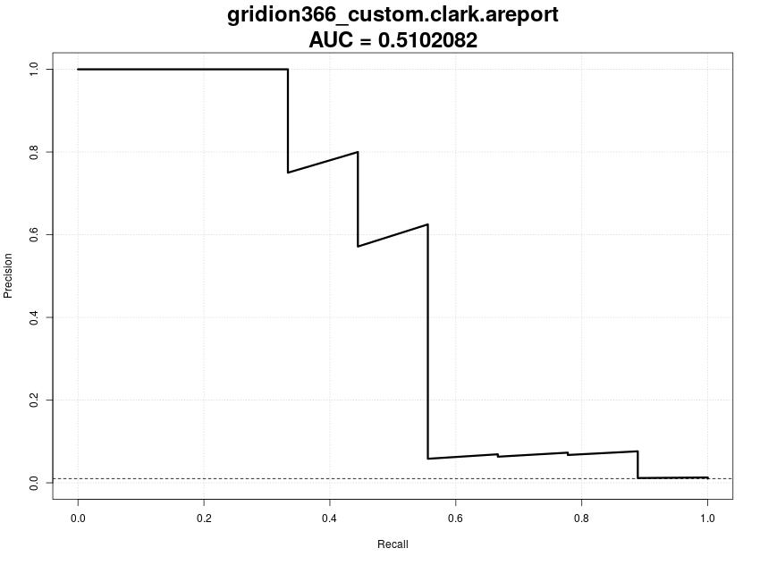

|   Diamond |   Kaiju |  Centrifuge  |  Clark  |  Kraken2  | 
|:--:|:--:|:--:|:---:|:--:|
||||||
|[(a) GridION364: PR Curve, Diamond (custom)](../../stats/pics/prc/gridion364_custom.diamond.prc.jpeg)|[(b) GridION364: PR Curve, Kaiju (custom)](../../stats/pics/prc/gridion364_custom.kaiju.prc.jpeg)|[(c) GridION364: PR Curve, Centrifuge (custom)](../../stats/pics/prc/gridion364_custom.centrifuge.prc.jpeg)|[(d) GridION364: PR Curve, CLARK (custom)](../../stats/pics/prc/gridion364_custom.clark.prc.jpeg)|[(e) GridION364: PR Curve, Kraken2 (custom)](../../stats/pics/prc/gridion364_custom.kraken2.prc.jpeg)|
| AUC: 0.7602105 | AUC: 0.7602105| AUC: 0.69504 |AUC: 0.5257158 | AUC: 0.8988399 | 
||||||
||[(f) PromethION365: PR Curve, Kaiju (custom)](../../stats/pics/prc/promethion365_custom.kaiju.prc.jpeg)|[(g) PromethION365: PR Curve, Centrifuge (custom)](../../stats/pics/prc/promethion365_custom.centrifuge.prc.jpeg)|[(h) PromethION365: PR Curve, CLARK (custom)](../../stats/pics/prc/promethion365_custom.clark.prc.jpeg)|[(i) PromethION365: PR Curve, Kraken2 (custom)](../../stats/pics/prc/promethion365_custom.kraken2.prc.jpeg)|
|| AUC: 0.5702636 | AUC: 0.6879514| AUC: 0.523079 | AUC: 0.8700717 |
||||||
||[(j) GridION366: PR Curve, Kaiju (custom)](../../stats/pics/prc/gridion366_custom.kaiju.prc.jpeg)|[(k) GridION366: PR Curve, Centrifuge (custom)](../../stats/pics/prc/gridion366_custom.centrifuge.prc.jpeg)|[(l) GridION366: PR Curve, CLARK (custom)](../../stats/pics/prc/gridion366_custom.clark.prc.jpeg)|[(m) GridION366: PR Curve, Kraken2 (custom)](../../stats/pics/prc/gridion366_custom.kraken2.prc.jpeg)|
| | AUC: 0.3398543|  AUC: 0.361886  |AUC: 0.5102082 | AUC: 0.5979277 | 
||||||
||[(n) PromethION367: PR Curve, Kaiju (custom)](../../stats/pics/prc/promethion367_custom.kaiju.prc.jpeg)|[(o) PromethION365: PR Curve, Centrifuge (custom)](../../stats/pics/prc/promethion367_custom.centrifuge.prc.jpeg)|[(p) PromethION367: PR Curve, CLARK (custom)](../../stats/pics/prc/promethion367_custom.clark.prc.jpeg)|[(q) PromethION367: PR Curve, Kraken2 (custom)](../../stats/pics/prc/promethion367_custom.kraken2.prc.jpeg)|
| | AUC: 0.4339642  |AUC: 0.3265234 | AUC: 0.5100713 | AUC: 0.6200843|

***Figure-S10: Overview of the different Precision Recall Curves, Custom Database.*** This figure shows the precision recall curves and the corresponding Area Under Curve (AUC) for each classification run. In comparison to the classification with the default database, the tools achive poorer results for the custom database.