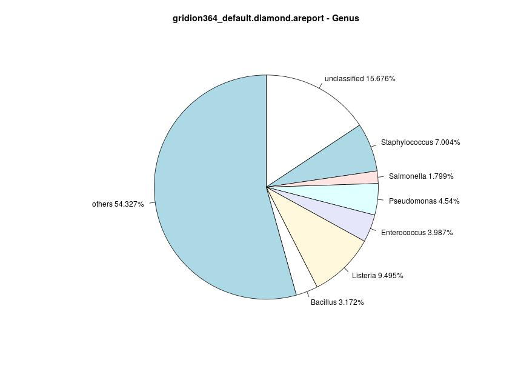

# Results and Discussion
## Area under Precision Recall Curve
With the Area under Precision-Recall Curve (AUPR), it is possible to evaluate precision and recall using only one value. Using the R script [visPRCurve.R](scripts/../../scripts/visPRCurve.R), the values in ***Table 6*** and ***Table 7*** are calculated.  
For this metric, higher values are better than smaller values. Since Centrifuge assigns a read to up to five species, the abundances are calculated slightly different: the number of reads assigned to one entry is divided by the total number of assignments which can be greater than the number of reads. This is important for the threshold that are considered for precision and recall.  

Although Diamond and Kaiju both are protein based tools, Diamond seems to achieve a better AUPR for GridION364 with a score of 1.0, which equals a perfect classifier (***Table 6***). Kaiju achieves a score  of 0.73 (for both CS Even samples) and performs slightly worse with 0.39 for GridION366, for which Diamond scores 0.51. Kaiju’s scores for the PromethION samples are in the same scope as those for its GridION samples. However, Kaiju scores lowest for the CS Log samples. Other tools achieve at least a score of 0.51, the majority of tools even exceed 0.65. An explanation for this behaviour might be the different types of databases since Diamond and Kaiju perform based on protein sequences. Both tools allow for the elongation of exact matches, therefore should probably perform better for long reads than tools with static k-mer lengths [Quelle-BugSeq](https://doi.org/10.1186/s12859-021-04089-5 "Fan, J., Huang, S., & Chorlton, S. D. (2021). BugSeq: a highly accurate cloud platform for long-read metagenomic analyses. *BMC bioinformatics*, 22(1), 1-12."). Nevertheless, the differences for GridION366 might be caused by different seed lengths. Kaiju has a default minimum length of 11, whereas Diamond uses blastx for the computation of alignments and blastx has a default word length of 6 positions (This value is used with the blastx [interface](https://blast.ncbi.nlm.nih.gov/Blast.cgi?PROGRAM=blastx&PAGE_TYPE=BlastSearch&LINK_LOC=blasthome "BLASTx Home")). Since a longer seed sequence results in less sensitivity, Diamond is more sensitive than Kaiju which could explain the differences in the AUPR score.  
That Diamond achieves the results of a perfect classifier with GridION364 seems counter intuitive due to the later discussed abundances of the species. In contrast to Centrifuge and Kraken2, Diamond is not able to assign more than 1% of reads to the majority of present species in the sample (***Table-S1***, supplements). However, this outcome is computed with the PPROC packages of R as well as validated with the sklearn.metrics package of python ([script](../scripts/calcPRCurve.py)). It therefore strengthens the use of more than one metric to evaluate the performance of classifiers ([Figure-S1](../stats/pics/prc/gridion364_default.diamond.prc.python.png "GridION364: PR Curve, Diamond (default), Python")).  
With the exception of CCMetagen, the tools perform better on the CS Even samples, Centrifuge, Clark and Kraken2 even achieve an AUPR score of 1.0, which equals the result that a perfect classifier would achieve. This seems reasonable since some abundances of species are really small and therefore only produce a small number of reads.  
CCMetagen has a score of 0.69 for GridION364 and 0.78 for GridION366, the results for Clark for the CS Log samples range in 0.69 to 0.73, the CS Even samples achieve the same AUPR of 1.0. The best for the PromethION367 sample is achieved with Clark, it outperforms the AUPRs of the other tools with respect to these samples -- it is the highest AUPR for the CS Log samples with 0.73. With a default k-mer length of 31 nt it is expected to be more sensitive than tools with longer k-mer lengths (Kraken2: 35 nt), this might be a reason why the AUPR on the CS Log samples is higher, whereas the AUPRs for the Cs Even samples are the same.  
Considering Kraken2 and Centrifuge and the CS Log samples, Kraken2 achieves higher results with values of 0.672 and 0.696 for GridION and PromethION, whereas Centrifuge achieves scores of 0.606 and 0.614, respectively. This is surprising since Centrifuge has a minimum match length of 22 nt, but elongates the matches, whereas Kraken2 uses a fixed k-mer length of 35 nt. Therefore, Centrifuge’s sensitivity should be greater than Kraken2’s.  

However, there does not seem to be a trend whether one of the approaches works best with the long reads of this dataset, the sequencing depth does not seem to influence the AUPR on a big scale either. Most tools achieve slightly better results with the PromethION samples, but the improvements are small (Kaiju: 0.3873 to 0.3897, Centrifuge: 0.606 to 0.614, Clark: 0.69 to 0.73, Kraken2: 0.672 to 0.697).  
A trend that can be observed is that Diamond and Kaiju, both using protein classification, seem to perform better for CS Even samples with their default database.  
The missing fungal sequences in the databases do not interfere with the precision-recall curves (e.g. [Figure-S2a](../stats/pics/noFungi/gridion364_default.diamond.noFung.prc.jpeg "GridION364: PR Curve, Diamond (default), no Fungi"), [Figure-S2b](../stats/pics/noFungi/gridion364_default.kaiju.noFung.prc.jpeg "GridION364: PR Curve, Kaiju (default), no Fungi")).

|                	| Diamond   	| Kaiju     	| CCMetagen 	| Centrifuge 	| Clark     	| Kraken2   	|
|----------------	|-----------	|-----------	|-----------	|------------	|-----------	|-----------	|
| GridION364    	| 1.0       	| 0.7253469 	| 0.6887791 	| 1.0        	| 1.0       	| 1.0       	|
| PromethION365 	|           	| 0.7253469 	|           	| 1.0        	| 1.0 	        | 1.0       	|
| GridION366    	| 0.5103104 	| 0.3873827 	| 0.7760189 	| 0.6062113  	| 0.6914607 	| 0.6724297 	|
| PromethION367 	|           	| 0.3896924  	|           	| 0.6138137  	| 0.7315841 	| 0.6965986 	|

***Table 6: AUPR values, Default Database.*** This table shows the calculated Area under Precision Recall Curve for the different tools and samples using their default database. Note that CCMetagen and Diamond are not able to perform on the PromethION samples, therefore those values are missing. There is no trend to be observed regarding the AUPR and different sequencing depths. However, some tools seem to perform better with the CS Even samples (e.g. Diamond, Centrifuge, Kraken2), whereas Kaiju, CCMetagen and Clarks seem to perform better for the CS Log samples. The corresponding plots can be seen in ***Figure-S9*** or [here](../stats/pics/prc).

|                	| Diamond   	| Kaiju     	| CCMetagen 	| Centrifuge 	| Clark     	| Kraken2   	|
|----------------	|-----------	|-----------	|-----------	|------------	|-----------	|-----------	|
| GridION364    	|  0.902987 	|  0.7602105	|           	| 0.69504       | 0.5257158     | 0.8988399   	|
| PromethION365 	|           	|  0.7602105    |           	| 0.6879514     | 0.523079   	| 0.8700717   	|
| GridION366    	|      !!!     	|  0.3398543 	|            	| 0.361886  	| 0.5102082     | 0.5979277 	|
| PromethION367 	|           	|  0.4339642	|           	| 0.3265234  	| 0.5100713 	| 0.6200843   	|

***Table 7: AUPR values, Custom Database.*** This table shows the calculated Area under Precision Recall Curve for the different tools and samples using their custom database. Note that CCMetagen and Diamond are not able to perform on the PromethION samples, therefore those values are missing. The scores for Kraken2 and Centrifuge are lower than those achieved with the default database. However, for Kraken2, the CS log samples have higher values, whereas Centrifuge scrores higher with the CS Even samples. Kaiju improves for the CS Log samples, but results in lower scores for CS Even samples. Clark is able to achieve a AUPR between 0.51 and 0.53 over all for samples, which is the poorest result. Diamond!!! The corresponding plots can be seen in ***Figure-S10*** or [here](../stats/pics/prc). There are no values for CCMetagen since KMA is not able to build an index due to memory-limits.

The results of AUPR analysis regarding the custom databases show a different outcome (***Table 7***). Centrifuge and Kraken2 are no longer able to perform like a perfect classifier. The AUPRs for Centrifuge range from 0.33 to 0.7, which is a deterioration compared to the previously discussed results. The degradation for Kraken2 is not that strong, the values for the CS Log samples are similar to the scores Kraken2 achieved on the CS Log samples with the default database, ranging from 0.598 to 0.62. The CS Even samples reach AUPRs of 0.899 and 0.87 for GridION and PromethION, respectively. An explanation for this worsening might be the custom database since it is the only change between runs, although both default databases are based on RefSeq sequences as are the custom databases. Variations might be due to different building timepoints and therefore distinctions in the included sequences. The index for Centrifuge is from 2018, whereas the Kraken2 database is generated in 2019, but the custom database relies on sequences that are last updated in 2021. These changes also lead to a loss in balanced accuracy. With the default database, Kraken2 has an accuracy of 1.0 for GridION364, but with the custom database, Kraken2 only reaches 0.83, this is the same for PromethION365. A similar difference can be seen for Centrifuge. Balanced accuracy is the proportion of added False Positive Rate and True Negative Rate divided by two. It is used when the classes for classification are imbalanced, i.e. there are more species not in the sample than species that are in the sample.  
For Kaiju, the CS Even samples achieve an AUPR of 0.76 both, which is an improvement for both samples. This is different for the CS Log samples: The GridION sample deteriorates, whereas the PromethION sample improves. Overall, the CS Even samples approximate the results of Kraken2 and Centrifuge, the differences are not as great as for the default database. Diamond, however, seems to perform best for GridION364 regarding the AUPR and custom database. The score of 0.903 is slightly higher than the corresponding value Kraken2 achieves (0.899). However, as discussed earlier, this result seems counter intuitive due to the achieved abundances of Diamond. The underlying sequences for the protein databases are the same for the bacterial sequences, therefore differences in the included sequences are only possible for the fungal sequences. Since the changes for Diamond and Kaiju are not as drastic as for the other tools, the smaller amount for fungal changes might account for the slight deterioration, even leading to an improvement for Kaiju and the CS Even samples.  
Due to memory limits, the index for Clark is build with Clark-l which is a memory-sensitive version of Clark. The corresponding k-mers have a length of 27 nt instead of 31 nt, the database is described as sparse, hence the memory-sensitivity. However, the results should be seen as a draft or approximation of the results Clark would achieve. It is not possible to run Clark on the sparsed database. Considering this, the results are not as bad as to be expected. The deterioration between default and custom database is particularly noticeable with the CS Even samples. Previously, the tool achieves an AUPR of 1.0. Here, the AUPR is 0.526 and 0.523 for GridION and PromethION, respectively. The values for the CS Log samples are in a similar scope (0.51 each) and thereofore, don't show a similar deterioration. Those values are higher than the corresponding values of Kaiju and Centrifuge. The worsening might be explained by the sparse database, but poorer results for the CS Log samples would have been expected.   
Furthermore, Diamond is used with a memory limiting parameter for GridION366 as well, otherwise no classification result would be possible. The limitation of memory and disc space comes with a slightly poorer performance. However, the result for GridION364 has not deteriorated in a similar proportion as can be observed with the other tools, the AUPR with the custom database i 0.903. For GridION366, the AUPR is XXX Worsening might be explained due to the changes parameter!!!  
Due to the beforementioned limits in memory, it is not abe to run CCMetagen with a custom database.  

It seems like the tools perform better on their (downloaded) default databases/indices. However, Kraken2 and Kaiju show the least deterioration between the two databases althoug Kraken2 performs best over all samples and databases, regarding the AUPR. This might be explained due to Kaiju not being especially for long reads, whereas Kraken2 is supposed to be able to work with those reads as well. In conclusion, it seems like Kraken2 and Kaiju achieve the best scores regarding the AUPR with Centrifuge following. Diamond does neet seem like a good option due to the long runtimes for samples with greather sequencing depth, the AUPRs, however, seem good.

<!-- lass ich das drin? -->
Most of the tools are also used in a benchmarking study for short reads by Simon H. Ye et al. [Quelle-benchmark](https://doi.org/10.1016/j.cell.2019.07.010 "Simon, H. Y., Siddle, K. J., Park, D. J., & Sabeti, P. C. (2019). Benchmarking metagenomics tools for taxonomic classification. *Cell*, 178(4), 779-794."). In that study, most tools achieved scores between 0.9 and 1.0 with their default database, except for Centrifuge which scored between 0.3 and 0.4. Using a RefSeq CG database, all tools are able to score between 0.9 and 1.0. This stands in contrast to the results presented here. The custom databases seem to result in inferior AUPR scores than the classifications with the default databases.

It has to be considered that only one dataset is not enough to fully access the performance of the classification tools.
## Abundance Profile Similarity
### Differences for Gram-positive and Gram-negative species
In hindsight of the different properties of species, this section deals with possible differences of the classifiers regarding the Gram staining of bacteria. The Gram stain of the bacterial species in the samples can be seen in ***Table 1***. Only the CS Even samples are discussed since the proportional abundances allow for comparisons regarding the preferences of classification tools, whereas the logarithmic abundances don’t allow for that.  
 
The abundances for the species in the samples classified using the default databases can be seen in ***Tables-S1, -S2, -S3 and -S4*** (supplements). It can be seen that the protein-based tools Kaiju and Diamond associate a minority of reads to the species in the sample. For Diamond (GridION364), the percentage of assigned reads is between 0 and 1% with the exception of *Listeria monocytogenes* with 2.89%. However, considering the genus level, Diamond is able to identify more reads belonging to a genus included in the dataset. The genera with the most abundances are *Listeria*, (9.459%), *Staphylococcus* (7.004%) and *Pseudomonas* (4.54%), see [Figure-S3](../stats/pics/gridion364_default.diamond.genus.piechart.jpeg "Piechart of Classification Results, Diamond, Default Database, Genus Level"). Two of the corresponding species in this dataset are gram-positive, whereas *Pseudomonas aeruginosa* is gram-negative, this proportion is applicable for the low abundances genera as well, hence there does not seem to be a trend which gram-species can be better classified with Diamond.  
Kaiju on the other hand assigns more reads to gram-positive species (4.151% - 12.503% abundances), whereas gram-negative species achieve fewer assigned reads (1.104% - 2.124% abundances) in GridION364. This is also true for the PromethION sample, the classified gram-positive species abundances range from 3.98% to 12.033%, whereas the gram-negative species have 1.111% to 2.101% of reads assigned to (***Table-S2***, [Figure 3a](../stats/pics/gridion364_default.kaiju.piechart.jpeg "(a) GridION364: Piechart for Classification Results of Kaiju (default)")).  
The four dominant species in the classification result of CCMetagen are *Bacillus spizizenii*, *Listeria monocytogenes*, *Limosilactobacillus fermentum* and *Staphylococcus fermentum*, which are all gram-positive species, two of the three remaining species with abundances ranging from 1.795% to 3.387% are gram-negative. This might imply a preference for gram-positive species.  
The classification results for the CS Even samples seem to be balanced with Centrifuge, there are no great differences in abundances. However, the three species with around 5% abundance (*Escherichia coli*, *Pseudomonas aeruginosa* and *Salmonella enterica*) are all gram-negative species. But since Kraken2 has a similar distribution of reads, this might not necessarily be due to the Gram stain. Additionally, all three species have less abundance in the ground truth than expected (around 9%, ***Table 1***).  
The abundances after classification with Clark are similar to Kraken2 and Centrifuge. The three species with the lowest abundances are those three gram-negative species. This means, either the tools have a preference for gram-positive species or the abundance of the gram-negative species is generally lower by chance than the abundances of the other species in the sample. The first assumption is supported by *Lactobacillus fermentum* (gram-positive): The estimated abundance in the ground truth is, too, lower than expected, but the tools associate a higher amount of reads with it. This stands in contrast to the theory that the lower abundance of reads in the ground truth is the reason for the lower percentage of assignment.    

The different abundances achieved with the custom database for the species of the sample can be seen in the supplements (***Table-S10, -S11, -S12, -S13***). Considering that run of classification and GridION364, there are no noticeablec hanges for Diamond. This is true for Kraken2 and Centrifuge as well, with the exception fo *Bacillus subtilis* which only has an abundance of 4.912% with the custom database instead of 17.51% for Kraken2 and the default database, the values for Centrifuge are similar. *Bacillus subtilis* is a gram-positive species, the fallen abundance probably is not due to that or other gram-positive species should have a loss of abundance as well. This is not the case, *Escherichia coli* and *Staphylococcus aureus* even have a gain in abundance of reads associated to the species. Clark has a general deterioration regarding the species in the sample (possibly due to the sparse database), there does not seem to be a connection. However, Clark classified several other species that are not in the sample, but the proportion of gram-positive and -negative species is similar.  
Kaiju's abunances are mixed. For some species, the values differ and are overall slightly poorer. The greatest changes can be observed for *Bacillus subtlis* (from 0.81% to 0.21% for default and custom database, respectively), *Enterococcus faecalis* (10.27% and 2.37%) and *Lactobacillus fermentum* (12.5% and 5.54%), which are all gram-positive species. However, there are three gram-negative species with great changes as well (*Salmonella enterica*, *Escherichia coli* and *Pseudomonas aeruginosa*), but those changes are not as severe. This could hint a preference for gram-negative species which contradicts the already discussed pereference for gram-positive species with the default database. It is more likely that the lower abundances are due to the custom database.  
This is true for PromethION365 too.

It seems like that especially the protein based tools have a preference for gram-positive species, although it might be possible that this trend is only due to the actual abundances within the sample, whereas Centrifuge, Kraken2 and Clark seem to have a slight preference for gram-negative species, at least while using the default database. This can be observed for the custom database as well, but only with Centrifuge and Kraken2. It might not be observed with Clark because of the sparse database.
## Classification Results
### Kraken2
The Kraken default database includes the fungal genomes, therefore this is the only classifier that has the possibility to accurately identify all present species. Both the GridION and PromethION sequences sample are able to identify all ten species, no other species are identified. The read abundances range from 2.003% to 17.514% for GridION364 and 1.954% to 16.991% for PromethION365. On average for the CS Even samples, 10% of reads could not be classified at all, and 4.5% are not assigned on species level ([Figure 11a](../stats/pics/gridion364_default.kraken2.piechart.jpeg "(a) GridION364: Piechart for Classification Results of Kraken2 (default)"), [Figure 11b](../stats/pics/promethion365_default.kraken2.piechart.jpeg "(b) PromethION365: Piechart for Classification Results of Kraken2 (default)"), ***Table 18***).

|||
|:--|:--|
| GridION364: Piechart for Classification Results of Kraken2 (default)")|**(a) GridION364: Piechart for Classification Results of Kraken2 (default).** Kraken2 identified the species present in the CS Even samples, the abundances range from 2.003% for *Cryptococcus neoformans* to 17.514% for *Bacillus subtilis*. 9.13% of the reads are unclassified and 4.566% of the reads are assigned to a taxon on a different level (not species) or the corresponding species has no abundance of 1%.|
| PromethION365: Piechart for Classification Results of Kraken2 (default)")|**(b) PromethION365: Piechart for Classification Results of Kraken2 (default).** Kraken2 identified the species present in the CS Even samples, the abundances range from 1.954% for *Cryptococcus neoformans* to 16.991% for *Bacillus subtilis*. 11.42% of the reads are unclassified and 4.569% of the reads are assigned to a taxon on a different level (not species) or the corresponding species has no abundance of 1%. |
|||

***Figure 11: Classification Results for Kraken2, CS Even, Default Database***    

| Classified Species 	| *B. subtilis* 	| *L. monocytogenes* 	| *E. faecalis* 	| *S. aureus* 	| *S. enterica* 	| *E. coli* 	| *P. aeruginosa* 	| *L. fermentum* 	| *S. cerevisiae* 	| *C. neoformans* 	|   	| unclassified 	| others 	|
|--------------------	|-------------	|------------------	|-------------	|-----------	|-------------	|---------	|---------------	|--------------	|---------------	|---------------	|---	|--------------	|--------	|
| CS Even            	|             	|                  	|             	|           	|             	|         	|               	|              	|               	|               	|   	|              	|        	|
| GridION364        	| 17.514      	| 12.87            	| 11.111      	| 11.067    	| 5.685       	| 5.255   	| 4.481         	| 14.142       	| 2.176         	| 2.003         	|   	| 9.13         	| 4.566  	|
| PrometION365      	| 16.991      	| 12.455           	| 10.757      	| 10.676    	| 5.703       	| 5.299   	| 4.612         	| 12.477       	| 2.096         	| 1.954         	|   	| 11.42        	| 4.559  	|
| CS Log             	|             	|                  	|             	|           	|             	|         	|               	|              	|               	|               	|   	|              	|        	|
| GridION366        	| 1.027       	| 81.293           	| -           	| -         	| -           	| -       	| 3.98          	| -            	| -             	| -             	|   	| 8.52         	| 5.18   	|
| PromethION367     	| 1.023       	| 79.702           	| -           	| -         	| -           	| -       	| 4.069         	| -            	| -             	| -             	|   	| 10.4         	| 4.805  	|

***Table 18: Abundances of classified species, Clark, Default Database.*** Kraken2 is able to assign the majority of reads. Over all four samples, an average of 9.87% of reads are unclassified, the PromethION samples showing a slightly increased rate of unclassified reads. With the CS Even samples, all ten species are identified. Considering the CS Log samples, *Listeria monocytogenes* is identified as a predominant species with 81.283% and 79.70% for GridIOn and PromethION, respectively. The two other species with at least 1% abundance are *Bacillus subtilis* and *Pseudomonas aeruginosa*.

The classification results for CS Log are similar between the sequencing methods as well. The majority of reads is assigned to *Listeria monocytogenes* (81.293% and 79.702%, respectively). The other two identified species are *Pseudomonas aeruginosa* and *Bacillus subtilis* with roughly 4% and 1%, respectively ([Figure 12a](../stats/pics/gridion366_default.kraken2.piechart.jpeg "(a) GridION366: Piechart for Classification Results of Kraken2 (default)"), [Figure 12b](../stats/pics/promethion367_default.kraken2.piechart.jpeg "(b) PromethION367: Piechart for Classification Results of Kraken2 (default)")).
|||
|:--|:--|
| GridION366: Piechart for Classification Results of Kraken2 (default)")|**(a) GridION366: Piechart for Classification Results of Kraken2 (default).** Kraken2 is able to assign the majoity of reads to *Listeria monocytogenes* with 81.293%. 1.027% are assigned to *Bacillus subtilis* and 3.98% are assigned to *Pseudomonas aeruginosa*. 8.52% of reads are not classified at all. The percentage of reads that are classified to a taxon not on species level or a species with less than 1% abundance is 5.18%.|
| PromethION367: Piechart for Classification Results of Kraken2 (default)")|**(b) PromethION367: Piechart for Classification Results of Kraken2 (default).** Kraken2 is able to assign the majoity of reads to *Listeria monocytogenes* with 79.702%. 1.023% are assigned to *Bacillus subtilis* and 4.069% are assigned to *Pseudomonas aeruginosa*. 10.4% of reads are not classified at all. The percentage of reads that are classified to a taxon not on species level or a species with less than 1% abundance is 4.805%. |
|||

***Figure 12: Classification Results for Kraken2, CS Log, Default Database***    

Kraken2 reached similar classification results with the the custom database (***Table-S9***).  
A main difference is the percentage of assigned reads to *Bacillus subtilis*, which decreased to roughly 5% for the CS Even samples. However, about 10.5% of the reads are instead assigned to *Bacillus spizizenii*, which is, as already mentioned, a subspecies of *Bacillus subtilis*. Taking the percentages for both species adds up roughly to the amount of reads Kraken2 is able to assign to *Bacillus subtilis* using the default database. Here, too, the fungal soecues are idntified with about 2% each in each sample ([Figure-S8a](../stats/pics/gridion364_custom.kraken2.piechart.jpeg "(a) GridION364: Piechart for Classification Results of Kraken2 (custom)"), [Figure-S8b](../stats/pics/promethion365_custom.kraken2.piechart.jpeg "(b) PromethION365: Piechart for Classification Results of Kraken2 (custom)")) 
The percentage of unclassified reads is similar (9.56% and 11.76%, respectively), but the percentage of reads assigned to "others" increased to ~8%.  
Considering the CS Log samples, the results are similar as well. The majority of reads is assigend to *Listeria monocytogenes* with 81.607% and 80.044% for GridION ([Figure-S8c](../stats/pics/gridion366_custom.kraken2.piechart.jpeg "(c) GridION366: Piechart for Classification Results of Kraken2 (custom)")) and PromethION ([Figure-S8d](../stats/pics/promethion367_custom.kraken2.piechart.jpeg "(d) PromethION367: Piechart for Classification Results of Kraken2 (custom)")), respectively. Around 4.5% of reads are assigned to *Pseudomonas aeruginosa*. The number of reads that are not classified as well as the number of reads assigned to taxa that are not on species level or to species that didn't reach 1% abundance.    

## Difficulties with the tools
At the beginning of this comparison, a list with more than 12 classification tools existed. Some of those tools are specifically for long read data, others are not. Additional to the difficutles which lead to not using some tools which will be discussed in this section, the commands used (or tried to use) for installation and setup can be seen [here](../notes/commands.md)  

The Naive Bayes Classification Tool [Quelle-NBC](https://academic.oup.com/bioinformatics/article/27/1/127/202209 "Rosen, G. L., Reichenberger, E. R., & Rosenfeld, A. M. (2011). NBC: the Naive Bayes Classification tool webserver for taxonomic classification of metagenomic reads. *Bioinformatics*, 27(1), 127-129.") should be used to test whether older classification approaches are able to handle the state-of-the-art long reads, but the webserver is only able to process 20 Mb files for gunal samples. The try to only use the bacterial database failed during the upload (GridiION 364), the page didn't respond. It seems that this tool is not able to process high throughput data.  

K-SLAM [Quelle-kslam](https://academic.oup.com/nar/article/45/4/1649/2674183 "Ainsworth, D., Sternberg, M. J., Raczy, C., & Butcher, S. A. (2017). k-SLAM: accurate and ultra-fast taxonomic classification and gene identification for large metagenomic data sets. *Nucleic acids research*, 45(4), 1649-1656.") claims to be able to process up to 10,000,000 reads, but repeats to throw the following error:

    terminate called after throwing an instance of 'std::bad_alloc'
    what():  std::bad_alloc
    /bin/bash: line 1: 19208 Aborted

After trying different <tt>--num-reads-at-once</tt> values, the tool run several weeks with <tt>--num-reads-at-once 1000000</tt> without any visible progress or output. It was terminated and decided not to be used.  

The lightweight alignment-free and assembly-free framework for metagenomic classification tool LiME [Quelle-lime](https://bmcbioinformatics.biomedcentral.com/articles/10.1186/s12859-020-03628-w "Guerrini, V., Louza, F. A., & Rosone, G. (2020). Metagenomic analysis through the extended Burrows-Wheeler transform. *BMC bioinformatics*, 21(8), 1-25.") could not be installed via conda and the manual installation with git caused several errors while trying to install dependencies. It could not be installed and is not used, therefore.  

taxMaps [Quelle-taxmaps](https://genome.cshlp.org/content/28/5/751 "Corvelo, A., Clarke, W. E., Robine, N., & Zody, M. C. (2018). taxMaps: comprehensive and highly accurate taxonomic classification of short-read data in reasonable time. *Genome research*, 28(5), 751-758.") is a python based classification tool for short read data. Trying to use it for long read data resulted in several IndexErrors.  

MetaOthello [Quelle-metaothello](https://doi.org/10.1093/bioinformatics/btx432 "Liu, X., Yu, Y., Liu, J., Elliott, C. F., Qian, C., & Liu, J. (2018). A novel data structure to support ultra-fast taxonomic classification of metagenomic sequences with k-mer signatures. *Bioinformatics*, 34(1), 171-178.") is probabilistic hashing classifier for metagenomic reads. During the processing of a GridION sample, the tool repeatingly throws <tt>Segmentation Fraud</tt>s. It therefore was decided not to use the tool.

DeepMicrobes [Quelle-deepMicrobes](https://doi.org/10.1093/nargab/lqaa009 "Liang, Q., Bible, P. W., Liu, Y., Zou, B., & Wei, L. (2020). DeepMicrobes: taxonomic classification for metagenomics with deep learning. *NAR Genomics and Bioinformatics*, 2(1), lqaa009.") uses deep learning for taxonomic classification of metagenomes. The classification preprocessing and the classification itself consists of several steps and minimizes the usability. A first step of the analysis is to convert the fastq sequences to TFRecord-format, this is needed for training. This step failed several times due to various reasons. However, the classification itself needs converted files as well, therefore this tool could not be used.  

BugSeq [BugSeq](https://doi.org/10.1186/s12859-021-04089-5 "Fan, J., Huang, S., & Chorlton, S. D. (2021). BugSeq: a highly accurate cloud platform for long-read metagenomic analyses. *BMC bioinformatics*, 22(1), 1-12.") is a cloud-based pipeline for classification, therefore no parameters can be specified. The website can be reached with [https://bugseq.com/free](https://bugseq.com/free). However, the used tools are used with default parameters.  
First, a quality control with fastp is performed, the reads are then mapped with minimap2 against refseq sequences of the corresponding database. Pathoscope reassigns the alignments to the reference sequences using a Bayesian statistical framework. The reads are classified based on te lowest common ancestor [BugSeq](https://doi.org/10.1186/s12859-021-04089-5 "Fan, J., Huang, S., & Chorlton, S. D. (2021). BugSeq: a highly accurate cloud platform for long-read metagenomic analyses. *BMC bioinformatics*, 22(1), 1-12."). 
The advanced options consist of the choice of the metagenomic database. The options are either the BugSeq Default, which includes all bacterial genomes in RefSeq as well as fungal, protozoal and viral genomes in RefSeq, the human genome and transcriptome are inclusded as well. The completion status is not taken into account. The other database is the NCBI nt, but for this analysis, it is not chosen but the BugSeq default database.  
The other option is a specification of the sample type. Since this dataset includes two fungal sequences, the option <tt>bacterial isolates</tt> could not be used, therefore the default <tt>Generic</tt> sample type has been chosen. The tool is avaiable in three options: academic and lab. The academic version allows only for uploads up to 10 GB, whereas the Lab version involved monthly payment. It is currently not possible to try out the Lab version if there already exists an account. This means, no samples could be submitted since the smallest sample has a size of at least 11 Gb.  

CCMetagen and Diamond are two tools used within this comparison, but only for the samples with up to 3.5 million reads. The PromethION samples could not be classified using these tools in reasonable time. Diamond used up to two weeks for a PromethION sample and stopped without reason or result. Due to this, it was decided to only use Diamond for the GridION samples. Since CCMetagen is based on KMA, the failed preprocessing with KMA while finding k-mer ankers lead to the use of CCMetagen only for GridION samples. Additionally, it is not possible to build a KMA index for the custom database, even in sparse mode the computing takes to much memory and is aborted several times. 
For Clark, the database and index creation with the custom sequences is only possible using the sparse mode and Clark-l, which generates a sparse database and the k-mer indices have a length of 27 nt than the default 31 nt.

# Supplements
| Classified Species 	| *B. subtilis*          	| *L. monocytogenes*     	| *E. faecalis*          	| *S. aureus*            	| *S. enterica*           	| *E. coli*               	| *P. aeruginosa*         	| *L. fermentum*        	| *S. cerevisiae*        	| *C. neoformans*         	|
|--------------------	|----------------------	|----------------------	|----------------------	|----------------------	|-----------------------	|-----------------------	|-----------------------	|---------------------	|----------------------	|-----------------------	|
| expected           	| 0.12                 	| 0.12                 	| 0.12                 	| 0.12                 	| 0.12                  	| 0.12                  	| 0.12                  	| 0.12                	| 0.02                 	| 0.02                  	|
| estimated          	| 0.1932               	| 0.1456               	| 0.1224               	| 0.1128               	| 0.0999                	| 0.0993                	| 0.097                 	| 0.0928              	| 0.0192               	| 0.0178                	|
| Diamond            	| 0.003931099075153449 	| 0.028948069393565312 	| 0.010118319637737405 	| 0.003972916231071292 	| 0.0025789155608511223 	| 0.0011511174632452977 	| 0.0010376955882900507 	| 0                   	| 0                    	| 0                     	|
| Kaiju              	| 0.00811224           	| 0.09322046           	| 0.10269091           	| 0.04151326           	| 0.01778919            	| 0.021244830000000003  	| 0.01103858            	| 0.12502928000000002 	| 0                    	| 0                     	|
| CCMetagen          	| 0.00357422115547103  	| 0.11325804335808948  	| 0.017949584549420146 	| 0.09837457287785094  	| 0                     	| 0.020692618126304997  	| 0.03386645433480648   	| 0                   	| 0.008941424475638643 	| 1.145675504598455e-06 	|
| Centrifuge         	| 0.18033222980001143  	| 0.13268354876744617  	| 0.10978380289037058  	| 0.11039120082853578  	| 0.05890522708106204   	| 0.05824580663430398   	| 0.05114965525948968   	| 0.14248487058908882 	| 0                    	| 0                     	|
| CLARK              	| 0.07331721749790199  	| 0.13241545630823254  	| 0.11445298290938566  	| 0.11208258029037145  	| 0.05648781717310298   	| 0.04960860860574155   	| 0.04561564305333979   	| 0                   	| 0                    	| 0                     	|
| Kraken2            	| 0.17514371067110807  	| 0.128698598552439    	| 0.11110932894921507  	| 0.11066767104219237  	| 0.05685214198356529   	| 0.05254612059953199   	| 0.04480679614709328   	| 0.14142218428763328 	| 0.021756091413448513 	| 0.020032995454532434  	|

***Table S1: Overview of abundances for GridION364, Default Database.*** This table shows the abundance the different classifiers achieved. It is based on the number of reads assigned to each species.

| Classified Species 	| *B. subtilis*          	| *L. monocytogenes*    	| *E. faecalis*         	| *S. aureus*           	| *S. enterica*          	| *E. coli*              	| *P. aeruginosa*        	| *L. fermentum*        	| *S. cerevisiae*       	| *C. neoformans*        	|
|--------------------	|----------------------	|---------------------	|---------------------	|---------------------	|----------------------	|----------------------	|----------------------	|---------------------	|---------------------	|----------------------	|
| expected           	| 0.12                 	| 0.12                	| 0.12                	| 0.12                	| 0.12                 	| 0.12                 	| 0.12                 	| 0.12                	| 0.02                	| 0.02                 	|
| estimated          	| 0.1902               	| 0.1433              	| 0.1207              	| 0.1111              	| 0.1032               	| 0.1026               	| 0.1011               	| 0.0913              	| 0.0187              	| 0.0177               	|
| Kaiju              	| 0.006889650000000001 	| 0.09046455          	| 0.09956079000000001 	| 0.03980312          	| 0.01784152           	| 0.02100569           	| 0.011106320000000001 	| 0                   	| 0                   	| 0                    	|
| Centrifuge         	| 0.1740696701561566   	| 0.12785193704152933 	| 0.106092408974466   	| 0.10588439652695726 	| 0.05829268429134972  	| 0.057807084237554436 	| 0.05111061918216472  	| 0.13512543438538727 	| 0                   	| 0                    	|
| CLARK              	| 0.07219174753831668  	| 0.12790055380526907 	| 0.11064198413206593 	| 0.10809287647472647 	| 0.05651135379967302  	| 0.050916139842427585 	| 0.046595982353225186 	| 0                   	| 0                   	| 0                    	|
| Kraken2            	| 0.1699094213132442   	| 0.12455124426561777 	| 0.10757029907294031 	| 0.10675915082205413 	| 0.057028290470714234 	| 0.05299148196601136  	| 0.04612495341161309  	| 0.1347737004447493  	| 0.02095813508282366 	| 0.019539547149290567 	|

***Table S2: Overview of abundances for PromethION365, Default Database.*** This table shows the abundance the different classifiers achieved. It is based on the number of reads assigned to each species. This table does not contain entries for Diamond and CCMetagen since those tools could not deal with the PromethION samples in appropiate time or space.

| Classified Species 	| *B. subtilis*          	| *L. monocytogenes* 	| *E. faecalis*          	| *S. aureus*            	| *S. enterica*          	| *E. coli*              	| *P. aeruginosa*       	| *L. fermentum*         	| *S. cerevisiae*       	| *C. neoformans*       	|
|--------------------	|------------------------	|--------------------	|------------------------	|------------------------	|------------------------	|------------------------	|-----------------------	|------------------------	|-----------------------	|-----------------------	|
| expected           	| 0.0089                 	| 0.891              	| 0.0000089              	| 0.00000089             	| 0.00089                	| 0.00089                	| 0.089                 	| 0.000089               	| 0.0089                	| 0.000089              	|
| Diamond            	| 0.00025494344890769686 	| 0.1887282275567965 	| 2.699401223728555e-05  	| 8.180003708268348e-07  	| 2.1813343222048926e-05 	| 1.2815339142953745e-05 	| 0.0009513344312716089 	| 0                      	| 0                     	| 0                     	|
| Kaiju              	| 0.00049489             	| 0.57905155         	| 0.00010442999999999999 	| 4.008e-05              	| 0.00015487             	| 0.00018487             	| 0.009706939999999999  	| 4.308e-05              	| 0                     	| 0                     	|
| CCMetagen          	| 0.00022822210346068691 	| 0.7149435034410548 	| 0                      	| 0                      	| 0                      	| 8.180003708268348e-07  	| 0.028215832124510565  	| 0                      	| 0.0018822188532725468 	| 0                     	|
| Centrifuge         	| 0.01072083365219725    	| 0.8359701133790269 	| 0.00033009152023178085 	| 7.92219648556274e-05   	| 0.0005451225676970552  	| 0.0006041348476405327  	| 0.04598754221129522   	| 5.173679337510361e-05  	| 0                     	| 0                     	|
| CLARK              	| 0.004480188031018574   	| 0.8270826289441251 	| 0.0014165039754818023  	| 6.0259360650910164e-05 	| 0.000442265533827042   	| 0.0004463555356811762  	| 0.03996749811859915   	| 0                      	| 0                     	| 0                     	|
| Kraken2            	| 0.010274629991165596   	| 0.8129274051937571 	| 0.0016234580693009913  	| 3.790068384831001e-05  	| 0.00048289288557810814 	| 0.0004796208840948008  	| 0.03980280737727268   	| 5.1534023362090594e-05 	| 0.006906649797681241  	| 2.699401223728555e-05 	|

***Table S3: Overview of abundances for GridION366, Default Database.***  This table shows the abundance the different classifiers achieved. It is based on the number of reads assigned to each species.

| Classified Species 	| *B. subtilis*          	| *L. monocytogenes* 	| *E. faecalis*         	| *S. aureus*           	| *S. enterica*         	| *E. coli*              	| *P. aeruginosa*      	| *L. fermentum*        	| *S. cerevisiae*      	| *C. neoformans*        	|
|--------------------	|------------------------	|--------------------	|-----------------------	|-----------------------	|-----------------------	|------------------------	|----------------------	|-----------------------	|----------------------	|------------------------	|
| expected           	| 0.0089                 	| 0.891              	| 0.0000089             	| 0.00000089            	| 0.00089               	| 0.00089                	| 0.089                	| 0.000089              	| 0.0089               	| 0.000089               	|
| Kaiju              	| 0.00042215000000000004 	| 0.5803125          	| 9.409e-05             	| 3.673e-05             	| 0.00016151            	| 0.00018481999999999998 	| 0.00964334           	| 0                     	| 0                    	| 0                      	|
| Centrifuge         	| 0.010583077878396838   	| 0.8121847388958147 	| 0.0002593407540856259 	| 8.203869770523221e-05 	| 0.0005472776906581768 	| 0.000588182540281616   	| 0.04485060756010358  	| 5.432988424442803e-05 	| 0                    	| 0                      	|
| CLARK              	| 0.004604104406402609   	| 0.806319139733393  	| 0.0014063171671118756 	| 5.388554086360676e-05 	| 0.0004462983872922449 	| 0.000881518856092401   	| 0.04021136899875459  	| 0                     	| 0                    	| 0                      	|
| Kraken2            	| 0.010232091937352085   	| 0.7970243033334238 	| 0.001674877149354811  	| 3.832439165017657e-05 	| 0.0004844781585965718 	| 0.00046553289329025806 	| 0.040692781206019144 	| 5.168731160669097e-05 	| 0.006771095668614857 	| 4.1477115189700534e-05 	|

***Table S4: Overview of abundances for PromethION367, Default Database.*** This table shows the abundance the different classifiers achieved. It is based on the number of reads assigned to each species. This table does not contain entries for Diamond and CCMetagen since those tools could not deal with the PromethION samples in appropiate time or space.

|||
|--|--|
| |**GridION364: Piechart for Classification Results of Diamond (default), Genus Level.** Diamond is able to identify at least six genera that are included in the sample (abundances ranging from 1.799% to 9.495% for GridION364, default database). Considering the CS Log sample, Diamond identifies *Listeria** (59.844%) and *Pseudomonas* (4.035%). With the custom database, Diamond achieves similar abundances. |

| Classified Species 	| *B. subtilis* 	| *L. monocytogenes* 	| *E. faecalis* 	| *S. aureus* 	| *S. enterica* 	| *E. coli* 	| *P. aeruginosa* 	| *L. fermentum* 	| *S. cerevisiae* 	| *C. neoformans* 	| *B. spizizenii* 	|   	| unclassified 	| others 	|
|--------------------	|-------------	|------------------	|-------------	|-----------	|-------------	|---------	|---------------	|--------------------	|---------------	|---------------	|---------------	|---	|--------------	|--------	|
| CS Even            	|             	|                  	|             	|           	|             	|         	|               	|                    	|               	|               	|               	|   	|              	|        	|
| GridION364        	| 4.912       	| 13.043           	| 10.513      	| 10.633    	| 3.699       	| 5.777   	| 5.097         	| 13.963             	| 2.088         	| 1.896         	| 10.531        	|   	| 9.56         	| 8.289  	|
| PrometION 365      	| 4.747       	| 12.626           	| 10.231      	| 10.296    	| 3.718       	| 5.793   	| 5.136         	| 13.32              	| 2.012         	| 1.852         	| 10.328        	|   	| 11.76        	| 8.181  	|
| CS Log             	|             	|                  	|             	|           	|             	|         	|               	|                    	|               	|               	|               	|   	|              	|        	|
| GridION366        	| -           	| 81.607           	| -           	| -         	| -           	| -       	| 4.523         	| -                  	| -             	| -             	| -             	|   	| 8.74         	| 5.13   	|
| PromethION367     	| -           	| 80.044           	| -           	| -         	| -           	| -       	| 4.469         	| -                  	| -             	| -             	| -             	|   	| 10.57        	| 4.917  	|

***Table S9: Abundances of classified species, Kraken2 (custom).*** The table shows the classification results of Kraken2 for all four samples considering the custom database (in %). Note that the species *Bacillus spizizenii* has ~10.4% of reads assigned. However, it is a subsepcies of *Bacillus subtilis*. In general, the results for the custom database are similar to those for the default database.    

|||
|--|--|
| GridION364: Piechart for Classification Results of Kraken2 (custom)")|**(a) GridION364: Piechart for Classification Results of Kraken2 (custom)**. The most dominant species are Limosilactobacillus fermentum (13.963%) and Listeria monocytogenes (13.043%), but Staphylococcus aureus (10.633%), Bacillus spizizenii (10.531%) and Enterococcus faecalis (10.513%) follow with slightly less assigned reads. There are 9.56% of reads that could not be assigned at all and 8.289% are assigned to other taxonomic level or species with less than 1% abundance. The bacterial species *Bacillus substilis*, *Salmonella enterica*, *Escherichia coli* and *Pseudomonas aeruginosa* range from 3.699% to 5.777%, whereas the two fungal species *Cryptococcus neoformans* and *Saccharomyces cerevisiae* have each around 2% of reads assigned (1.896% and 2.088%, respectively).|
| PromethION365: Piechart for Classification Results of Kraken2 (custom)")|**(b) PromethION365: Piechart for Classification Results of Kraken2 (custom).** The most dominant species are Limosilactobacillus fermentum (13.32%) and Listeria monocytogenes (12.626%), but Bacillus spizizenii (10.328%), Staphylococcus aureus (10.296%) and Enterococcus faecalis (10.231%) follow with slightly less assigned reads. There are 11.76% of reads that could not be assigned at all and 8.181% are assigned to other taxonomic level or species with less than 1% abundance. The bacterial species *Bacillus substilis*, *Salmonella enterica*, *Escherichia coli* and *Pseudomonas aeruginosa* range from 3.718% to 5.793%, whereas the two fungal species *Cryptococcus neoformans* and *Saccharomyces cerevisiae* have each around 2% of reads assigned (1.852% and 2.012%, respectively). |
| GridION366: Piechart for Classification Results of Kraken2 (custom)")|**(c) GridION366: Piechart for Classification Results of Kraken2 (custom).** Kraken2 is able to assign the majoity of reads to *Listeria monocytogenes* with 81.607%. 4.523% are assigned to *Pseudomonas aeruginosas* and 8.74% of reads are not classified at all. The percentage of reads that are classified to a taxon not on species level or a species with less than 1% abundance is 5.13%. In contrast to the default database, *Bacillus subtilis* has a lower abundance than 1%.|
| PromethION367: Piechart for Classification Results of Kraken2 (custom)")|**(d) PromethION367: Piechart for Classification Results of Kraken2 (custom).** Kraken2 is able to assign the majoity of reads to *Listeria monocytogenes* with 80.044%. 4.469% are assigned to *Pseudomonas aeruginosas* and 10.57% of reads are not classified at all. The percentage of reads that are classified to a taxon not on species level or a species with less than 1% abundance is 4.917%. In contrast to the default database, *Bacillus subtilis* has a lower abundance than 1%. |
|||

***Figure S8: Classification Results for Kraken2, Custom Database***

| Classified species | *B. subtiis*          | *L. monocytogenes*  | *E. faecalis*        | *S. aureus*          | *S. enterica*         | *E. coli*            | *P. aeruginosa*       | *L. fermentum*         | *S. cerevisiae*       | *C. neoformans*       |
|--------------------|-----------------------|---------------------|----------------------|----------------------|-----------------------|----------------------|-----------------------|------------------------|-----------------------|-----------------------|
| expected           	| 0.12                 	| 0.12                 	| 0.12                 	| 0.12                 	| 0.12                  	| 0.12                  	| 0.12                  	| 0.12                	| 0.02                 	| 0.02                  	|
| estimated          	| 0.1932               	| 0.1456               	| 0.1224               	| 0.1128               	| 0.0999                	| 0.0993                	| 0.097                 	| 0.0928              	| 0.0192               	| 0.0178                	|
| Diamond            | 0.003919069482355165  | 0.02889336338822074 | 0.010096551803150035 | 0.003964037245910655 | 0.0025686044813097364 | 0.001170307527947322 | 0.0010832361895978392 | 0.04799377898201003    | 5.728377522992275e-07 | 0.0038113759849229102 |
| Kaiju              | 0.00206699            | 0.06849603          | 0.02370758           | 0.01232755           | 0.0046437200000000005 | 0.00516443           | 0.00335596            | 0.05535143             | 0.01369701            | 0.015078659999999999  |
| Centrifuge         | 0.02123056577992018   | 0.09774058555190615 | 0.1400625338595497   | 0.08246930051693115  | 0.0058034106723214764 | 0.037031846986407636 | 0.04943299890796138   | 0.14670502612719946    | 0.000434236577017356  | 9.481147969811266e-06 |
| Clark              | 0.0006034845720472362 | 0.0324764635288524  | 0.03532776344092181  | 0.07759946611521486  | 0.061207427414296314  | 0.2248313708866669   | 0.04192943211729426   | 0.00016125382727223255 | 0                     | 0.0002626461094291958 |
| Kraken2            | 0.04912370144842026   | 0.13042685005112578 | 0.10512918923408729  | 0.1063324349327918   | 0.036986415152704226  | 0.0577678231306156   | 0.05096909826745222   | 0.1396292021229367     | 0.020878503976926095  | 0.018957492574590635  |

***Table S10: Overview of abundances for GridION364, Custom Database.*** This table shows the abundance the different classifiers achieved. It is based on the number of reads assigned to each species. It can be seen, that although the species do not appear within the classification results, that all classifiers are able to associate a small proportion of reads to the fungal species. There are no results for CCMetagen, since no database could be build.

| Classified species | *B. subtiis*          | *L. monocytogenes*  | *E. faecalis*        | *S. aureus*          | *S. enterica*        | *E. coli*           | *P. aeruginosa*      | *L. fermentum*         | *S. cerevisiae*       | *C. neoformans*       |
|--------------------|-----------------------|---------------------|----------------------|----------------------|----------------------|---------------------|----------------------|------------------------|-----------------------|-----------------------|
| expected           	| 0.12                 	| 0.12                 	| 0.12                 	| 0.12                 	| 0.12                  	| 0.12                  	| 0.12                  	| 0.12                	| 0.02                 	| 0.02                  	|
| estimated          	| 0.1932               	| 0.1456               	| 0.1224               	| 0.1128               	| 0.0999                	| 0.0993                	| 0.097                 	| 0.0928              	| 0.0192               	| 0.0178                	|
| Kaiju              | 0.00197934            | 0.06641388          | 0.02295115           | 0.011725429999999998 | 0.00454274           | 0.0050174           | 0.00347193           | 0.053229280000000004   | 0.013439540000000002  | 0.01484032            |
| Centrifuge         | 0.018637776854035813  | 0.09238262541650814 | 0.13193723109053898  | 0.07839831861737195  | 0.005310269327927637 | 0.03662499952013868 | 0.048248902936003694 | 0.13570378885455459    | 0.0004005303693620681 | 7.512470011422812e-06 |
| Clark              | 0.0005190589261729711 | 0.03174787564355642 | 0.034395779862161205 | 0.07519758683953849  | 0.06139692473503156  | 0.2224182019344188  | 0.04313958270264891  | 0.00014258203556268508 | 0                     | 0.0002697497970104853 |
| Kraken2            | 0.04747199900767818   | 0.12626228454118923 | 0.1023072738926345   | 0.1029555949109774   | 0.03718271971630587  | 0.05792650703082182 | 0.05136203681537411  | 0.1332044882456805     | 0.020117275260092837  | 0.018521814115973367  |

***Table S11: Overview of abundances for PromethION365, Custom Database.*** This table shows the abundance the different classifiers achieved. It is based on the number of reads assigned to each species. It can be seen, that although the species do not appear within the classification results, that all classifiers are able to associate a small proportion of reads to the fungal species.

| Classified species | *B. subtiis*          | *L. monocytogenes*  | *E. faecalis*          | *S. aureus*            | *S. enterica*          | *E. coli*             | *P. aeruginosa*      | *L. fermentum*        | *S. cerevisiae*        | *C. neoformans*        |
|--------------------|-----------------------|---------------------|------------------------|------------------------|------------------------|-----------------------|----------------------|-----------------------|------------------------|------------------------|
| expected           	| 0.0089                 	| 0.891              	| 0.0000089              	| 0.00000089             	| 0.00089                	| 0.00089                	| 0.089                 	| 0.000089               	| 0.0089                	| 0.000089              	|
| Diamond            | !!!                   |                     |                        |                        |                        |                       |                      |                       |                        |                        |
| Kaiju              | 0.00014479            | 0.42248409000000003 | 9.025e-05              | 2.2360000000000003e-05 | 4.908e-05              | 5.235e-05             | 0.00309204           | 1.854e-05             | 0.0043125              | 1.0909999999999999e-05 |
| Centrifuge         | 0.0016345766241678125 | 0.7284266511934747  | 0.0022264096593773253  | 0.00038282906123692276 | 0.00010222570608164316 | 0.001142899948762986  | 0.051993773750921894 | 8.194611256747104e-05 | 0.00015789112093176868 | 1.0346731384781696e-06 |
| Clark              | 0.0004329948629576712 | 0.21048458341967782 | 0.0005027975612682278  | 0.02042710526028772    | 0.06251704167439223    | 0.05682348642664718   | 0.037235649546827794 | 0.0005731455931593356 | 0                      | 6.271336176339067e-06  |
| Kraken2            | 0.0028643646318453    | 0.816070435285264   | 0.00015323873613489372 | 4.253601928299541e-05  | 0.0003190201446224656  | 0.0005439702465998451 | 0.04523296650561148  | 5.098868978153937e-05 | 0.006624439669745984   | 2.3449343963702598e-05 |

***Table S12: Overview of abundances for GridION366, Custom Database.*** This table shows the abundance the different classifiers achieved. It is based on the number of reads assigned to each species. It can be seen, that although the species do not appear within the classification results, that all classifiers are able to associate a small proportion of reads to the fungal species. Overall, many species have an abundance near zero, even the predominant species *Listeria monocytogenes* has less reads associated with, compared to ***Table-S3*** with the default database.

| Classified species | *B. subtiis*          | *L. monocytogenes*  | *E. faecalis*          | *S. aureus*            | *S. enterica*         | *E. coli*              | *P. aeruginosa*      | *L. fermentum*        | *S. cerevisiae*        | *C. neoformans*        |
|--------------------|-----------------------|---------------------|------------------------|------------------------|-----------------------|------------------------|----------------------|-----------------------|------------------------|------------------------|
| expected           	| 0.0089                 	| 0.891              	| 0.0000089              	| 0.00000089             	| 0.00089                	| 0.00089                	| 0.089                 	| 0.000089               	| 0.0089                	| 0.000089              	|
| Kaiju              | 0.00012488            | 0.42823135          | 8.510999999999999e-05  | 2.155e-05              | 4.444e-05             | 4.8219999999999996e-05 | 0.00304363           | 2.111e-05             | 0.0044173400000000005  | 1.333e-05              |
| Centrifuge         | 0.0013851807191193148 | 0.7022292890024266  | 0.0020059596700666427  | 0.0007510394750522713  | 9.923467684494949e-05 | 0.0016799153511831153  | 0.049641595787925735 | 8.421301399141259e-05 | 0.00013456178512550576 | 9.170201160589393e-07  |
| Clark              | 0.0004143083667902862 | 0.21891520162881847 | 0.00044788921109659185 | 0.020512892007186357   | 0.06447675404377287   | 0.05925167879636073    | 0.038377062380135045 | 0.0005792044851281403 | 0                      | 2.7101852812238075e-05 |
| Kraken2            | 0.0028094526866150574 | 0.8004382690656907  | 0.00017339979467381777 | 4.9633702695624904e-05 | 0.0003107601991618846 | 0.0005196209026380544  | 0.044690752818896395 | 5.142699498416147e-05 | 0.006462967559747438   | 3.679141598416951e-05  |

***Table S13: Overview of abundances for PromethION367, Custom Database.*** This table shows the abundance the different classifiers achieved. It is based on the number of reads assigned to each species. It can be seen, that although the species do not appear within the classification results, that all classifiers are able to associate a small proportion of reads to the fungal species. Overall, many species have an abundance near zero, even the predominant species *Listeria monocytogenes* has less reads associated with, compared to ***Table-S4*** with the default database.