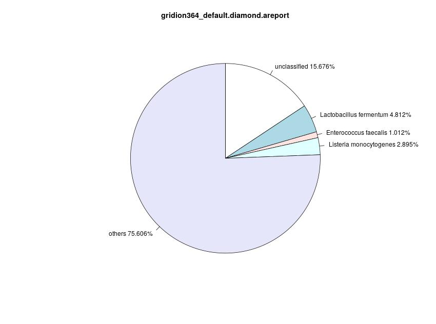
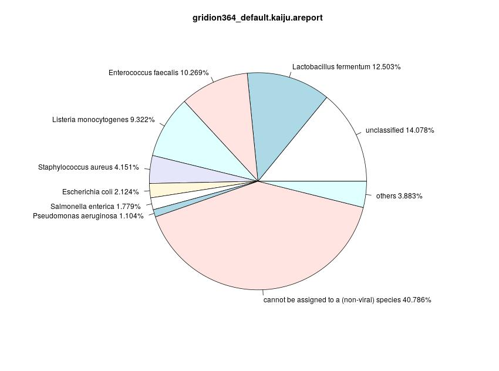
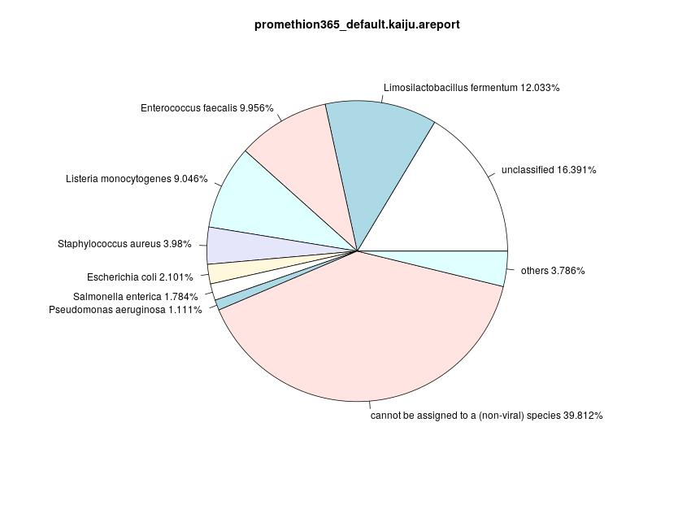
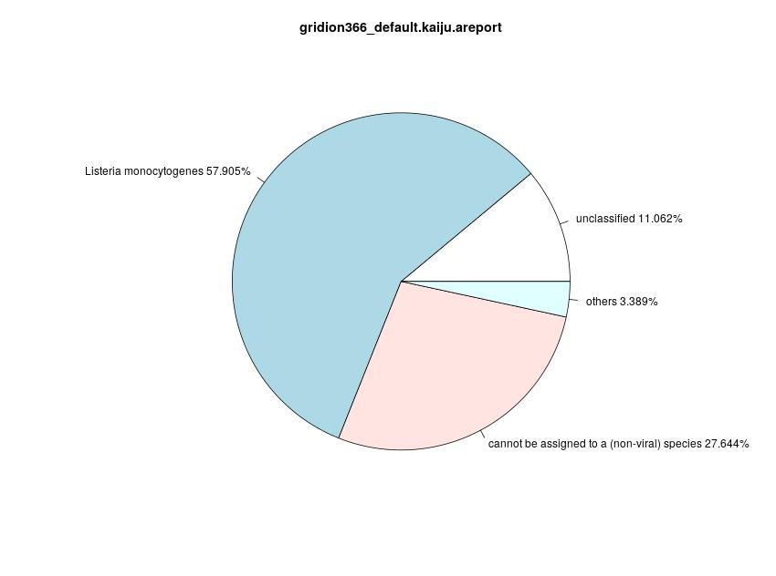
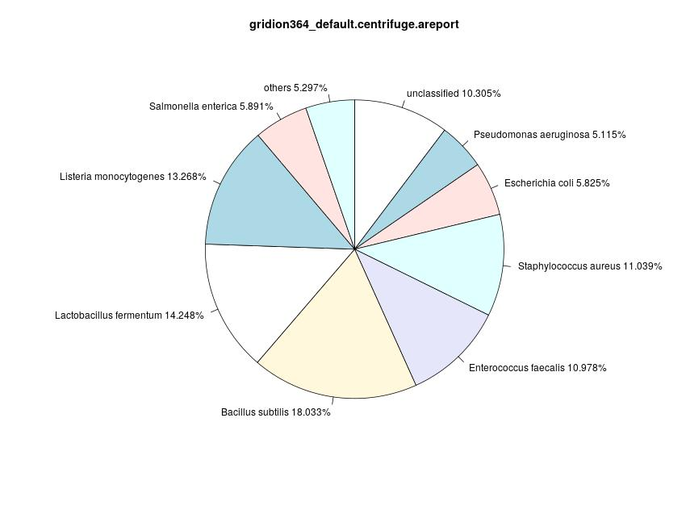
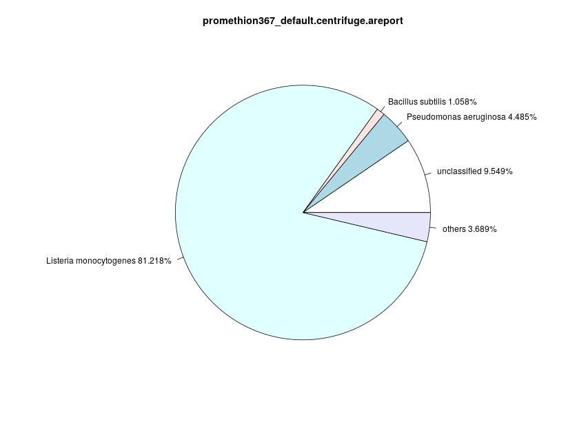
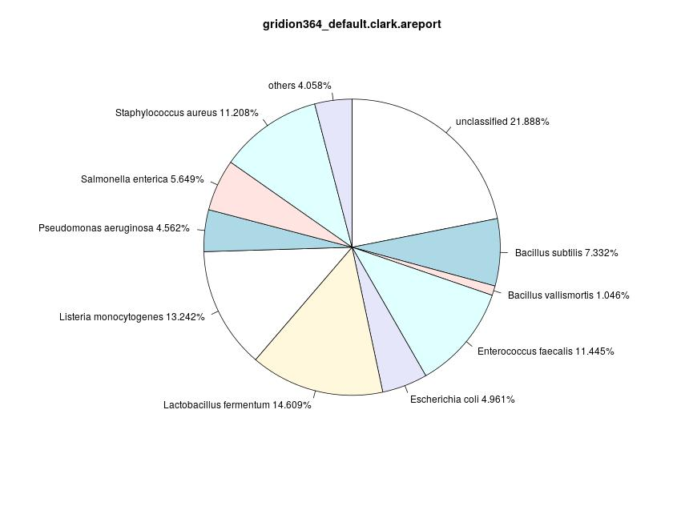
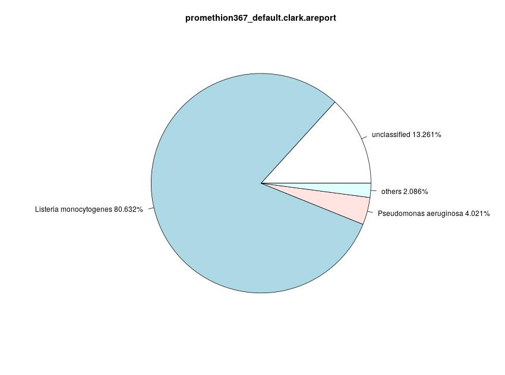
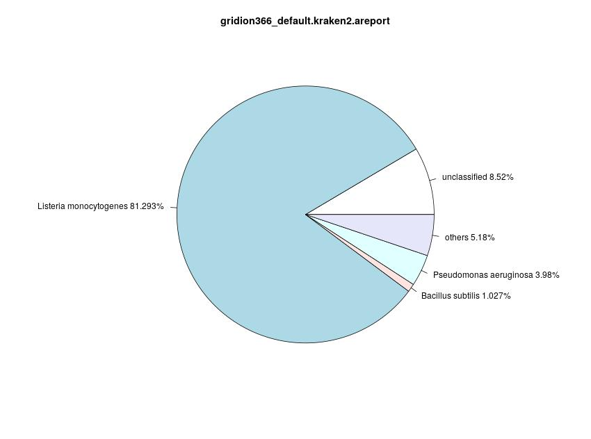
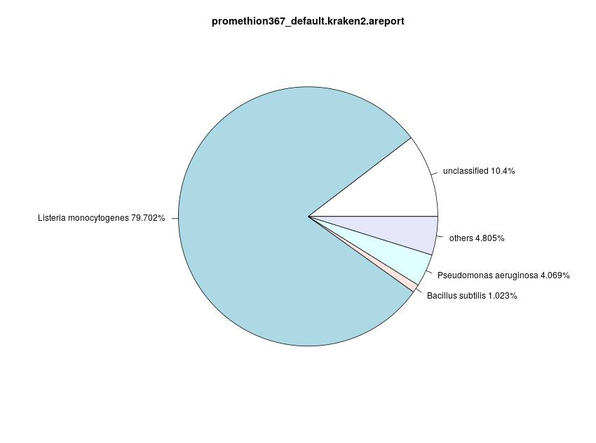

# Titel
# Introduction
# Material and Methods
## Data
The present dataset consists of four samples of the underlying ZymoBIOMICS Microbial Community Standards CS and CSII ([ZymoEven](https://www.zymoresearch.de/collections/zymobiomics-microbial-community-standards/products/zymobiomics-microbial-community-standard "Zymo Research Corporation, Irvine, CA, USA. Product D6300, Lot ZRC190633"), [ZymoLog](https://www.zymoresearch.de/collections/zymobiomics-microbial-community-standards/products/zymobiomics-microbial-community-standard-ii-log-distribution "Zymo Research Corporation, Irvine, CA, USA. Product D6310, Lot ZRC190842"), [DataPaper](https://doi.org/10.1093/gigascience/giz043 "Nicholls, S. M., Quick, J. C., Tang, S., & Loman, N. J. (2019). Ultra-deep, long-read nanopore sequencing of mock microbial community standards. Gigascience, 8(5), giz043.")). Those mock communities are composed of ten microbial species, eight bacteria and two fungi (Table 1). Each of these two standards is sequenced with GridION and PromethION, resulting in four samples, two for each standard. 
|      Name                    	|       Taxonomic ID        	| CS EVEN                	|                         	| CS LOG                 	|
|--------------------------	|--------------	|------------------------	|-------------------------	|------------------------	|
|                      	| 	| Expected Abundancy (%) 	| Estimated Abundance (%) 	| Expected Abundancy (%) 	|
| *Bacillus subtilis*        	| 1423         	| 12                     	| 19.32 (19.02)           	| 0.89                   	|
| *Listeria monocytogenes*   	| 1639         	| 12                     	| 14.56 (14.33)           	| 89.1                   	|
| *Enterococcus faecalis*    	| 1351         	| 12                     	| 12.24 (12.07)           	| 0.00089                	|
| *Staphylococcus aureus*    	| 1280         	| 12                     	| 11.28 (11.11)           	| 0.000089               	|
| *Salmonella enterica*      	| 28901        	| 12                     	| 9.99 (10.32)            	| 0.089                  	|
| *Escherichia coli*         	| 562          	| 12                     	| 9.93 (10.26)            	| 0.089                  	|
| *Pseudomonas aeruginosa*   	| 287          	| 12                     	| 9.7 (10.11)             	| 8.9                    	|
| *Lactobacillus fermentum*  	| 1613         	| 12                     	| 9.28 (9.13)             	| 0.0089                 	|
|  *Saccharomyces cerevisiae* 	| 4932         	| 2                      	| 1.92 (1.87)             	| 0.89                   	|
| *Cryptococcus neoformans*  	| 5207         	| 2                      	| 1.78 (1.77)             	| 0.00089                	|
|||

***Tabel 1: General information about the used species.*** This table shows the different species included in the mock communities with their taxonomic ID and expected as well as estimated proportion of genome. Note that the CS Even samples have differen measured proportions for GridION (PromethION) that expected. There is no information about the measured proportions for CS Log. The information are gathered from [DataPaper](https://doi.org/10.1093/gigascience/giz043 "Nicholls, S. M., Quick, J. C., Tang, S., & Loman, N. J. (2019). Ultra-deep, long-read nanopore sequencing of mock microbial community standards. Gigascience, 8(5), giz043."), [ZymoEven](https://www.zymoresearch.de/collections/zymobiomics-microbial-community-standards/products/zymobiomics-microbial-community-standard "Zymo Research Corporation, Irvine, CA, USA. Product D6300, Lot ZRC190633") and [ZymoLog](https://www.zymoresearch.de/collections/zymobiomics-microbial-community-standards/products/zymobiomics-microbial-community-standard-ii-log-distribution "Zymo Research Corporation, Irvine, CA, USA. Product D6310, Lot ZRC190842").   

| FASTQ accession         | ERR3152364 | ERR3152366 | ERR3152365    | ERR3152367    |
|-------------------------|------------|------------|---------------|---------------|
| Sequencer               | GridION    | GridION    | PromethION    | PromethION    |
| Zymo Community Standard | CS Even    | CS Log     | CS Even       | CS Log        |
| Working Name            | gridion364 | gridion366 | promethion365 | promethion367 |
| Reads (M)               | 3.59       | 3.67       | 35.7          | 34.5          |
| Quality (Median Q)      | 10.3       | 9.8        | 10.5          | 10.7          |
| N50 (kb)                | 5.3        | 5.4        | 5.4           | 5.4           |
|||

***Tabel 2: General information about the samples.***  This table shows different information about the four samples of this project, inclusinf information about the quality and read length of the samples as well as information about the used terms. In general, the PromethION samples are sequenced with greater depth resulting in more than 34 million reads, whereas the GridION samples have around 3.6 million reads. The quality of all samples ranges from 9.8 to 10.7. The N50 is 5.4 except for gridion364, where it is 5.3. The information are gathered from Nicholls et al., 2019 [DataPaper](https://doi.org/10.1093/gigascience/giz043 "Nicholls, S. M., Quick, J. C., Tang, S., & Loman, N. J. (2019). Ultra-deep, long-read nanopore sequencing of mock microbial community standards. Gigascience, 8(5), giz043.").   

The samples sequenced with PromethION show a higher read count with an average of 35.1 million reads and a median quality of 10.6. The GridION samples consist of approximately 3.5 million reads with a quality of 10 (Table 2) [DataPaper](https://doi.org/10.1093/gigascience/giz043 "Nicholls, S. M., Quick, J. C., Tang, S., & Loman, N. J. (2019). Ultra-deep, long-read nanopore sequencing of mock microbial community standards. Gigascience, 8(5), giz043.").
The ZymoBIOMICS Microbial Community Standards come with knowledge about the abundance of the different species, which differ for CS and CSII. In the following, CS will be referred to as CS Even, since the abundances are 12% for each bacterial species and 2% for the two fungi, whereas CSII abundances follow a log distribution and will be referred to as CS Log [ZymoEven](https://www.zymoresearch.de/collections/zymobiomics-microbial-community-standards/products/zymobiomics-microbial-community-standard "Zymo Research Corporation, Irvine, CA, USA. Product D6300, Lot ZRC190633"), [ZymoLog](https://www.zymoresearch.de/collections/zymobiomics-microbial-community-standards/products/zymobiomics-microbial-community-standard-ii-log-distribution "Zymo Research Corporation, Irvine, CA, USA. Product D6310, Lot ZRC190842"). The different abundances (expected and estimated) can be seen in Table 1 [DataPaper](https://doi.org/10.1093/gigascience/giz043 "Nicholls, S. M., Quick, J. C., Tang, S., & Loman, N. J. (2019). Ultra-deep, long-read nanopore sequencing of mock microbial community standards. Gigascience, 8(5), giz043.")[ZymoEven](https://www.zymoresearch.de/collections/zymobiomics-microbial-community-standards/products/zymobiomics-microbial-community-standard "Zymo Research Corporation, Irvine, CA, USA. Product D6300, Lot ZRC190633")[ZymoLog](https://www.zymoresearch.de/collections/zymobiomics-microbial-community-standards/products/zymobiomics-microbial-community-standard-ii-log-distribution "Zymo Research Corporation, Irvine, CA, USA. Product D6310, Lot ZRC190842").

## Tools

## Classification
|     Tool     |   Version  |   Type  |         Approach        |Default Database| Reference                                 |
|:------------:|:----------:|:-------:|:-----------------------:|:--------------:|:-----------------------------------------:|
|   Diamond    | 2.0.5      | Protein |        Alignment        | full Proteome Bacteria|http://www.diamondsearch.org/index.php |
|     Kaiju    |    1.7.4        | Protein |   FM-Index, Alignment  |refseq |              http://kaiju.binf.ku.dk/               |
|   CCMetagen  |    1.2.3        |   DNA   |*k*-mer, Alignment (KMA)| refseq |     https://github.com/vrmarcelino/CCMetagen       |
|  Centrifuge  |    1.0.4        |   DNA   |         FM-Index       | complete genomes|https://ccb.jhu.edu/software/centrifuge/manual.shtml |
|     CLARK    |    1.2.5        |   DNA   |      (spaced) *k*-mer  | refseq |         http://clark.cs.ucr.edu/Overview/          |
|    Kraken2   | 2.0.7-beta      |   DNA   |          *k*-mer          |-|         http://ccb.jhu.edu/software/kraken2/         |
|BugSeq| v1 | DNA | Pipeline?? |-| https://bugseq.com/free |

***Table X: Overview of used classification tools and general information.***

### Others
Additional to the classification tools, conda [conda](https://docs.anaconda.com/ "Anaconda Software Distribution. (2020). Anaconda Documentation. Anaconda Inc. Retrieved from https://docs.anaconda.com/") is used to organise and coordinate the different requirements of the tools. The tools themselves and their execution are structured with snakemake [snakemake](https://snakemake.readthedocs.io/en/stable/ "Köster, J., & Rahmann, S. (2012). Snakemake—a scalable bioinformatics workflow engine. Bioinformatics, 28(19), 2520-2522."). Some analysis is done with Python, R and Bash (Table 3).

|           	| Version   	| Reference                                                	|
|-----------	|-----------	|----------------------------------------------------------	|
| conda     	| 4.7.5     	| [conda](https://docs.anaconda.com/)                     	| 
| snakemake 	| 3.10.0    	| [snakemake](https://snakemake.readthedocs.io/en/stable/) 	| 
| Python    	| 3.8.8     	| [Python](https://www.python.org)                         	| 
| R         	| 3.4.4     	| [R](https://www.r-project.org/)                          	| 
| Bash      	| 4.4.12(1) 	|                                                       	| 
|||

***Table 3: Overview of additional software and the used versions***. 
## Metrics
The difficulty in bechmarking different classifiers since the chosen metrics can affect the evaluated performance.  
Precision and recall are considered as the most important metrics in this context, which are commonly used in bechmarking studies [[1]](https://doi.org/10.1016/j.cell.2019.07.010 "Simon, H. Y., Siddle, K. J., Park, D. J., & Sabeti, P. C. (2019). Benchmarking metagenomics tools for taxonomic classification. *Cell*, 178(4), 779-794."). The F1 score (harmonic mean of precision and recall) does not provide a realistic estimate of performance since it is based on a single precision and recall [[1]](https://doi.org/10.1016/j.cell.2019.07.010 "Simon, H. Y., Siddle, K. J., Park, D. J., & Sabeti, P. C. (2019). Benchmarking metagenomics tools for taxonomic classification. *Cell*, 178(4), 779-794.").  

Dealing with a lot of different tools involves dealing with a lot of different output formats, therefore all the following calculations are based on preprocessed output formats <tt>areport</tt>. The python scripts generating these outputs are specific for the different tools and can be found in [scripts](../scripts) with the names "(tool)Output.py". The areports consist of five columns: abundance, read count, taxonomic rank, taxonomic ID and scientific species name. For the analyses, only the entries of species are considered.

### Area-Under-Precision-Recall Curve
The Area-Under-Precision-Recall curve (AUPR) is a metric that combines those most important measures for metagenomic classification precision and recall [[1]](https://doi.org/10.1016/j.cell.2019.07.010 "Simon, H. Y., Siddle, K. J., Park, D. J., & Sabeti, P. C. (2019). Benchmarking metagenomics tools for taxonomic classification. *Cell*, 178(4), 779-794."). Precision is defined as precision=TP&frasl;TP+FP, i.e. the ratio between true positive (TP) classification results and the total number of classification results that are reported as true, including false positive (FP) hits. Recall or sensitivity, on the other hand, is defined as the ratio of true positives against all correct classifications including false negatives (FN), i.e. recall=TP&frasl;TP+FN. <!-- $precision=\frac{TP}{TP+FP}$ $recall=\frac{TP}{TP+FN}$-->  
The AUPR provides are more realistic measure for the performance of classifiers since it is not based on one raw value (precision, recall, F1, ...) but instead on a list of values for different thresholds [[1]](https://doi.org/10.1016/j.cell.2019.07.010 "Simon, H. Y., Siddle, K. J., Park, D. J., & Sabeti, P. C. (2019). Benchmarking metagenomics tools for taxonomic classification. *Cell*, 178(4), 779-794.").  
The AUPR curve can be used to evaluate precision and recall across different abundance thresholds. If the thresholds are chosen accordingly in the range from 0-1.0, the AUPR returns a single metric considering precision and recall. In short: This metric considers the number of correctly identified species [[1]](https://doi.org/10.1016/j.cell.2019.07.010 "Simon, H. Y., Siddle, K. J., Park, D. J., & Sabeti, P. C. (2019). Benchmarking metagenomics tools for taxonomic classification. *Cell*, 178(4), 779-794.").To identify true positive and false positive hit, a ground truth is needed, which is given due to the underlying ZymoBIOMICS Microbial Community Standards.  
The Precision-Recall Curves and the AUPR are calculated within the bash script [PRCurve.sh](../scripts/PRCurve.sh) which uses the python script [extractingVal4Vis.py](../scripts/extractingVal4Vis.py) for extracting the ground truth vectors and vectors with abundances of the species as an input for the R script  [visPRCurve.R](../scripts/visPRCurve.R) which then visualizes the values as a precision-recall curve. The used R package is [PRROC](https://cran.r-project.org/web/packages/PRROC/index.html "Jens Keilwagen, Ivo Grosse and Jan Grau (2014). Area under Precision-Recall Curves for Weighted and Unweighted Data. PLOS ONE (9) 3.").  
The resulting plots also contain a baseline, which is different for each sample and represents the lowest precision. It is the number of true positives divided by the number of all hits. 

### Abundance Profile Similarity
This metric is based on the abundances the different classifier detect for the given species of the sample. This might be important as the changes in microbial population composition play a role in phenotypic effect [Morgan2012](https://doi.org/10.1186/gb-2012-13-9-r79 "Morgan, X. C., Tickle, T. L., Sokol, H., Gevers, D., Devaney, K. L., Ward, D. V., ... & Huttenhower, C. (2012). Dysfunction of the intestinal microbiome in inflammatory bowel disease and treatment. Genome biology, 13(9), 1-18."). The abundance that is considered here is based in the number of reads assigned to a certain species divided by the total number of reads, therefore the read counts are not corrected for genome size.  
The abundance profiles are determined with the pairwise distances between the abundances of ground-truth and the abundances estimated by the classifiers at species level [[1]](https://doi.org/10.1016/j.cell.2019.07.010 "Simon, H. Y., Siddle, K. J., Park, D. J., & Sabeti, P. C. (2019). Benchmarking metagenomics tools for taxonomic classification. *Cell*, 178(4), 779-794."). To calculate the euclidion distance, the python script [abundanceProfileSimilarity.py](../scripts/abundanceProfileSimilarity.py) is used which uses Scipy's [spatial.distance](https://docs.scipy.org/doc/scipy/reference/generated/scipy.spatial.distance.euclidean.html) package.

### Multi Locus Sequence Typing
- *Bacillus subtilis* https://pubmlst.org/bigsdb?db=pubmlst_bsubtilis_seqdef&page=alleleInfo&locus=purH&allele_id=105
- *Listeria monocytogenes* 
- *Enterococcus faecalis* https://pubmlst.org/bigsdb?db=pubmlst_efaecalis_seqdef&page=locusInfo&locus=gki 
- *Staphylococcus aureus* https://pubmlst.org/bigsdb?db=pubmlst_saureus_seqdef&page=locusInfo&locus=gmk 
- *Salmonella enterica* 
- *Escherichia coli*
- *Pseudomonas aeruginosa* https://pubmlst.org/bigsdb?db=pubmlst_paeruginosa_seqdef&page=locusInfo&locus=acsA
- *Lactobacillus fermentum*
-  *Saccharomyces cerevisiae*
-  *Cryptococcus neoformans*

### Computational Requirements
Additionally to the quality of the different classifiers, the computational requirements are compared, i.e. the runtime for classification and database construction, if possible. They are measured using the <tt>benchmark</tt> option in <tt>snakemake</tt>, which returns the wall clock time of a task. <!-- The results are then compared to [[1]](https://doi.org/10.1016/j.cell.2019.07.010 "Simon, H. Y., Siddle, K. J., Park, D. J., & Sabeti, P. C. (2019). Benchmarking metagenomics tools for taxonomic classification. *Cell*, 178(4), 779-794.") -->

# Results and Discussion
## Comparison using the metrics
### Area under Preicison Recall Curve
### Abundance Profile Similarity
### Multi Locus Sequence Typing
### Time
|            	| kma            	| ccmetagen      	| clark                 	| centrifuge     	| kaiju          	| kraken2        	| diamond                 	|
|------------	|----------------	|----------------	|-----------------------	|----------------	|----------------	|----------------	|-------------------------	|
| gridion364 	| 0:58:33.332763 	| 0:00:19.790294 	| 0:42:52.407070	        | 3:28:34.545058 	| 3:30:55.818875 	| 0:08:55.109309 	|         -                	|       	
| gridion366 	| 2:03:00.949100 	| 0:00:12.93     	|    0:38:11.365624         | 4:45:25.614299 	| 3:40:21.257391 	| 0:11:17.788488 	| 4 days, 10:02:19.511836 	|       	
| promethion365 |            -    	|                -	|   5:35:37.829886          |1 day, 14:05:20.470530 |1 day, 9:14:36.672953   	|    1:26:06.232660            	|         -                	|       	
| promethion367 | -                 |-                  |5:24:34.567883             |1 day, 9:46:48.769590|1 day, 4:03:14.998929|1:27:05.043035 |- |

*** Table Time: Overview of time consumption for the default runs.*** Cells with a dash symbolize runs that did start or took unreasonable much time to start. The time benchmarks can be found in /mnt/fass1/kirsten/result/classification/benchmarks/default.

## Classification Results
The following section shows the species in the diagrams that had an abundance of at least one per cent. Reads that were not assigned to a species but other taxa, or are below the 1% mark, are summarized in "Others".
### Diamond
As mentioned earlier **[Tabelle X]**, Diamond can classify 84.23% and [PromethionEven Hier], respectively, for the CS Even samples (gridion364, promethion365, Link zu areports) with the default database. However, in the sample sequenced with GridION, Diamond is only able to identify *Limosilactobacillus fermentum* with 4.812% abundance, *Enterococcus faecalis* with 1.012% and *Listeria monocytogenes* with 2.895% on species level. Over 75% of the reads couldn’t be assigned to a species. For PromethION, the results are [similar, different, whatever]. therefore, Diamond is not able to classify the majority of the species in the sample, with many species having low abundances **[Tabelle X]**. This does [not] change for a greater sequencing depth.
|||
|:--|:--|
|\label{diamond364D}|**Gridion364: Piechart for Classification Results of Diamond (default)**. The diagram shows the three species classified with more than one per cent of reads assigned: *Listeria monocytogenes* (2.895%), *Enterococcus faecalis* (1.012%) and *Limosilactobacillus fermentum* (4,812%). 75.606% of the reads could not be assigned to a species, but other taxa and 15.676% of the reads could not be assigned at all.|
|\label{diamond365D}|**Promethion365: Piechart for Classification Results of Diamond (default).**|
|||

***Figure 1: Classification Results for Diamond, CS Even***    

The usage of the custom database [didn’t change a thing, changed everything, whatever → Verweis auf Anhang für Bilder]

Regarding the CS Log samples and the default database, *Listeria monocytogenes* is supposed to be the most abundant species in the sample. Diamond assigned 18.873% of reads of the GridION sample to that species. No other species could be accurately classified (Others: 69.076%), 12.051% of the reads are unclassified. Although the most abundant species can be identified using Diamond, the abundance does not come near the expected abundance [Table X]. [Similar, different, whatever] results can be observed for the PromethION sample.

|||
|:--|:--|
|\label{diamond366D}|**Gridion366: Piechart for Classification Results of Diamond (default)**. The only species with more than one per cent of reads assigned to is *Listeria monocytogenes* with 18.873%. 12.051% of the reads could not be assigned to any taxa, whereas 69.076% of the reads could not be assigned on species level or the corresponding species have an abundance below 1%.|
|\label{diamond367D}|**Promethion367: Piechart for Classification Results of Diamond (default).**|
|||

***Figure 2: Classification Results for Diamond, CS Log***    

The usage of the custom database [didn’t change a thing, changed everything, whatever → Verweis auf Anhang für Bilder]

An explanation for the poor results might be that Diamonds key features are pairwise alignments and frameshift alignments, the taxonomic classification is only considered as an output format. This might lead to poorer performance classifying the single reads.

Due to the relatively long runtime [Table Time], no specifications and different parameters are used.    

### Kaiju
|||
|:--|:--|
|\label{kaiju364D}|**Gridion364: Piechart for Classification Results of Kaiju (default)**. The diagram is parted into ten pieces, whereby 40.786% of reads could not be assigned to a taxon on species level, 3.883% of the reads are therefore assigned to a species but with less than 1% abundance and 14.078% of the reads are unclassified. The three most abundant species are *Lactobacillus fermentum*, *Enterococcus faecalis* and *Listeria monocytogenes* with 12.503%, 10.269% and 9.322%, respectively. The abundances of Pseudomonas aeruginoa, *Salmonella enterica*, *Escherichia coli* and *Staphylococcus aureus* range between 1.104% and 4.151%.|
|\label{kaiju365D}|**Promethion365: Piechart for Classification Results of Kaiju (default).** This diagram is as well parted into ten pieces, whereby 39.812% of reads could not be assigned to a taxon on species level, 3.786% of the reads are therefore assigned to a species but with less than 1% abundance and 16.391% of the reads are unclassified. The three most abundant species are *Lactobacillus fermentum*, *Enterococcus faecalis* and *Listeria monocytogenes* with 12.033%, 9.956% and 9.046%, respectively. The abundances of *Pseudomonas aeruginosa*, *Salmonella enterica*, *Escherichia coli* and *Staphylococcus aureus* range between 1.111% and 3.98%.|
|||

***Figure 3: Classification Results for Kaiju, CS Even***    

The other protein-based classifier used in this comparison is Kaiju. Considering the CS Even samples, Kaiju is able to identify seven of the ten species in both samples and the abundances are similar as well. 3.883% and 3.786% of reads could not be classified at all for GridION and PromethION, respectively and roughly 40% of the reads in both samples could not be assigned on the species level, therefore roughly 3.8% of the reads are assigned to species that do not reach the 1% abundance mark (Tabelle Y). The plots produced on Kaiju outputs include an entry for the percentage of reads that could not be assigned to any taxa on species level due to the way Kaiju generates outputs, see \ref{kaiju364D} and \ref{kaiju365D}. 
The identified species are *Lactobacillus fermentum*, *Enterococcus faecalis*,  *Listeria monocytogenes*, *Staphylococcus aureus*, *Escherichia coli*, *Salmonella enterica* and *Pseudomonas aeruginosa*. The default database does not include fungi, therefore the species that is not classified, although present in the reference database, is *Bacillus subtilis*. 

| Classified species 	| L. monocytogenes 	| E. faecalis 	| S. aureus 	| S. enterica 	| E. coli 	| P. aeruginosa 	| L. fermentum 	|   	| unclassified 	| others 	|     different taxon level   	|
|--------------------	|------------------	|-------------	|-----------	|-------------	|---------	|---------------	|--------------	|---	|--------------	|--------	|--------	|
| CS Even            	|                  	|             	|           	|             	|         	|               	|              	|   	|              	|        	|        	|
| GridION 364        	| 9.322            	| 10.269      	| 4.151     	| 1.779       	| 2.124   	| 1.104         	| 12.503       	|   	| 14.078       	| 3.883  	| 40.786 	|
| PromethION 365     	| 9.046            	| 9.956       	| 3.98      	| 1.784       	| 2.101   	| 1.111         	| 12.033       	|   	| 16.391       	| 3.786  	| 39.812 	|
| CS Log             	|                  	|             	|           	|             	|         	|               	|              	|   	|              	|        	|        	|
| GridION 366        	| 57.905           	| -           	| -         	| -           	| -       	| -             	| -            	|   	| 11.062       	| 3.389  	| 27.644 	|
| PromethION 367     	| 58.031           	| -           	| -         	| -           	| -       	| -             	| -            	|   	| 12.866       	| 3.135  	| 25.968 	|
|||

***Table 1: Abundances of classified species, Kaiju.*** The table shows the classificaiton results of Kaiju for all four samples considering the default database (in %). Note that the species that is present in the reference database but no classified is *Bacillus subtilis*. The two fungis can not be identified with the default database, because it only includes microbial genomes or proteomes.    

The CS Log samples are similar as well.  Kaiju is able to assign 57.905% and 58.031% of the reads to *Listeria monocytogenes*, depending on the sequencing machine (GridION, PromethION). Roughly 11% and 12.866% of the reads could not be assigned at all, whereas 27.644% and 25.968% could not be assigned to a taxon on species level, respectively. Around 3% of the reads are assigned to species with less than 1% abundance, see \ref{kaiju364D} and \ref{kaiju365D}. 

|||
|:--|:--|
|\label{kaiju366D}|**Gridion364: Piechart for Classification Results of Kaiju (default)**.  It is visible that the majority of reads is assigned to *Listeria monocytogenes* with 57.905%. Most of the remaining reads (27.644%) could not be assigned to anything on species level, therefore 3.389% of the reads are assigned to a species, but this species does not reach the abundance of 1%. 11.062% of the reads are unclassified.|
|\label{kaiju367D}|**Promethion365: Piechart for Classification Results of Kaiju (default).** It is visible that the majority of reads is assigned to *Listeria monocytogenes* with 58.031%. Most of the remaining reads (25.968%) could not be assigned to anything on species level, therefore 3.135% of the reads are assigned to a species, but this species does not reach the abundance of 1%. 12.866% of the reads are unclassified.|
|||

***Figure 4: Classification Results for Kaiju, CS Log***    

### CCMetagen
CCMetagen uses the KMA for aligning, which is designed to map reads against redundant databases. The tool is supposed to work for large datasets, however, no classification could be done for the deep sequences samples with PromethION. KAM throws an error stating not enough space on the device. Therefore, there are only one CS Even and one CS Log sample to analyse.
|||
|:--|:--|
|\label{ccmetagen364D}|**Gridion364: Piechart for Classification Results of CCMetagen (default).**  26.736% of reads couöd not be assigned to any taxon, whereas 19.458% of reads are not assigned to a taxon on species level or the species do not reach 1% abundance. The identified species are *Enterococcus faecalis* (1.795%), *Escherichia coli* (2.069%), *Pseudomonas aeruginosa* (3.387%), *Limosilactobacillus fermentum* (9.083%), *Staphylococcus aureus* (9.837%), *Listeria monocytogenes* (11.326%) and *Bacillus spizizenii* (16.309%).|
|||

***Figure X: Classification Results for CCMetagen, CS Even, GridION***    

CCMetagen is not able to classify 26.736% of the reads of CS Even and 19.458% of the reads could not be assigned to a taxon on species level. The remaining reads are assigned to species with abundances between 1.795% (Enterococcus faecalis) and 16.309 (*Bacillus spizizenii*). In general, CCMetagen is able to classify 5 species correctly (Figure). *Limosilactobacillus fermentum* and *Bacillus spizizenii* are, however, close relatives to *Lactobacillus fermentum* and *Bacillus subtilis* [QUELLE]. Again, the default databse does not include fungal genomes, therefore those cannot be considered here.

Considering the CS Log sample sequenced with GridION, CCMetagen is able to assign 71.494% of reads to *Listeria monocytogenes* and 2.822% to *Pseudomonas aeruginosa*. 0.279% are assigned to others and 25.405% are unclassified.

|||
|:--|:--|
|\label{ccmetagen366D}|**Gridion366: Piechart for Classification Results of CCMetagen (default).**  26.736% of reads couöd not be assigned to any taxon, whereas 19.458% of reads are not assigned to a taxon on species level or the species do not reach 1% abundance. The identified species are *Enterococcus faecalis* (1.795%), *Escherichia coli* (2.069%), *Pseudomonas aeruginosa* (3.387%), *Limosilactobacillus fermentum* (9.083%), *Staphylococcus aureus* (9.837%), *Listeria monocytogenes* (11.326%) and *Bacillus spizizenii* (16.309%).|
|||

***Figure X: Classification Results for CCMetagen, CS Log, GridION***    

### Centrifuge
For the CS Even samples, Centrifuge is able to classify 89.504% and 87.086% for GridION364 and PromethION365, respectively. Between 3.5% and 3.9% of the reads could not be assigned to a taxon on species level. 
Since the default database of Centrifuge does not contain fungal genomes, Centrifuge is only able to identify the eight bacterial species. Those species are identified with abundances ranging between 6% for *Salmonella enterica* and 18.368% for Bacillus substilis for GridION and between 5.936% for *Salmonella enterica* and 17.724% for *Bacillus subtilis* for PromethION, respectively (see Table 2). The classification results therefore do not improve with greater sequencing depth. 

|||
|:--|:--|
|\label{centrifuge364D}|**Gridion364: Piechart for Classification Results of Centrifuge (default)**. Centrifuge is able to identify all bacterial species in the sample with relatively high abundances (6% to 18.368%). 10.496% of the reads could not be classified and 3.541% could not be assigned to a taxon on species level or exceed the 1% abundance mark.|
|\label{centrifuge365D}|**Promethion365: Piechart for Classification Results of Centifuge (default).** Centrifuge is able to identify all bacterial species in the sample with relatively high abundances (5.936% to 17.724%). 12.914% of the reads could not be classified and 3.974% could not be assigned to a taxon on species level or exceed the 1% abundance mark.|
|||

***Figure 5: Classification Results for Centrifuge, CS Even***    

| Classified species 	| B. subtilis 	| L. monocytogenes 	| E. faecalis 	| S. aureus 	| S. enterica 	| E. coli 	| P. aeruginosa 	| L. fermentum 	|   	| unclassified 	| other 	|
|--------------------	|-------------	|------------------	|-------------	|-----------	|-------------	|---------	|---------------	|--------------	|---	|--------------	|-------	|
| CS Even            	|             	|                  	|             	|           	|             	|         	|               	|              	|   	|              	|       	|
| GridION 364        	| 18.368      	| 13.514           	| 11.182      	| 11.244    	| 6           	| 5.933   	| 5.21          	| 14.513       	|   	| 10.496       	| 3.541 	|
| PromethION 365     	| 17.724      	| 13.018           	| 10.803      	| 10.782    	| 5.936       	| 5.886   	| 5.204         	| 13.759       	|   	| 12.914       	| 3.974 	|
| CS Log             	|             	|                  	|             	|           	|             	|         	|               	|              	|   	|              	|       	|
| GridION 366        	| 1.085       	| 84.591           	|     -        	|    -       	|     -        	|       -  	| 4.653         	|      -        	|   	| 7.214        	| 2.457 	|
| PromethION 367     	| 1.069       	| 82.068           	|      -       	|   -        	|       -      	|      -   	| 4.532         	|       -       	|   	| 9.649        	| 2.682 	|
|||

***Table 2: Abundances of classified species, Centrifuge.*** The table shows the classificaiton results of Centrifuge for all four samples considering the default database (in %). The two fungis can not be identified with the default database, because it only includes microbial genomes.    

The CS Log results show similarity betweent the samples as well. Three species can be identified with the majotrity of reads assigned to *Listeria monocytogenes* (84.591% and 82.068% for GridIOn and PromethION, respectively). Centrifuge assigned about 1% of the reads to *Bacillus subtilis* and 4.5% to *Pseudomonas aeruginosa*. The sample sequences with GridION shows slightly less uncassified reads with 7.214% in contrast to 9.649% for PromethION. There are about 2.5% reads that could not be assigned to a taxon on species level (Table, Picture).

|||
|:--|:--|
|\label{centrifuge366D}|**Gridion366: Piechart for Classification Results of Centrifuge (default)**. In this sample, 8.52% of reads could not be classified at all and 5.18% of reads are assigned to taxa that are not on species level or the corresponding species has below 1% abundance. The remaining reads are assigned to *Listeria monocytogenes* (81.293%), *Pseudomonas aeruginosa* (3.98%) and *Bacillus subtilis* (1.027%)|
|\label{centrifuge367D}|**Promethion367: Piechart for Classification Results of Centifuge (default).** In this sample, 10.4% of reads could not be classified at all and 4.805% of reads are assigned to taxa that are not on species level or the corresponding species has below 1% abundance. The remaining reads are assigned to *Listeria monocytogenes* (79.702%), *Pseudomonas aeruginosa* (4.069%) and *Bacillus subtilis* (1.023%).|
|||

***Figure X: Classification Results for Centrifuge, CS Log***    

[Results Custom Database]
[Results Restricted Run]
   

### CLARK
As for CLARK, the results of the CS Even samples are similar for GridION and PromethION. The default database does not include fungi, therefore they cannot be considered here. 
Additional to the expected species, CLARK assigned 1.046% and 1.041% of the reads to Bacillus vallismortis for GridION and PromethION, respectively. 21.888% (22.801%) of reads are not classified, 4.068% (4.979%) could not be assigned to a taxon on species level. The bacterial species have abundances ranging from 4.562% to 14.609% and 4.66% to 13.894% (Table X). As seen for other classifiers, reads are assigned to *Limosilactobacillus fermentum*, which is a close relative to *Lactobacillus fermentum* (Figure X).
|||
|:--|:--|
|\label{clark364D}|**Gridion364: Piechart for Classification Results of CLARK (default)**. Since 25.946% of reads could not be assigned at all or to a species, the remaining reads are assigned to *Bacillus subtilis*, Bacillus vallismortis, *Enterococcus faecalis*,  *Escherichia coli*, *Limosilactobacillus fermentum*, *Listeria monocytogenes*, *Pseudomonas aeruginosa*, *Salmonella enterica* and *Staphylococcus aureus*.|
|\label{clark365D}|**Promethion365: Piechart for Classification Results of CLARK (default).** Since 27.78%% of reads could not be assigned at all or to a species, the remaining reads are assigned to *Bacillus subtilis*, Bacillus vallismortis, *Enterococcus faecalis*,  *Escherichia coli*, *Limosilactobacillus fermentum*, *Listeria monocytogenes*, *Pseudomonas aeruginosa*, *Salmonella enterica* and *Staphylococcus aureus*.|
|||

***Figure 5: Classification Results for Centrifuge, CS Even***    

| Classified species 	| B. subtilis 	| L. monocytogenes 	| E. faecalis 	| S. aureus 	| S. enterica 	| E. coli 	| P. aeruginosa 	| L. fermentum 	| B. vallismortis 	|   	| unclassified 	| other 	|
|--------------------	|-------------	|------------------	|-------------	|-----------	|-------------	|---------	|---------------	|--------------	|-----------------	|---	|--------------	|-------	|
| CS Even            	|             	|                  	|             	|           	|             	|         	|               	|              	|                 	|   	|              	|       	|
| GridION 364        	| 7.332       	| 13.242           	| 11.445      	| 11.208    	| 5.649       	| 4.961   	| 4.562         	| 14.609       	| 1.046           	|   	| 21.888       	| 4.068 	|
| PromethION 365     	| 7.219       	| 12.79            	| 11.064      	| 10.809    	| 5.651       	| 5.092   	| 4.66          	| 13.894       	| 1.041           	|   	| 22.801       	| 4.979 	|
| CS Log             	|             	|                  	|             	|           	|             	|         	|               	|              	|                 	|   	|              	|       	|
| GridION 366        	| -           	| 82.708           	| -           	| -         	| -           	| -       	| 3.997         	| -            	| -               	|   	| 11.764       	| 1.531 	|
| PromethION 367     	| -           	| 80.632           	| -           	| -         	| -           	| -       	| 4.021         	| -            	| -               	|   	| 13.261       	| 2.086 	|
|||

***Table 2: Abundances of classified species, CLARK.*** The table shows the classificaiton results of CLARK for all four samples considering the default database (in %). Note that, in this case, L. fermentum refers to *Limosilactobacillus fermentum*. The two fungis can not be identified with the default database, because it only includes microbial genomes.   

CLARK is also able to identify *Listeria monocytogenes* as the most prominent species in the CS Log samples. 82.708% and 80.632% of the reads are assigned to this species from the GridION and PromethION sample, respectively. In both samples, *Pseudomonas aeruginosa* can be identified as well with 3.997% and 4.021%, respectively. Roughly 12% of the reads could not be classified and roughly 1.75% of the reads could not be assigned to a taxon on species level (Figure X).
|||
|:--|:--|
|\label{clark366D}|**Gridion366: Piechart for Classification Results of CLARK (default)**. *Listeria monocytogenes* and *Pseudomonas aeruginosa* are the identified species with 82.708% of reads and 3.997%, respectively. 11.764% of reads are not classified, whereas 1.531% of reads are not assigned to a taxon on species level or the assigned species has an abundance below 1%. |
|\label{clark367D}|**Promethion367: Piechart for Classification Results of CLARK (default).**  *Listeria monocytogenes* and *Pseudomonas aeruginosa* are the identified species with 80.632% of reads and 4.021%, respectively. 31.261% of reads are not classified, whereas 2.086% of reads are not assigned to a taxon on species level or the assigned species has an abundance below 1%.|
|||

***Figure 5: Classification Results for Centrifuge, CS Log***    

[Custom Database]
[Resttricted Parameters?]    

### Kraken2
The Kraken default database includes the fungal genomes, therefore this is the only classifier that has the possibility to accurately identify all present species. Both the GridION and PromethION sequences sample are able to identify all ten species, no other species are identified. The read abundances range from 2.003% to 17.514% for GridION364 and 1.954% to 16.991% for PromethION365. On average for the CS Even samples, 10% of reads could not be classified at all, and 4.5% are not assigned on species level (Figure Y, Table X(OBEN)).

|||
|:--|:--|
|\label{kraken364D}|**Gridion364: Piechart for Classification Results of Kraken2 (default)**. Kraken2 identified the species present in the CS Even samples, the abundances range from 2.003% for *Cryptococcus neoformans* to 17.514% for *Bacillus subtilis*. 9.13% of the reads are unclassified and 4.566% of the reads are assigned to a taxon on a different level (not species) or the corresponding species has no abundance of 1%.|
|\label{kraken365D}|**Promethion365: Piechart for Classification Results of CLARK (default).** Kraken2 identified the species present in the CS Even samples, the abundances range from 1.954% for *Cryptococcus neoformans* to 16.991% for *Bacillus subtilis*. 11.42% of the reads are unclassified and 4.569% of the reads are assigned to a taxon on a different level (not species) or the corresponding species has no abundance of 1%. |
|||

***Figure Y: Classification Results for Kraken2, CS Even***    

The classification results for CS Log are similar between the sequencing methods as well. The majority of reads is assigned to *Listeria monocytogenes* (81.293% and 79.702%, respectively). The other two identified species are *Pseudomonas aeruginosa* and *Bacillus subtilis* with roughly 4% and 1%, respectively (Figure A).
|||
|:--|:--|
|\label{kraken366D}|**Gridion366: Piechart for Classification Results of Kraken2 (default)**. Kraken2 identified the species present in the CS Even samples, the abundances range from 2.003% for *Cryptococcus neoformans* to 17.514% for *Bacillus subtilis*. 9.13% of the reads are unclassified and 4.566% of the reads are assigned to a taxon on a different level (not species) or the corresponding species has no abundance of 1%.|
|\label{kraken367D}|**Promethion367: Piechart for Classification Results of CLARK (default).** Kraken2 identified the species present in the CS Even samples, the abundances range from 1.954% for *Cryptococcus neoformans* to 16.991% for *Bacillus subtilis*. 11.42% of the reads are unclassified and 4.569% of the reads are assigned to a taxon on a different level (not species) or the corresponding species has no abundance of 1%. |
|||

***Figure A: Classification Results for Kraken2, CS Log***    

[Custom Databse]
[Restricted Parameter]
### BugSeq
### MetaMaps

## Stuff that didn't work
# Conclusion
# Attachments and Supplementary Information
# Citations

[[1]](https://doi.org/10.1016/j.cell.2019.07.010) Simon, H. Y., Siddle, K. J., Park, D. J., & Sabeti, P. C. (2019). Benchmarking metagenomics tools for taxonomic classification. *Cell*, 178(4), 779-794.

[conda](Anaconda Software Distribution. (2020). Anaconda Documentation. Anaconda Inc. Retrieved from https://docs.anaconda.com/)

[PRROC](https://cran.r-project.org/web/packages/PRROC/index.html "Jens Keilwagen, Ivo Grosse and Jan Grau (2014). Area under Precision-Recall Curves for Weighted and Unweighted Data. PLOS ONE (9) 3.").

[DataPaper](https://doi.org/10.1093/gigascience/giz043) Nicholls, S. M., Quick, J. C., Tang, S., & Loman, N. J. (2019). Ultra-deep, long-read nanopore sequencing of mock microbial community standards. Gigascience, 8(5), giz043.

[Morgan2012](https://doi.org/10.1186/gb-2012-13-9-r79) Morgan, X. C., Tickle, T. L., Sokol, H., Gevers, D., Devaney, K. L., Ward, D. V., ... & Huttenhower, C. (2012). Dysfunction of the intestinal microbiome in inflammatory bowel disease and treatment. Genome biology, 13(9), 1-18.

[ZymoEven](https://www.zymoresearch.de/collections/zymobiomics-microbial-community-standards/products/zymobiomics-microbial-community-standard) Zymo Research Corporation, Irvine, CA, USA. Product D6300, Lot ZRC190633

[ZymoLog](https://www.zymoresearch.de/collections/zymobiomics-microbial-community-standards/products/zymobiomics-microbial-community-standard-ii-log-distribution) Zymo Research Corporation, Irvine, CA, USA. Product D6310, Lot ZRC190842