# Titel
# Introduction
!!!
# Material and Methods
## Data
The present dataset consists of four samples of the underlying ZymoBIOMICS Microbial Community Standards CS and CSII ([ZymoEven](https://www.zymoresearch.de/collections/zymobiomics-microbial-community-standards/products/zymobiomics-microbial-community-standard "Zymo Research Corporation, Irvine, CA, USA. Product D6300, Lot ZRC190633"), [ZymoLog](https://www.zymoresearch.de/collections/zymobiomics-microbial-community-standards/products/zymobiomics-microbial-community-standard-ii-log-distribution "Zymo Research Corporation, Irvine, CA, USA. Product D6310, Lot ZRC190842"), [DataPaper](https://doi.org/10.1093/gigascience/giz043 "Nicholls, S. M., Quick, J. C., Tang, S., & Loman, N. J. (2019). Ultra-deep, long-read nanopore sequencing of mock microbial community standards. Gigascience, 8(5), giz043.")). Those mock communities are composed of ten microbial species, eight bacteria and two fungi (Table 1). Each of these two standards is sequenced with GridION and PromethION, resulting in four samples, two for each standard. 
|      Name                    	|Type|       Taxonomic ID        	| CS EVEN                	|                         	| CS LOG                 	|
|--------------------------	|--------------	|------|------------------------	|-------------------------	|------------------------	|
|                      	| 	|| Expected Abundancy (%) 	| Estimated Abundance (%) 	| Expected Abundancy (%) 	|
| *Bacillus subtilis*        | Gram+	| 1423         	| 12                     	| 19.32 (19.02)           	| 0.89                   	|
| *Listeria monocytogenes*   |Gram+	| 1639         	| 12                     	| 14.56 (14.33)           	| 89.1                   	|
| *Enterococcus faecalis*    |Gram+	| 1351         	| 12                     	| 12.24 (12.07)           	| 0.00089                	|
| *Staphylococcus aureus*    |Gram+	| 1280         	| 12                     	| 11.28 (11.11)           	| 0.000089               	|
| *Salmonella enterica*      |Gram-	| 28901        	| 12                     	| 9.99 (10.32)            	| 0.089                  	|
| *Escherichia coli*         |Gram-	| 562          	| 12                     	| 9.93 (10.26)            	| 0.089                  	|
| *Pseudomonas aeruginosa*   |Gram-	| 287          	| 12                     	| 9.7 (10.11)             	| 8.9                    	|
| *Lactobacillus fermentum*  |Gram+	| 1613         	| 12                     	| 9.28 (9.13)             	| 0.0089                 	|
|  *Saccharomyces cerevisiae*|Yeast 	| 4932         	| 2                      	| 1.92 (1.87)             	| 0.89                   	|
| *Cryptococcus neoformans*  |Yeast	| 5207         	| 2                      	| 1.78 (1.77)             	| 0.00089                	|

***Tabel 1: General information about the used species.*** This table shows the different species included in the mock communities with their taxonomic ID and expected as well as estimated proportion of genome. Note that the CS Even samples have differen measured proportions for GridION (PromethION) that expected. There is no information about the measured proportions for CS Log. The information are gathered from [DataPaper](https://doi.org/10.1093/gigascience/giz043 "Nicholls, S. M., Quick, J. C., Tang, S., & Loman, N. J. (2019). Ultra-deep, long-read nanopore sequencing of mock microbial community standards. Gigascience, 8(5), giz043."), [ZymoEven](https://www.zymoresearch.de/collections/zymobiomics-microbial-community-standards/products/zymobiomics-microbial-community-standard "Zymo Research Corporation, Irvine, CA, USA. Product D6300, Lot ZRC190633") and [ZymoLog](https://www.zymoresearch.de/collections/zymobiomics-microbial-community-standards/products/zymobiomics-microbial-community-standard-ii-log-distribution "Zymo Research Corporation, Irvine, CA, USA. Product D6310, Lot ZRC190842").   

| FASTQ accession         | ERR3152364 | ERR3152366 | ERR3152365    | ERR3152367    |
|-------------------------|------------|------------|---------------|---------------|
| Sequencer               | GridION    | GridION    | PromethION    | PromethION    |
| Zymo Community Standard | CS Even    | CS Log     | CS Even       | CS Log        |
| Working Name            | gridion364 | gridion366 | promethion365 | promethion367 |
| Reads (M)               | 3.59       | 3.67       | 35.7          | 34.5          |
| Quality (Median Q)      | 10.3       | 9.8        | 10.5          | 10.7          |
| N50 (kb)                | 5.3        | 5.4        | 5.4           | 5.4           |

***Tabel 2: General information about the samples.***  This table shows different information about the four samples of this project, inclusinf information about the quality and read length of the samples as well as information about the used terms. In general, the PromethION samples are sequenced with greater depth resulting in more than 34 million reads, whereas the GridION samples have around 3.6 million reads. The quality of all samples ranges from 9.8 to 10.7. The N50 is 5.4 except for gridion364, where it is 5.3. The information are gathered from Nicholls et al., 2019 [DataPaper](https://doi.org/10.1093/gigascience/giz043 "Nicholls, S. M., Quick, J. C., Tang, S., & Loman, N. J. (2019). Ultra-deep, long-read nanopore sequencing of mock microbial community standards. Gigascience, 8(5), giz043.").   

The samples sequenced with PromethION show a higher read count with an average of 35.1 million reads and a median quality of 10.6. The GridION samples consist of approximately 3.5 million reads with a quality of 10 (Table 2) [DataPaper](https://doi.org/10.1093/gigascience/giz043 "Nicholls, S. M., Quick, J. C., Tang, S., & Loman, N. J. (2019). Ultra-deep, long-read nanopore sequencing of mock microbial community standards. Gigascience, 8(5), giz043.").
The ZymoBIOMICS Microbial Community Standards come with knowledge about the abundance of the different species, which differ for CS and CSII. In the following, CS will be referred to as CS Even, since the abundances are 12% for each bacterial species and 2% for the two fungi, whereas CSII abundances follow a log distribution and will be referred to as CS Log [ZymoEven](https://www.zymoresearch.de/collections/zymobiomics-microbial-community-standards/products/zymobiomics-microbial-community-standard "Zymo Research Corporation, Irvine, CA, USA. Product D6300, Lot ZRC190633"), [ZymoLog](https://www.zymoresearch.de/collections/zymobiomics-microbial-community-standards/products/zymobiomics-microbial-community-standard-ii-log-distribution "Zymo Research Corporation, Irvine, CA, USA. Product D6310, Lot ZRC190842"). The different abundances (expected and estimated) can be seen in Table 1 [DataPaper](https://doi.org/10.1093/gigascience/giz043 "Nicholls, S. M., Quick, J. C., Tang, S., & Loman, N. J. (2019). Ultra-deep, long-read nanopore sequencing of mock microbial community standards. Gigascience, 8(5), giz043.")[ZymoEven](https://www.zymoresearch.de/collections/zymobiomics-microbial-community-standards/products/zymobiomics-microbial-community-standard "Zymo Research Corporation, Irvine, CA, USA. Product D6300, Lot ZRC190633")[ZymoLog](https://www.zymoresearch.de/collections/zymobiomics-microbial-community-standards/products/zymobiomics-microbial-community-standard-ii-log-distribution "Zymo Research Corporation, Irvine, CA, USA. Product D6310, Lot ZRC190842").

## Tools
The detailed commands for the classifcation and postprocessing of the outputs can be seen in [Snakefile](../Snakefile), the detailed commands for database construction are saved in [Snakefile_DB](../Snakefile_DB).  

Every tool is used on two different databases: The default database describes the databases or indices provided by the tool. The custom database for each tool is based on the same sequences: The refseq sequences for bacteria and fungi downloaded from [NCBI](ftp://ftp.ncbi.nlm.nih.gov/ "FTP Server") as of 01/04/2021, see [command](../.paths.md "Line 1ff., 'Bacterial and Fungal RefSeq'"). For the protein tools, the bacterial proteome sequences present at this [location](../.paths.md "Line 4, 'Bacterial Proteome'") are used, the fungal sequences, stored [here](../.paths.md "Line 5, 'Fungal Proteome'") are downloaded from [NCBI](ftp://ftp.ncbi.nlm.nih.gov/ "FTP Server") as of 12/02/2021.
### Classification
|     Tool     |   Version  |   Type  |         Approach        |Default Database| Reference                                 |
|:------------:|:----------:|:-------:|:-----------------------:|:--------------:|:-----------------------------------------:|
|   Diamond    | 2.0.5      | Protein |        Alignment        | full Proteome Bacteria|http://www.diamondsearch.org/index.php |
|     Kaiju    |    1.7.4        | Protein |   FM-Index, Alignment  |refseq |              http://kaiju.binf.ku.dk/               |
|   CCMetagen  |    1.2.3        |   DNA   |*k*-mer, Alignment (KMA)| refseq |     https://github.com/vrmarcelino/CCMetagen       |
|  Centrifuge  |    1.0.4        |   DNA   |         FM-Index       | refseq|https://ccb.jhu.edu/software/centrifuge/manual.shtml |
|     CLARK    |    1.2.5        |   DNA   |       *k*-mer  | refseq |         http://clark.cs.ucr.edu/Overview/          |
|    Kraken2   | 2.0.7-beta      |   DNA   |          *k*-mer          |-|         http://ccb.jhu.edu/software/kraken2/         |
|BugSeq| v1 | DNA | Pipeline?? |-| https://bugseq.com/free |

***Table X: Overview of used classification tools and general information.***
!!! date of creation

#### Diamond
This tool is a sequence aligner for protein and translated DNA searches specifically designed for big sequence data [Diamond](https://doi.org/10.1038/nmeth.3176 "Buchfink, B., Xie, C., & Huson, D. H. (2015). Fast and sensitive protein alignment using DIAMOND. Nature methods, 12(1), 59-60.").  
The default database is based on the [full bacterial proteome](../.paths.md "Line 4, 'Bacterial Proteome'") (as of 27/07/2019), whereas the custom database consists of the beforementioned refseq sequences of bacterial and fungal proteome.

    diamond makedb --in {input.faa} -d prefix --taxonmap {map} --taxonnodes {nodes} --taxonnames {names}

    # Parameters:
    #   -d      prefix of database file name

To use DIAMOND for taxonomic classification, the output format has to be defined. This is done with <tt>--outfmt 102</tt>.

    diamond blastx --db {database} -q {input.fastq} -o {output} -p {threads} --outfmt 102 

    # Parameters:
    #   --outfmt    output format, 102 for taxonomic classification (default: BLAST tabular format)

#### Kaiju
Kaiju [Kaiju](https://doi.org/10.1186/s13062-018-0208-7 "Menzel, P., Ng, K. L., & Krogh, A. (2016). Fast and sensitive taxonomic classification for metagenomics with Kaiju. *Nature communications*,* 7(1), 1-9.") is a fast and sensitive tool for taxonomic classification of metagenomic samples that uses a reference database of annotated protein-coding genes of microbial genomes. The DNA reads are translated into the six reading frames and split according to the stop codons. The resulting fragments are sorted regarding their length and due to the usage of the Ferragina and Mazini-Index (FM-Index), exact matches can be searched between read and database-reference in effient time by Kaiju.  
The default database consists of the downloaded index [<tt>kaiju\_db\_refseq\_2020-05-25</tt>](../.paths.md "Line 6, 'Kaiju Default Index'") which was downloaded from the [Kaiju webserver](http://kaiju.binf.ku.dk/server) as of 28/11/2020.  
Building a custom database consists of two steps and the sequence headers need to consist of the NCBI taxonomic ID and optinally a prefix spearated with an underscore. To achieve this format, the protein sequence file [refseq_bac_fung.faa](../.paths.md "Line 7, 'RefSeq Proteome Bacteria and Fungi'") is altered with the script [changeHeaderKaiju.py](scripts/../../scripts/changeHeaderKaiju.py), which is based on a script of [CCMetagen](https://github.com/vrmarcelino/CCMetagen/blob/master/benchmarking/rename_nt/rename_nt.py "Renaming script from CCMetagen"). The commands to build the custom database can be seen in the following box.
    
    kaiju-mkbwt -n {threads} -a ACDEFGHIKLMNPQRSTVWY -o {bwt} {input.faa}
    kaiju-mkfmi -r {bwt}

    # Parameters:
    #   -a      used alphabet (basic proteins)
    #   -r      removing unused files
    #   -o      name of the BWT output file

<tt>kaiju-mkbwt</tt> takes a fasta file as an input and generates the corresponding Burrows-Wheeler-Transform (BWT), whereas <tt>kaiju-mkfmi</tt> uses the BWT as an input to generate the needed index file.  

To generate reports, the following command is used. Since this comparison is based on species level, the report is generated for species, hence the parameter <tt>-r species</tt>.
    
    kaiju -t nodes.dmp -f index.fmi -i {input.fastq} -o {output.classification}
    kaiju2table -t {input.nodes} -n {input.names} -r species -o {output.report} {input.classification}

    # Parameters
    #   -r      taxonomic rank

#### BugSeq
BugSeq [BugSeq](https://doi.org/10.1186/s12859-021-04089-5 "Fan, J., Huang, S., & Chorlton, S. D. (2021). BugSeq: a highly accurate cloud platform for long-read metagenomic analyses. *BMC bioinformatics*, 22(1), 1-12.") is a cloud-based pipeline for classification, therefore no parameters can be specified. The website can be reached with [https://bugseq.com/free](https://bugseq.com/free).

#### CCMetagen
This classifier uses a k-mer alignment (KMA) [KMA!!!] mapping method and produces ranked taxonomic classification results. 
The used [indexed database](../.paths.md "Line 8, 'CCMetagen Default Index'") was downloaded from their [website](http://www.cbs.dtu.dk/public/CGE/databases/CCMetagen/) as of 08/12/2020.

    CCMetagen.py  -o {output} -r RefSeq -i {kma} -ef y 
    
    # Parameters    
        # -r    reference database
        # -i    path to kma result
        # -ef   extended output file that includes percentage of classified reads

The custom database using the refseq of bacteria and fungi needs to be created with kma. The input sequence headers need to be altered to fit the necessary format. This is done with [changeHeaderCCMetagen.py](../../scripts/changeHeaderCCMetagen.py) which is based on the CCMetagen script for renaming nt sequenes ([CCMetagen script]((https://github.com/vrmarcelino/CCMetagen/blob/master/benchmarking/rename_nt/rename_nt.py "Renaming script from CCMetagen")))

    kma_index -i {input} -o {output}
    
#### Centrifuge
Centrifuge [Centrifuge](https://doi.org/10.1101%2Fgr.210641.116 "Kim, D., Song, L., Breitwieser, F. P., & Salzberg, S. L. (2016). Centrifuge: rapid and sensitive classification of metagenomic sequences. *Genome research*, 26(12), 1721-1729.") is a classification tool for metagenomic microbial data. This FM-Index-based approach searches for forward and reverse complements of the given input reads in the corresponding database of species. If a match with a given seed length is found, that region is expanded until a mismatch is found.  
The [used indices](../.paths.md "Line 9, 'Centrifuge Default Index'") are downloaded from their [website](https://genome-idx.s3.amazonaws.com/centrifuge/) as of 15/01/2021.  
The custom database can be created with the following command, where <tt>prefix</tt> is the prefix the index files will carry. The <tt>seqid2taxid.map</tt> file generated from Kraken2 during database building is used. This spares the download of all sequences that should be included in the index.

    centrifuge-build -p {threads} --conversion-table {seqid2taxid.map} --taxonomy-tree {nodes.dmp} --name-table {names.dmp} {input.fna} {prefix}

For classification with Centrifuge, the default parameters are used which can be seen in the following command box. The parameter <tt>ignore-quals</tt> classifies with assuming the quality of each read is 30. <!-- The minimum hit length is set to the median read length of each sample.-->

    centrifuge -q -x {index} {input.fastq} --report-file {report} -S {output} [--ignore-quals]
        
    # Parameters:
        # -q                files are fastq
        # --ignore-quals    treat all quality values as 30 on Phred scale

<!-- # --min-hit-length  minimum length of partial hits -->

#### CLARK
CLARK is a taxonomic classification tool for metagenomic samples of any format (reads, contigs, scaffolds, assemblies, ...). The method is based on discriminative k-mers which is used in supervised sequence classification. The bacterial (and virus) [default database](../.paths.md "Line 10, 'Clark Default Database'") is build using the in-build script <tt>set\_targets.sh</tt> as of 7/12/2020. The custom database is build using the same script but custom sequences. Classification is done with the following command:

    CLARK --long -O {input.fastq} -R {output} -D {database} -n {threads} -T {targets}

#### Kraken2
The taxonomic sequence classifier Kraken2 examines k-mers of a query sequence and uses those information to query a database. During the query, the k-mers are mapped to the lowest common ancestor of the genomes that contain a given k-mer.  
The used default database is is located [here](../.paths.md "Line 11, 'Kraken2 Default Database'"). The custom database can be generated using the following commands with the <tt>clean</tt> command removing unnecessary files.

    kraken2-build --download-taxonomy --db {database}
    kraken2-build --add-to-library {input.fungi.fna} --db {database} --threads {threads}
    kraken2-build --add-to-library {input.bacteria.fna} --db {database} --threads {threads}
    kraken2-build --build {database} --threads {threads}
    kraken2-build --clean

For taxonomic classification, the following command is used:

    kraken2 --db {database} --report {report} --threads {threads} --output {output} {input.fastq}

### Others
Additional to the classification tools, conda [conda](https://docs.anaconda.com/ "Anaconda Software Distribution. (2020). Anaconda Documentation. Anaconda Inc. Retrieved from https://docs.anaconda.com/") is used to organise and coordinate the different requirements of the tools. The tools themselves and their execution are structured with snakemake [snakemake](https://snakemake.readthedocs.io/en/stable/ "Köster, J., & Rahmann, S. (2012). Snakemake—a scalable bioinformatics workflow engine. Bioinformatics, 28(19), 2520-2522."). Some analysis is done with Python, R and Bash (Table 3).

|           	| Version   	| Reference                                                	|
|-----------	|-----------	|----------------------------------------------------------	|
| conda     	| 4.7.5     	| [conda](https://docs.anaconda.com/)                     	| 
| snakemake 	| 3.10.0    	| [snakemake](https://snakemake.readthedocs.io/en/stable/) 	| 
| Python    	| 3.8.8     	| [Python](https://www.python.org)                         	| 
| R         	| 3.4.4     	| [R](https://www.r-project.org/)                          	| 
| Bash      	| 4.4.12(1) 	|                                                       	| 
| seqtk| 1.0-r82-dirty | [seqtk](https://github.com/lh3/seqtk)|
|makeblastdb| 2.5.0+|https://blast.ncbi.nlm.nih.gov/Blast.cgi |
|blastn|2.7.1+|https://blast.ncbi.nlm.nih.gov/Blast.cgi|

The usage of BLAST [blast](https://doi.org/10.1016/S0022-2836(05)80360-2 "Altschul, S. F., Gish, W., Miller, W., Myers, E. W., & Lipman, D. J. (1990). Basic local alignment search tool. *Journal of molecular biology*, 215(3), 403-410.") is explained in more detailed in the section Multi Locus Sequence Typing.

***Table 3: Overview of additional software and the used versions***. 
## Metrics
There is a difficulty in bechmarking different classifiers since the chosen metrics can affect the evaluated performances.  
Precision and recall are considered as the most important metrics in this context which are commonly used in bechmarking studies [[1]](https://doi.org/10.1016/j.cell.2019.07.010 "Simon, H. Y., Siddle, K. J., Park, D. J., & Sabeti, P. C. (2019). Benchmarking metagenomics tools for taxonomic classification. *Cell*, 178(4), 779-794."). The F1 score (harmonic mean of precision and recall) does not provide a realistic estimate of performance since it is based on a single precision and recall [[1]](https://doi.org/10.1016/j.cell.2019.07.010 "Simon, H. Y., Siddle, K. J., Park, D. J., & Sabeti, P. C. (2019). Benchmarking metagenomics tools for taxonomic classification. *Cell*, 178(4), 779-794.").  

Dealing with a lot of different tools involves dealing with a lot of different output formats, therefore all the following calculations are based on preprocessed output formats <tt>areport</tt>. The python scripts generating these outputs are specific for the different tools and can be found in [scripts](../scripts) with the names <tt>(tool)Output.py</tt>. The areports consist of five columns: abundance, read count, taxonomic rank, taxonomic ID and scientific species name. For the analyses, only the entries on species level are considered.

### Area-Under-Precision-Recall Curve
The Area-Under-Precision-Recall curve (AUPR) is a metric that combines those most important measures for metagenomic classification: precision and recall [[1]](https://doi.org/10.1016/j.cell.2019.07.010 "Simon, H. Y., Siddle, K. J., Park, D. J., & Sabeti, P. C. (2019). Benchmarking metagenomics tools for taxonomic classification. *Cell*, 178(4), 779-794."). Precision is defined as TP&frasl;TP+FP, i.e. the ratio between true positive (TP) classification results and the total number of classification results that are reported as true, including false positive (FP) hits. Recall or sensitivity, on the other hand, is defined as the ratio of true positives against all correct classifications including false negatives (FN), i.e. TP&frasl;TP+FN. <!-- $precision=\frac{TP}{TP+FP}$ $recall=\frac{TP}{TP+FN}$-->  
The AUPR provides are more realistic measure for the performance of classifiers since it is not based on one raw value (precision, recall, F1, ...) but instead on a list of values for different thresholds [[1]](https://doi.org/10.1016/j.cell.2019.07.010 "Simon, H. Y., Siddle, K. J., Park, D. J., & Sabeti, P. C. (2019). Benchmarking metagenomics tools for taxonomic classification. *Cell*, 178(4), 779-794.").  
The AUPR curve can be used to evaluate precision and recall across different abundance thresholds. If the thresholds are chosen accordingly in the range from 0-1.0, AUPR returns a single metric considering precision and recall. In short: This metric considers the number of correctly identified species [[1]](https://doi.org/10.1016/j.cell.2019.07.010 "Simon, H. Y., Siddle, K. J., Park, D. J., & Sabeti, P. C. (2019). Benchmarking metagenomics tools for taxonomic classification. *Cell*, 178(4), 779-794.").To identify true positive and false positive hits, a ground truth is needed, which is given due to the underlying ZymoBIOMICS Microbial Community Standards.  
The Precision-Recall Curves and the AUPR are calculated within the bash script [PRCurve.sh](../scripts/PRCurve.sh) which uses the python script [extractingVal4Vis.py](../scripts/extractingVal4Vis.py) for extracting the ground truth vectors and vectors with abundances of the species as an input for the R script  [visPRCurve.R](../scripts/visPRCurve.R) which then visualizes the values as a precision-recall curve. The used R package is [PRROC](https://cran.r-project.org/web/packages/PRROC/index.html "Jens Keilwagen, Ivo Grosse and Jan Grau (2014). Area under Precision-Recall Curves for Weighted and Unweighted Data. PLOS ONE (9) 3.").  
The resulting plots also contain a baseline, which is different for each sample and represents the lowest precision. It is the number of true positives divided by the number of all hits. 

### Abundance Profile Similarity
This metric is based on the abundances the different classifier detect for the given species of the sample. This might be important as the changes in microbial population composition play a role in phenotypic effect [Morgan2012](https://doi.org/10.1186/gb-2012-13-9-r79 "Morgan, X. C., Tickle, T. L., Sokol, H., Gevers, D., Devaney, K. L., Ward, D. V., ... & Huttenhower, C. (2012). Dysfunction of the intestinal microbiome in inflammatory bowel disease and treatment. Genome biology, 13(9), 1-18."). The abundance that is considered here is based in the number of reads assigned to a certain species divided by the total number of reads, therefore the read counts are not corrected for genome size.  
The abundance profiles are determined with the pairwise distances between the abundances of ground-truth and the abundances estimated by the classifiers at species level [[1]](https://doi.org/10.1016/j.cell.2019.07.010 "Simon, H. Y., Siddle, K. J., Park, D. J., & Sabeti, P. C. (2019). Benchmarking metagenomics tools for taxonomic classification. *Cell*, 178(4), 779-794."). To calculate the euclidion distance, the python script [abundanceProfileSimilarity.py](../scripts/abundanceProfileSimilarity.py) is used which uses Scipy's [spatial.distance](https://docs.scipy.org/doc/scipy/reference/generated/scipy.spatial.distance.euclidean.html) package.

## Multi Locus Sequence Typing
Multi Locus Sequence Typing (MLST) describes using, in general, seven preserved and well-known genes or loci to identify species and especially strains and therefore to analyze the molecular evolution [MLSTToxi](https://www.sciencedirect.com/science/article/pii/S0580951715000148 "Dingle, T. C., & MacCannell, D. R. (2015). Molecular strain typing and characterisation of toxigenic Clostridium difficile. *Methods in Microbiology*, 42, 329-357."). From the genes, internal fragments of 450 to 500 bp are used. There are different sequences for each gene representing the different alleles. A selection of those alleles for each strain/isolate defines the sequence type (ST) or allelic profile. The collection of ST is the MLST scheme for the species, i.e. each isolate/srain is characterized by the the alleles at the gene loci [PubMLST](https://pubmlst.org/multilocus-sequence-typing "Public databases for molecular typing and microbial genome diversity. Multi-Locus Sequence Typing. Retrieved from https://pubmlst.org/multilocus-sequence-typing. Last visited on 21/04/2021.").  
Here, MLSTs are used as an additional validation of the classifiers performances.  

The chosen sequence types for each species are retrieved from [PubMLST](https://pubmlst.org/) for most species. An overview of the used genes and alleles can be seen in Table XYZ. The first ST is selected for each species.  
The database has no entry for *Lactobacillus fermentum* fermentum, therefore the MLST is retrieved from Poluektova et al. [MLSTfermentum](https://doi.org/10.1007/s00203-017-1346-5 "Poluektova, E. U., Yunes, R. A., Epiphanova, M. V., Orlova, V. S., & Danilenko, V. N. (2017). The Lactobacillus rhamnosus and Lactobacillus fermentum strains from human biotopes characterized with MLST and toxin-antitoxin gene polymorphism. *Archives of microbiology*, 199(5), 683-690."). The first entry for each gene is used.   
The MLST housekeeping-genes for *Cryptococcus neoformans* are based on Meyer et al. [MLSTcryptococcus](https://doi.org/10.1080/13693780902953886 "Meyer, W., Aanensen, D. M., Boekhout, T., Cogliati, M., Diaz, M. R., Esposto, M. C., ... & Kwon-Chung, J. (2009). Consensus multi-locus sequence typing scheme for Cryptococcus neoformans and Cryptococcus gattii. *Medical mycology*, 47(6), 561-570."), the sequences are gathered from the [International Fungal Multi Locus sequence Typing Database](https://mlst.mycologylab.org/). For the Allele Type Number, one is chosen across all genes.  
The sequences chosen for *Saccharomyces cerevisiae* are based on Eeom, YJ., Son, SY., Jung, DH. et al. [MLST_Saccharomyces](https://doi.org/10.1007/s10068-018-0335-z "Eeom, Y. J., Son, S. Y., Jung, D. H., Hur, M. S., Kim, C. M., Park, S. Y., ... & Park, C. S. (2018). Diversity analysis of Saccharomyces cerevisiae isolated from natural sources by multilocus sequence typing (MLST). *Food science and biotechnology*, 27(4), 1119-1127.") and gathered from [GenBank](https://www.ncbi.nlm.nih.gov/genbank/). The specific files can be seen [here](../.paths.md "Lines 13ff, 'MLST Saccharomyces Cerevisiae'"). The sequence primers are searched for in the corresponding files and depending on the discovery of forward or reverse primers, the specified number of nucleotides in front or following the primer are chosen as gene fragments.

|      	|      	|      	|      	|      	|      	|      	|      	| |                          	|       	|      	|      	|      	|      	|      	|      	|      	|
|------------------------	|------	|------	|------	|------	|------	|------	|------	|-|--------------------------	|-------	|------	|------	|------	|------	|------	|------	|------	|
|[*Bacillus subtilis*](https://pubmlst.org/bigsdb?db=pubmlst_bsubtilis_seqdef&page=downloadProfiles&scheme_id=1 "MLST scheme, B. subtilis")||||||||| Escherichia coli         	|       	|      	|      	|      	|      	|      	|      	|      	|
|                   	| glpF 	| ilvD 	| pta  	| purH 	| pycA 	| rpoD 	| tpiA 	||                          	| dinB  	| icdA 	| pabB 	| polB 	| putP 	| trpA 	| trpB 	| uidA 	|
|                  	| 1    	| 1    	| 1    	| 1    	| 1    	| 1    	| 1    	||                          	| 1     	| 1    	| 2    	| 1    	| 1    	| 2    	| 3    	| 1    	|
| [*Listeria monocytogenes*](https://bigsdb.pasteur.fr/cgi-bin/bigsdb/bigsdb.pl?db=pubmlst_listeria_seqdef&page=downloadProfiles&scheme_id=2 "MLST scheme, L. monocytogenes") 	|      	|      	|      	|      	|      	|      	|      	| | [*Pseudomonas aeruginosa*](https://pubmlst.org/bigsdb?db=pubmlst_paeruginosa_seqdef&page=downloadProfiles&scheme_id=1 "MLST scheme, P. aeruginosa")   	|       	|      	|      	|      	|      	|      	|      	|      	|
|                        	| abcZ 	| bglA 	| cat  	| dapE 	| dat  	| ldh  	| lhkA 	| |                          	| acsA  	| aroE 	| guaA 	| mutL 	| nuoD 	| ppsA 	| trpE 	|      	|
|                        	| 3    	| 1    	| 1    	| 1    	| 3    	| 1    	| 3    	| |                          	| 1     	| 1    	| 1    	| 1    	| 1    	| 1    	| 1    	|      	|
| [*Enterococcus faecalis*](https://pubmlst.org/bigsdb?db=pubmlst_efaecalis_seqdef&page=downloadProfiles&scheme_id=1 "MLST scheme, E. faecalis")   	|      	|      	|      	|      	|      	|      	|      	| | [*Lactobacillus fermentum*](https://static-content.springer.com/esm/art%3A10.1007%2Fs00203-017-1346-5/MediaObjects/203_2017_1346_MOESM1_ESM.docx "MLST from Supplements [MLSTfermentum], L. fermentum")  	|       	|      	|      	|      	|      	|      	|      	|      	|
|                        	| gdh  	| gyd  	| pstS 	| gki  	| aroE 	| xpt  	| yqiL 	| |                          	| parB  	| ychF 	| pyrG 	| atpF 	| recA 	| ileS 	| recG 	| leuS 	|
|                        	| 3    	| 1    	| 16   	| 1    	| 1    	| 1    	| 1    	| |                          	| 1     	| 1    	| 1    	| 1    	| 1    	| 1    	| 1    	| 1    	|
| [*Staphylococcus aurueus*](https://pubmlst.org/bigsdb?db=pubmlst_saureus_seqdef&page=downloadProfiles&scheme_id=1 "MLST scheme, S. aureus") 	|      	|      	|      	|      	|      	|      	|      	|| [Saccharomyces cerevisiae](https://link.springer.com/article/10.1007/s10068-018-0335-z/tables/2 "Eeom, Y. J., Son, S. Y., Jung, D. H., Hur, M. S., Kim, C. M., Park, S. Y., ... & Park, C. S. (2018). Diversity analysis of Saccharomyces cerevisiae isolated from natural sources by multilocus sequence typing (MLST). *Food science and biotechnology*, 27(4), 1119-1127.") 	|    ACC1   	|    GLN4 	|    ADP1  	|   RPN2   	|   META4   	| NUP116     	|      	|      	|
|                        	| arcC 	| aroE 	| glpF 	| gmk  	| pta  	| tpi  	| yqiL 	||                          	|       	|      	|      	|      	|      	|      	|      	|      	|
|                        	| 1    	| 1    	| 1    	| 1    	| 1    	| 1    	| 1    	||                          	|     r  	|   f   	|    r  	|    r  	|   f   	|   r   	|      	|      	|
| [*Salmonella enterica*](https://pubmlst.org/bigsdb?db=pubmlst_mlst_seqdef&page=downloadProfiles&scheme_id=2 "MLST scheme, S. enterica")    	|      	|      	|      	|      	|      	|      	|      	|| [*Cryptococcus neoformans*](https://mlst.mycologylab.org/page/CN%20Main "Database, C. neoformans")  	|       	|      	|      	|      	|      	|      	|      	|      	|
|                        	| aroC 	| dnaN 	| hemD 	| hisD 	| purE 	| sucA 	| thrA 	||                          	| cap59 	| gpd1 	| lac1 	| plb1 	| sod1 	| ura5 	| lgs1 	|      	|
|                        	| 1    	| 1    	| 1    	| 1    	| 1    	| 1    	| 5    	||                          	| 1     	| 1    	| 1    	| 1    	| 1    	| 1    	| 1    	|      	|

**Table XYZ: Overview of MLST schemes for given species**. This table shows the selected gene fragments for each species. The first line contains the included genes whereas the second line states which locus is used in that allelic profile. for *S. cerevisiae*, it is noted with primer is used as an anchor point for choosing the gene fragment.  
The used MLS schemes or origins from where the sequences are gatheres are linked with the species name.  

The sequences are concatenated into the file [MLSTS.fasta](../.paths.md "Line 12, 'MLST'") and blasted against each sample. To generate a database for each sample, the following command is used:

    makeblastdb -in input.fasta -parse_seqids -dbtype nucl -out output.prefix

Since the use of those MLSTs is to validate the occurence of species in the sample, it is sufficient to return one hit per sequene in the query file. This is done by setting the parameter <tt>max_targets_seq</tt> and <tt>culling_limit</tt>. This leads to the following command for blasting:

    blastn -task blastn -outfmt 6 -max_target_seqs 1 -culling_limit 1 -query MLST.fasta -db sample.db -out sample.blast

### Computational Requirements
Additionally to the quality of the different classifiers, the computational requirements are compared, i.e. the runtime for classification and database construction, if possible. They are measured using the <tt>benchmark</tt> option in <tt>snakemake</tt>, which returns the wall clock time of a task.  
The runs are performed on <tt>Linux prost 4.9.0-13-amd64 #1 SMP Debian 4.9.228-1 (2020-07-05) x86_64 GNU/Linux</tt> where eight threads are used for classificaiton and 16 for database creation.
 <!-- The results are then compared to [[1]](https://doi.org/10.1016/j.cell.2019.07.010 "Simon, H. Y., Siddle, K. J., Park, D. J., & Sabeti, P. C. (2019). Benchmarking metagenomics tools for taxonomic classification. *Cell*, 178(4), 779-794.") -->

# Results and Discussion
## Comparison using the metrics
### Area under Precision Recall Curve
With the Area under Precision-Recall Curve (AUPR), it is possible to evaluate precision and recall using only one value. Using the R script [visPRCurve.R](scripts/../../scripts/visPRCurve.R), the values in Table XYZ are calculated for the default database.  
For this metric, higher values are better than smaller values.  

Although Diamond and Kaiju both are protein based tools, Diamond seems to achieve a better AUPR for Gridion364 with a score of 1.0, which equals a perfect classifier. Kaiju achieves a score  of 0.73 (for both CS Even samples) and performs slightly worse with 0.39 for GridION 366, for which Diamond scores 0.51. Kaiju’s scores for the PromethION samples are in the same scope as those for its GridION samples. However, Kaiju scores lowest for the CS Log samples. Other tools achieve at least a score of 0.51, the majority of tools even exceed 0.65. An explanation for this behaviour might be the different types of databases since Diamond and Kaiju perform based on protein sequences. Both tools allow for the elongation of exact matches, therefore should probably perform better for long reads than tools with static k-mer lengths [BugSeq](https://doi.org/10.1186/s12859-021-04089-5 "Fan, J., Huang, S., & Chorlton, S. D. (2021). BugSeq: a highly accurate cloud platform for long-read metagenomic analyses. *BMC bioinformatics*, 22(1), 1-12."). Nevertheless, the differences for GridION 366 might be caused by different seed lengths. Kaiju has a default minimum length of 11, whereas Diamond uses blastx for the computation of alignments and blastx has a default word length of 6 positions (This value is used with the blastx [interface](https://blast.ncbi.nlm.nih.gov/Blast.cgi?PROGRAM=blastx&PAGE_TYPE=BlastSearch&LINK_LOC=blasthome "BLASTx Home")). Since a longer seed sequence results in less sensitivity, Diamond is more sensitive than Kaiju which could explain the differences in the AUPR score.  
That Diamond achieves the results of a perfect classifier with GridION364 seems counter intuitive due to the later discussed abundances of the species. In contrast to Centrifuge and Kraken2, Diamond is not able to assign more than one 1% of reads to the majority of present species in the sample (Table XYZ_364 anhang). However, this outcome is computed with the PPROC packages of R as well as validated with the sklearn (Picture Anhang).metrics package of python. It therefore strengthens the use of more than one metric to evaluate the performance of classifiers.  
With the exception of CCMetagen, the tools perform better on the CS Even samples, Centrifuge, Clark and Kraken2 even achieve an AUPR score of 1.0, which equals the result that a perfect classifier would achieve. This seems reasonable since some abundances of species are really small and therefore only produce a small number of reads.  
CCMetagen has a score of 0.69 for GridION 364 and 0.78 for GridION 366, the results for Clark for the CS Log samples range in 0.69 to 0.73, the CS Even samples achieve the same AUPR of 1.0. The best for the PromethION 367 sample is achieved with Clark, it outperforms the AUPRs of the other tools with respect to these samples -- it is the highest AUPR for the CS Log samples with 0.73. With a default k-mer length of 31 nt it is expected to be more sensitive than tools with longer k-mer lengths (Kraken2: 35 nt), this might be a reason why the AUPR on the CS Log samples is higher, whereas the AUPRs for the CD Even samples are the same.  
Considering Kraken2 and Centrifuge and the CS Log samples, Kraken2 achieves higher results with values of 0.672 and 0.696 for GridION and PromethION, whereas Centrifuge achieves scores of 0.606 and 0.614, respectively. This is surprising since Centrifuge has a minimum match length of 22 nt, but elongates the matches, whereas Kraken2 uses a fixed k-mer length of 35 nt. Therefore, Centrifuge’s sensitivity should be greater than Kraken2’s.  

However, there does not seem to be a trend whether one of the approaches works best with the long reads of this dataset, the sequencing depth does not seem to influence the AUPR on a big scale either. Most tools achieve slightly better results with the PromethION samples, but the improvements are small (Kaiju: 0.3873 to 0.3897, Centrifuge: 0.606 to 0.614, Clark: 0.69 to 0.73, Kraken2: 0.672 to 0.697).  
A trend that can be observed is that Diamond and Kaiju, both using protein classification, seem to perform better for CS Even samples with their default database.  
The missing fungal sequences in the databases do not interfere with the precision-recall curves (e.g. [Figure A_PRC_NOFUNGI!!!](../stats/pics/noFungi/gridion364_default.diamond.noFung.prc.jpeg), [Figure A_PRC_NOFUNGI!!!](../stats/pics/noFungi/gridion364_default.centrifuge.noFung.prc.jpeg)).

|                	| Diamond   	| Kaiju     	| CCMetagen 	| Centrifuge 	| Clark     	| Kraken2   	|
|----------------	|-----------	|-----------	|-----------	|------------	|-----------	|-----------	|
| GridION 364    	| 1.0       	| 0.7253469 	| 0.6887791 	| 1.0        	| 1.0       	| 1.0       	|
| PromethION 365 	|           	| 0.7253469 	|           	| 1.0        	| 1.0 	        | 1.0       	|
| GridION 366    	| 0.5103104 	| 0.3873827 	| 0.7760189 	| 0.6062113  	| 0.6914607 	| 0.6724297 	|
| PromethION 367 	|           	| 0.3896924  	|           	| 0.6138137  	| 0.7315841 	| 0.6965986 	|

***Table XYZ.*** This table shows the calculated Area under Precision Recall Curve for the different tools and samples using their default database. Note that CCMetagen and Diamond are not able to perform on the PromethION samples, therefore those values are missing. There is no trend to be observed regarding the AUPR and different sequencing depths. However, some tools seem to perform better with the CS Even samples (e.g. Diamond, Centrifuge, Kraken2), whereas Kaiju, CCMetagen and Clarks seem to perform better for the CS Log samples.

|                	| Diamond   	| Kaiju     	| CCMetagen 	| Centrifuge 	| Clark     	| Kraken2   	|
|----------------	|-----------	|-----------	|-----------	|------------	|-----------	|-----------	|
| GridION 364    	|  0.902987 	|  0.7602105	|           	| 0.69504       |           	| 0.8988399   	|
| PromethION 365 	|           	|  0.7602105    |           	| 0.6879514     |           	| 0.8700717   	|
| GridION 366    	|           	|  0.3398543 	|            	| 0.361886  	|               | 0.5979277 	|
| PromethION 367 	|           	|  0.4339642	|           	| 0.3265234  	|            	| 0.6200843   	|

***Table XYZ_2.*** This table shows the calculated Area under Precision Recall Curve for the different tools and samples using their custom database. Note that CCMetagen and Diamond are not able to perform on the PromethION samples, therefore those values are missing. The scores for Kraken2 and Centrifuge are lower than those achieved with the default database. However, for Kraken2, the CS log samples have higher values, whereas Centrifuge scrores higher with the CS Even samples. Kaiju improves for the CS Log samples, but results in lower scores for CS Even samples. !!! Diamond, CCMetagen, CLARK

The results of AUPR analysis regarding the custom databases show a different outcome (Table XYZ_2). Centrifuge and Kraken2 are no longer able to perform like a perfect classifier. The AUPRs for Centrifuge range from 0.33 to 0.7, which is a deterioration compared to the previously discussed results. The degradation for Kraken2 is not that strong, the values for the CS Log samples are similar to the scores Kraken2 achieved on the CS Log samples with the default database, ranging from 0.598 to 0.62. The CS Even samples reach AUPRs of 0.899 and 0.87 for GridION and PrometHION, respectively. An explanation for this worsening might be the custom database since it is the only change between runs, although both default databases are based on RefSeq sequences as are the custom databases. Variations might be due to different building timepoints and therefore distinctions in the included sequences. The index for Centrifuge is from 2018, whereas the Kraken2 database is generated in 2019, but the custom database relies on sequences that are last updated in 2021. These changes also lead to a loss in balanced accuracy. With the default database, Kraken2 has an accuracy of 1.0 for GridION 364, but with the custom database, Kraken2 only reaches 0.83, this is the same for PromethION 365. A similar difference can be seen for Centrifuge. Balanced accuracy is the proportion of added False Positive Rate and True Negative Rate divided by two. It is used when the classes for classification are imbalanced, i.e. there are more species not in the sample than species that are in the sample.  
For Kaiju, the CS Even samples achieve an AUPR of 0.76 both, which is an improvement for both samples. This is different for the CS Log samples: The GridION sample deteriorates, whereas the PromethION sample improves. Overall, the CS Even samples approximate the results of Kraken2 and Centrifuge, the differences are not as great as for the default databse. Diamond, however, seems to perform best for GridION364 regarding the AUPR and custom database. The score of 0.903 is slightly higher than the corresponding value Kraken2 achieves (0.899). However, as discussed earlier, this results seems counter intuitive due to the achieves abundances of Diamond. The underlying sequences for the protein databases are the same for the bacterial sequences, therefore differences in the included sequences are only possible for the fungal sequences. Since the changes for Diamond and Kaiju are not as drastic as for the other tools, the smaller amount for fungal changes might account for the slight deterioration, even leading to an improvement for Kaiju and the CS Even samples.  
- CLARK
- CCMETAGEN
- second DIAMOND

It seems like the tools perform better on their (downloaded) default databases/indices. However, Kraken2 and Kaiju show the least deterioration between the two databases althoug Kraken2 performs best over all samples and databases, regarding the AUPR.

<!-- lass ich das drin? -->
Most of the tools are also used in a benchmarking study for short reads by Simon H. Ye et al. [benchmark](https://doi.org/10.1016/j.cell.2019.07.010 "Simon, H. Y., Siddle, K. J., Park, D. J., & Sabeti, P. C. (2019). Benchmarking metagenomics tools for taxonomic classification. *Cell*, 178(4), 779-794."). In that study, most tools achieved scores between 0.9 and 1.0 with their default database, except for Centrifuge which scored between 0.3 and 0.4. Using a RefSeq CG database, all tools are able to score between 0.9 and 1.0. This stands in contrast to the results presented here. The custom databases seem to result in inferior AUPR scores than the classifications with the default databases.

It has to be considered that only one dataset is not enough to fully access the results of the classification tools.
### Abundance Profile Similarity
In this section, the abundance profile similarity is discussed as well as the existence of differences for the different types of species, i.e. if some tools deal better with Gram+ or Gram- samples. 

|                	| Diamond            	| Kaiju               	| CCMetagen           	| Centrifuge          	| Clark               	| Kraken2*            	|
|----------------	|--------------------	|---------------------	|---------------------	|---------------------	|---------------------	|---------------------	|
| GridION 364    	| 0.3328755025017039 	| 0.2524563913653301  	| 0.2774142832363516  	| 0.09183813828242338 	| 0.15634436137707863 	| 0.0994108824974598  	|
| PromethION 365 	|                    	| 0.2688914919874045  	|                     	| 0.09582324157256271 	| 0.156092295498046 	| 0.10231318952587602 	|
| GridION 366    	| 0.7078237621972878 	| 0.32197969049397424 	| 0.18646967118074362 	| 0.06987121531428973 	| 0.08069408454315104 	| 0.09232824290320052 	|
| PromethION 367 	|                    	| 0.3207758103763161  	|                     	| 0.09035555349250719 	| 0.09783551055519883 	| 0.1057092749303736  	|

***Table XYZ_APS. Abundance Profile Similarities, Default Database*** This table shows the Abundace Profile Similarity Scores for the different tools and samples. Since this value is based on the L2 distance, smaller values are better than higher ones. Hence, both protein samples show poorer results for the CS Log samples, whereas the other tools show better values for the CS Log samoles. The averages for Kraken2 and Centrifuge are the smallest with Centrifuge having 0.087 and Kraken2 ~0.1. Diamond has the highest average wih 0.52. Note that the APS for Kraken2 include the fungal abundancies, whereas the APS for the other tools do not take those into account here. !!!no averages anymore

Regarding the Abundance Profile Similarity (APS), lower values are better than high values, since the metric is based on the L2 distance. The APS scores for the default databases are generated with or without the fungal abundances depending on those species present in the default database. Regarding the custom database, all abundances are considered.  
This means that, regarding the APS, Kraken2 and Centrifuge performed best with their default databases, i.e. classified the species of the CS samples with similar proportions. Centrifuge scored the best result with GridION 366 and an APS value of 0.0699 (Table XYZ_APS). In general, Centrifuge’s outcome seems to be closest to the ground truth abundances, the average APS of all four samples is the lowest with 0.087, whereas Kraken2 has an average score of 0.0999.
Especially the PromethION samples result in less abundance profile similarity, although the difference is small, e.g. Kraken2 has a score of 0.0994 for GridION 264 and 0.1023 for PromethION 365.   
Clark’s APS scores show an improvement for CS Log samples, such a difference could not be observed for Centrifuge or Kraken2. The CS Even samples for Clark achieve an average APS of 0.156, whereas the average score is 0.0893 with the CS Log samples. This contrast might be explained by the logarithmic distribution of the present species. Since there are only a few species with high abundances and therefore with a predominant number of reads, the classification of reads with a sufficient abundance is more likely for those few species than to correctly reconstruct the abundances of all twelve species for the CS Even samples. Differences in the lower abundance values might not have that big of an impact.  
The protein-based tools Kaiju and Diamond seem to do worst with the correct abundances of species, although CCMetagen scores high values as well. In contrast to Clark, Diamond shows a great degradation between the CS Even GridION sample and the CS Log GridION sample. The APS score for GridION 364 is 0.3329, which ranges in another scope than Clark, Centrifuge and Kraken2. However, it is similar to the values Kaiju and CCMetagen generate. Kaiju’s APS scores range from 0.2525 to 0.322 with the higher values with CS Log samples. CCMetagen performs slightly better with 0.2774 and 0.1865 for GridION 364 and 366, respectively. The GridION 366 score of Diamond scores the highest, regarding the default databases, with 0.7078. This strengthens the possibility that an alignment-based approach is not the best way for taxonomic classification. Kaiju uses an FM-Index and performs slightly better. Therefore, the worsening of APS scores might not be due to the protein classification, but due to the alignment approach. However, CCMetagen, which uses an alignment approach as well due to KMA, scores better than Diamond. Hence, the combination of alignment and protein might be a cause for the bad APS. 

!!!Limosilactobacillus, Bacillus spizizenii
- custom database

#### Differences for Gram+ and Gram- species
In hindsight of the different properties of species, this section deal with possible differences of the classifiers regarding the Gram staining of bacteria. The Gram stain of the bacterial species in the samples can be seen in Table 1. Only the CS Even samples are discussed since the proportional abundances allow for comparisons regarding the preferences of classification tools, whereas the logarithmic abundances don’t allow that.  
 
The abundances for the species in the samples classified using the default databases can be seen in Tables A1-A4, etc. It can be seen that the protein-based tools Kaiju and Diamond assign a minority of reads to the species in the sample. For Diamond (GridION 364), the percentage of assigned reads is between 0 and 1% with the exception of Listeria Monocytogenes with 2.89%. However, considering the genus level, Diamond is able to assign more reads to a genus included in the dataset. The genera with the most abundances are *Listeria*, (9.459%), *Staphylococcus* (7.004%) and *Pseudomonas* (4.54%), see [Figure A_Anhang_DiamondGenus364](../stats/pics/gridion364_default.diamond.genus.piechart.jpeg “Piechart of Classification Results, Diamond, Default Database, Genus Level”). Two of the corresponding species in this dataset are gram-positive, whereas *Pseudomonas aeruginosa* is gram-negative, this proportion is applicable for the low abundances genera as well, hence there does not seem to be a trend which gram-species can be better classified with Diamond.  
Kaiju on the other hand assigns more reads to gram-positive species (4.151% - 12.503% abundances), whereas gram-negative species achieve fewer assigned reads (1.104% - 2.124% abundances) in GridION 364. This is also true for the PromethION sample, the classified gram-positive species abundances range from 3.98% to 12.033%, whereas the gram-negative species have 1.111% to 2.101% of reads assigned to (Table XYZ_APS_365, Piechart Kaiju).  
The four dominant species in the classification result of CCMetagen are *Bacillus spizizenii*, *Listeria monocytogenes*, *Limosilactobacillus fermentum* and *Staphylococcus fermentum*, which are all gram-positive species, two of the three remaining species with abundances ranging from 1.795% to 3.387% are gram-negative. This might imply a preference for gram-positive species.  
The classification results for the CS Even samples seem to be balanced with Centrifuge, there are no great differences in abundances. However, the three species with around 5% abundance (*Escherichia coli*, *Pseudomonas aeruginosa* and *Salmonella enterica*) are all gram-negative species. But since Kraken2 has a similar distribution of reads, this might not necessarily be due to the Gram stain. Additionally, all three species have less abundance in the ground truth than expected (around 9%, Table 1).  
The abundances after classification with Clark are similar to Kraken2 and Centrifuge. The three species with the lowest abundances are those three gram-negative species. This means, either the tools have a preference for gram-positive species or the abundance of the gram-negative species is generally lower by chance than the abundances of the other species in the sample. The first assumption supported by *Lactobacillus fermentum*: The estimated abundance in the ground truth is, too,  lower than expected, but the tools assign a higher amount of reads to it. This stands in contrast to the theory that the lower abundance of reads in the ground truth is the reason for the lower percentage of assignment.

### Time

|            	| kma            	| ccmetagen      	| clark                 	| centrifuge     	| kaiju          	| kraken2        	| diamond                 	|
|------------	|----------------	|----------------	|-----------------------	|----------------	|----------------	|----------------	|-------------------------	|
| gridion364 	| 0:58:33.332763 	| 0:00:19.790294 	| 0:42:52.407070	        | 3:28:34.545058 	| 3:30:55.818875 	| 0:08:55.109309 	|         -                	|       	
| gridion366 	| 2:03:00.949100 	| 0:00:12.93     	|    0:38:11.365624         | 4:45:25.614299 	| 3:40:21.257391 	| 0:11:17.788488 	| 4 days, 10:02:19.511836 	|       	
| promethion365 |            -    	|                -	|   5:35:37.829886          |1 day, 14:05:20.470530 |1 day, 9:14:36.672953   	|    1:26:06.232660            	|         -                	|       	
| promethion367 | -                 |-                  |5:24:34.567883             |1 day, 9:46:48.769590|1 day, 4:03:14.998929|1:27:05.043035 |- |

***Table Time 1: Overview of time consumption for the default runs.*** Time is given  as hh:mm:ss and if needed, the number of days is stated explicitly in front. Cells with a dash symbolize runs that did start or took unreasonable much time to start. The time benchmarks can be found in /mnt/fass1/kirsten/result/classification/benchmarks/default.    

Runtime is a secondary metric to evaluate tools. There is no explicit effect on the output, but tools that classify in efficient time have an advantage considering the increasing data sets.  
Looking at all the tools, Kraken2 was by far the fastest with the default database (Table Time 1). The GridION samples took a few minutes (0:08:55, 0:11:17), the PromethION samples about one and a half hours (1:26:06 and 1:27:05 for promethion365 and promethion367, respectively). Thus, even the promethion samples are classified faster with Kraken2 than the gridion samples with most other tools.  
Diamond needs about four and a half days for the GridION samples, the calculations for the PromethION samples stopped after about 14 days without a result and were not restarted because of this high computing time. KMA/CCMetagen also had problems ([Error: 28](logs/ols/screen.kma.promethion.log "Log, KMA and promethion367 (Line 25)")) with the PromethION samples, which contain on average ten times as many reads as the GridION samples.  
Centrifuge and Kaiju need up to 4:45:25 hours (Centrifuge, gridion366) for the GridION samples and up to 1 day, 14:05:20 hours (Centrifuge, promethion365) for the PromethION samples with Kaiju being a little faster (gridion366: 3:40:21, promethion365: 1 day, 9:14:36).  
CLARK's performance is between those extremes. It needs 40 minutes for the GridION samples (0:42:52 fo 364 and 0:38:11 for 366, repsectively) and about five and a half hours for the PromethION samples.

!!! This trend can be observed within the custom database as well (Table Time 2). Kraken2 is still fastest with similar times, around 12 minutes for the GridION samples and one and a half hours for the PromethION samples. 
- here info abou ccmetagen and diamond
Centrifuge performed a slower which might be explained with the greater number of species in the custom database. The Centrifuge used default database does not contain fungal sequences. 
- kaiju noch machen
- dann clark

|            	| kma            	| ccmetagen      	| clark          | centrifuge           	| kaiju          	    | kraken2        	| diamond                 	|
|------------	|----------------	|----------------	|--------------- |----------------      	|----------------    	|----------------	|-------------------------	|
| gridion364 	|                	|                	| 	             | 5:09:32.420430       	| 3:05:24.622132 	    | 0:12:03.455402 	|  2 days, 17:38:23.548931               	|       	
| gridion366 	|                	|                	|                | 5:31:10.976138       	| 3:12:15.641435        | 0:12:31.477754 	|          	|       	
| promethion365 |            -    	|                -	|                | 2 days, 6:49:22.551248   | 1 day, 7:11:14.124467 | 1:26:16.939620    |         -                	|       	
| promethion367 | -                 |-                  |                | 2 days, 3:59:35.103469   | 1 day, 3:12:06.381124 |1:29:48.305022     |-                          |

***Table Time 2: Overview of time consumption for the custom runs.*** Time is given  as hh:mm:ss and if needed, the number of days is stated explicitly in front. Cells with a dash symbolize runs that did start or took unreasonable much time to start. The time benchmarks can be found in /mnt/fass1/kirsten/result/classification/benchmarks/custom.    

The last aspect of runtime that needs to be consideres is the database creation time.  
For CLARK, the builing tiome of the indices is considered, which are build with the first call of the classifier for a new database. 
Although the runtime of Diamond is comparably worse, the time for database creation is fast with about 0:23:52. 
- rest geht noch nicht!!!
  
| Tool    	| KMA 	| CLARK 	| Centrifuge             	| Kaiju              	| Kraken2 	| Diamond        	| 
|---------	|-----	|-------	|------------------------	|--------------------	|---------	|----------------	|
| runtime 	|     	|       	| 1 day, 14:04:24.423278 	| 0:58:52.067620     	|    ???    | 0:23:52.417193 	|

***Table Time32: Overview of time consumption database creation.*** Time is given  as hh:mm:ss and if needed, the number of days is stated explicitly in front. The time benchmarks can be found in /mnt/fass1/kirsten/result/classification/benchmarks/databases.    

The runtime of BugSeq can not be evaluated accordingly since the cloud service offers no information about the time the classification needed and no custom database is build.

## Multi Locus Sequence Typing
The following don't consider MLST for *Saccharomyces cerevisiae* since no fitting explicit MLST scheme could be found, no paper published sequence fragments and no database included the species.  

Blasting the housekeeping-genes against the samples revealed for each of the chose genes in evey species at least one hit. The sequence identities for GridION364 range from 88.831% to 99.045% with an average hit length of 468 nt. The hit lengths vary from 311 to 645. The greatest e-value is 7.83e-171, the majority of values is 0.0.  
Considering the other CS Even sample, PromethION 365, the MLST blast shows sequences identities from 90.13% to 99.52% with an average hit length of 467 nt,which is similar to the hit length for GridION 364. The lengths vary from 308 nt to 642 nt. The average e-value is similar small with 2.200078e-143.  

Blasting the MLSTs against GridION366 shows that for each gene at least one hit. The average sequence identity is 85.57% with values ranging from 66.08% to 99.34%. The average math length is comparatively small with 363 nt (ranging from 27 nt to 760 nt) compared to the CS Even match lengths. The average e-value is 0.25 which again is higher not as good as the e-values for the CS Even samples.  
This can be observed within the PromethION 367 samples as well. The sequence identities range from 67.68% to 99.75% with an average of 89.59%, therefore having a wider range of identity. The hit length range from 29 nt to 742 nt with an average of 396 nt, which again is shorter than the average hit lengths in the CS Even samples. The average e-value is 0.057.  

The slightly poorer results might be explained with the abundances of species in the sample.  
Rhe predominant species in the CS Log samples is *Listeria monocytogenes*, considering only this species, the average sequence identifiy for both samples and all genes is 99.14, which is similar and even better than the reslult for both CS Even samples (98.62%). Considering a species with nearly no abundance, for example *Escherichia Coli*, the Log samples achieve less sequence identity (90.63% and 94.15%).  

However, this method seems to be a valuable step for preprocessing if the species in the metagenomic sample are not known.

## Classification Results
The following section shows the species in the diagrams that had an abundance of at least one per cent. Reads that were not assigned to a species but other taxa, or are below the 1% mark, are summarized in "Others".
### Diamond
As mentioned earlier **[Tabelle X]**, Diamond can classify 84.23% of reads for the CS Even sample (GridION 364, Link zu areports) with the default database. However, in the sample sequenced with GridION, Diamond is only able to identify *Limosilactobacillus fermentum* (previously known as *Lactobacillus fermentum* [renamingFermentum](https://doi.org/10.1099/ijsem.0.004107 "Zheng, J., Wittouck, S., Salvetti, E., Franz, C. M., Harris, H. M., Mattarelli, P., ... & Lebeer, S. (2020). A taxonomic note on the genus Lactobacillus: Description of 23 novel genera, emended description of the genus Lactobacillus Beijerinck 1901, and union of Lactobacillaceae and Leuconostocaceae. *International journal of systematic and evolutionary microbiology*, 70(4), 2782-2858.")) with 4.812% abundance, *Enterococcus faecalis* with 1.012% and *Listeria monocytogenes* with 2.895% on species level. Over 75% of the reads couldn’t be assigned to a species. 
Diamond is not able to classify the majority of the species in the sample, with many species having low abundances **[Tabelle X]**. 
<!-- This does [not] change for a greater sequencing depth. -->
|||
|:--|:--|
|\label{diamond364D}|**Gridion364: Piechart for Classification Results of Diamond (default)**. The diagram shows the three species classified with more than one per cent of reads assigned: *Listeria monocytogenes* (2.895%), *Enterococcus faecalis* (1.012%) and *Limosilactobacillus fermentum* (4,812%). 75.606% of the reads could not be assigned to a species, but other taxa and 15.676% of the reads could not be assigned at all.|
|||

***Figure 1: Classification Results for Diamond, CS Even, Default Database***    

The usage of the custom database [didn’t change a thing, changed everything, whatever → Verweis auf Anhang für Bilder] !!!

Regarding the CS Log samples and the default database, *Listeria monocytogenes* is supposed to be the most abundant species in the sample. Diamond assigned 18.873% of reads of the GridION sample to that species. No other species could be accurately classified (Others: 69.076%), 12.051% of the reads are unclassified. Although the most abundant species can be identified using Diamond, the abundance does not come near the expected abundance [Table X]. As discussed earlier, there are no results for the PromethION samples.

|||
|:--|:--|
|\label{diamond366D}|**Gridion366: Piechart for Classification Results of Diamond (default)**. The only species with more than one per cent of reads assigned to is *Listeria monocytogenes* with 18.873%. 12.051% of the reads could not be assigned to any taxa, whereas 69.076% of the reads could not be assigned on species level or the corresponding species have an abundance below 1%.|
|||

***Figure 2: Classification Results for Diamond, CS Log, Default Database***    

The usage of the custom database [didn’t change a thing, changed everything, whatever → Verweis auf Anhang für Bilder]

An explanation for the poor results might be that Diamonds key features are pairwise alignments and frameshift alignments, the taxonomic classification is only considered as an output format. This might lead to poorer performance classifying the single reads.

Due to the relatively long runtime [Table Time], no specifications and different parameters are used.    

!!! genus level angucken
### Kaiju
|||
|:--|:--|
|\label{kaiju364D}|**Gridion364: Piechart for Classification Results of Kaiju (default)**. The diagram is parted into ten pieces, whereby 40.786% of reads could not be assigned to a taxon on species level, 3.883% of the reads are therefore assigned to a species but with less than 1% abundance and 14.078% of the reads are unclassified. The three most abundant species are *Lactobacillus fermentum*, *Enterococcus faecalis* and *Listeria monocytogenes* with 12.503%, 10.269% and 9.322%, respectively. The abundances of Pseudomonas aeruginoa, *Salmonella enterica*, *Escherichia coli* and *Staphylococcus aureus* range between 1.104% and 4.151%.|
|\label{kaiju365D}|**Promethion365: Piechart for Classification Results of Kaiju (default).** This diagram is as well parted into ten pieces, whereby 39.812% of reads could not be assigned to a taxon on species level, 3.786% of the reads are therefore assigned to a species but with less than 1% abundance and 16.391% of the reads are unclassified. The three most abundant species are *Lactobacillus fermentum*, *Enterococcus faecalis* and *Listeria monocytogenes* with 12.033%, 9.956% and 9.046%, respectively. The abundances of *Pseudomonas aeruginosa*, *Salmonella enterica*, *Escherichia coli* and *Staphylococcus aureus* range between 1.111% and 3.98%.|
|||

***Figure 3: Classification Results for Kaiju, CS Even, Default Database***    

The other protein-based classifier used in this comparison is Kaiju. Considering the CS Even samples, Kaiju is able to identify seven of the ten species in both samples and the abundances are similar as well. 3.883% and 3.786% of reads could not be classified at all for GridION and PromethION, respectively and roughly 40% of the reads in both samples could not be assigned on the species level, therefore roughly 3.8% of the reads are assigned to species that do not reach the 1% abundance mark (Tabelle Y). The plots produced on Kaiju outputs include an entry for the percentage of reads that could not be assigned to any taxa on species level due to the way Kaiju generates outputs, see \ref{kaiju364D} and \ref{kaiju365D}. 
The identified species are *Lactobacillus fermentum*, *Enterococcus faecalis*,  *Listeria monocytogenes*, *Staphylococcus aureus*, *Escherichia coli*, *Salmonella enterica* and *Pseudomonas aeruginosa*. The default database does not include fungi, therefore the species that is not classified, although present in the reference database, is *Bacillus subtilis*. 

| Classified species 	| L. monocytogenes 	| E. faecalis 	| S. aureus 	| S. enterica 	| E. coli 	| P. aeruginosa 	| L. fermentum 	|   	| unclassified 	| others 	|     different taxon level   	|
|--------------------	|------------------	|-------------	|-----------	|-------------	|---------	|---------------	|--------------	|---	|--------------	|--------	|--------	|
| CS Even            	|                  	|             	|           	|             	|         	|               	|              	|   	|              	|        	|        	|
| GridION 364        	| 9.322            	| 10.269      	| 4.151     	| 1.779       	| 2.124   	| 1.104         	| 12.503       	|   	| 14.078       	| 3.883  	| 40.786 	|
| PromethION 365     	| 9.046            	| 9.956       	| 3.98      	| 1.784       	| 2.101   	| 1.111         	| 12.033       	|   	| 16.391       	| 3.786  	| 39.812 	|
| CS Log             	|                  	|             	|           	|             	|         	|               	|              	|   	|              	|        	|        	|
| GridION 366        	| 57.905           	| -           	| -         	| -           	| -       	| -             	| -            	|   	| 11.062       	| 3.389  	| 27.644 	|
| PromethION 367     	| 58.031           	| -           	| -         	| -           	| -       	| -             	| -            	|   	| 12.866       	| 3.135  	| 25.968 	|

***Table 1: Abundances of classified species, Kaiju.*** The table shows the classificaiton results of Kaiju for all four samples considering the default database (in %). Note that the species that is present in the reference database but no classified is *Bacillus subtilis*. The two fungis can not be identified with the default database, because it only includes microbial genomes or proteomes.    

The CS Log samples are similar as well.  Kaiju is able to assign 57.905% and 58.031% of the reads to *Listeria monocytogenes*, depending on the sequencing machine (GridION, PromethION). Roughly 11% and 12.866% of the reads could not be assigned at all, whereas 27.644% and 25.968% could not be assigned to a taxon on species level, respectively. Around 3% of the reads are assigned to species with less than 1% abundance, see \ref{kaiju364D} and \ref{kaiju365D}. 

|||
|:--|:--|
|\label{kaiju366D}|**Gridion366: Piechart for Classification Results of Kaiju (default)**.  It is visible that the majority of reads is assigned to *Listeria monocytogenes* with 57.905%. Most of the remaining reads (27.644%) could not be assigned to anything on species level, therefore 3.389% of the reads are assigned to a species, but this species does not reach the abundance of 1%. 11.062% of the reads are unclassified.|
|\label{kaiju367D}|**Promethion367: Piechart for Classification Results of Kaiju (default).** It is visible that the majority of reads is assigned to *Listeria monocytogenes* with 58.031%. Most of the remaining reads (25.968%) could not be assigned to anything on species level, therefore 3.135% of the reads are assigned to a species, but this species does not reach the abundance of 1%. 12.866% of the reads are unclassified.|
|||

***Figure 4: Classification Results for Kaiju, CS Log, Default Database***    

Using the custom database, Kaiju achieves poorer results. Using the defaultn database results in classification of all bacterial species, this is not achieved with the custom database. For GridION 364, 64.834% of reads are not assigned to a species but another taxonomic level, whereas 3.501% are not assigned to a species that reached 1% of abundance and 12.799% of reads are unclassified. The identified species are *Listeria monocytogenes* (6.85%), *Limosilactobacillus fermentum* (5.35%). *Enterococcus faecalis* (2.371%), *Staphylococcus aureus* (1.233%), *Saccharomyces cerevisiae* (1.37%) and *Cryptococcus neoformans* (1.508%). Although not all bacterial species are idntified, the fungal species can be classified this time. The results for PromethIoN 365, the other CS Even sample, are alike with similar percentages (Table A_KaijuCustom).  
In the CS Log samples, *Listeria monocytogenes* is again the predominant species, i.e. the only species that is identified with 42.248% or reads assigned to. 44.3% or reads are not assigned to anything on species level, 10.97% are unclassified and 2.481% of reads are assigned to a species that does not reach 1% of abundance. This can be observed in PromethION as well ((Table A_KaijuCustom).

### CCMetagen
CCMetagen uses the KMA for aligning, which is designed to map reads against redundant databases. The tool is supposed to work for large datasets, however, no classification could be done for the deep sequences samples with PromethION, as discussed bedore!!!. KMA throws an error stating not enough space on the device. Therefore, there are only one CS Even and one CS Log sample to analyse.
|||
|:--|:--|
|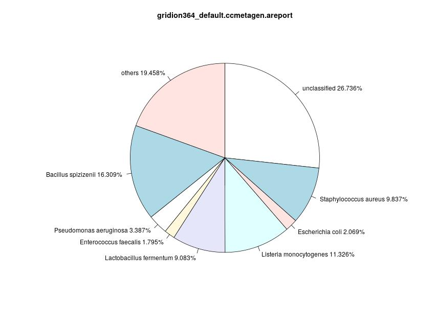\label{ccmetagen364D}|**Gridion364: Piechart for Classification Results of CCMetagen (default).**  26.736% of reads couöd not be assigned to any taxon, whereas 19.458% of reads are not assigned to a taxon on species level or the species do not reach 1% abundance. The identified species are *Enterococcus faecalis* (1.795%), *Escherichia coli* (2.069%), *Pseudomonas aeruginosa* (3.387%), *Limosilactobacillus fermentum* (9.083%), *Staphylococcus aureus* (9.837%), *Listeria monocytogenes* (11.326%) and *Bacillus spizizenii* (16.309%).|
|||

***Figure X: Classification Results for CCMetagen, CS Even, GridION, Default Database***    

CCMetagen is not able to classify 26.736% of the reads of CS Even and 19.458% of the reads could not be assigned to a taxon on species level. The remaining reads are assigned to species with abundances between 1.795% (*Enterococcus faecalis*) and 16.309 (*Bacillus spizizenii*). In general, CCMetagenonly classified species present in the sample (Figure). *Limosilactobacillus fermentum* and *Bacillus spizizenii* are, however, the new name for *Lactobacillus fermentum* and a subspezies of *Bacillus subtilis* [subSpecB]( https://doi.org/10.1007/s10482-019-01354-9 "Dunlap, C. A., Bowman, M. J., & Zeigler, D. R. (2020). Promotion of Bacillus subtilis subsp. inaquosorum, Bacillus subtilis subsp. spizizenii and Bacillus subtilis subsp. stercoris to species status. *Antonie van Leeuwenhoek*, 113(1), 1-12."), respectively. The default database does not include fungal genomes, therefore those cannot be considered here.

Considering the CS Log sample (Figure X) sequenced with GridION, CCMetagen is able to assign 71.494% of reads to *Listeria monocytogenes* and 2.822% to *Pseudomonas aeruginosa*. 0.279% are assigned to others and 25.405% are unclassified.

|||
|:--|:--|
|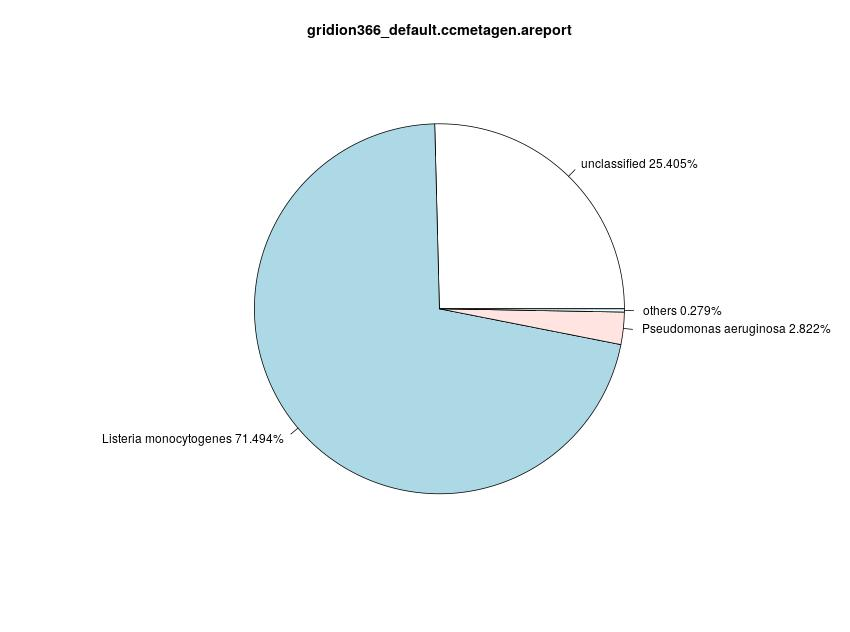\label{ccmetagen366D}|**Gridion366: Piechart for Classification Results of CCMetagen (default).**  26.736% of reads couöd not be assigned to any taxon, whereas 19.458% of reads are not assigned to a taxon on species level or the species do not reach 1% abundance. The identified species are *Enterococcus faecalis* (1.795%), *Escherichia coli* (2.069%), *Pseudomonas aeruginosa* (3.387%), *Limosilactobacillus fermentum* (9.083%), *Staphylococcus aureus* (9.837%), *Listeria monocytogenes* (11.326%) and *Bacillus spizizenii* (16.309%).|
|||

***Figure X: Classification Results for CCMetagen, CS Log, GridION, default Database***    

### Centrifuge
For the CS Even samples, Centrifuge is able to classify 89.504% and 87.086% for GridION364 and PromethION365, respectively. Between 3.5% and 3.9% of the reads could not be assigned to a taxon on species level. 
Since the default database of Centrifuge does not contain fungal genomes, Centrifuge is only able to identify the eight bacterial species. Those species are identified with abundances ranging between 6% for *Salmonella enterica* and 18.368% for Bacillus substilis for GridION and between 5.936% for *Salmonella enterica* and 17.724% for *Bacillus subtilis* for PromethION, respectively (see Table 2). The classification results therefore do not improve with greater sequencing depth.  
Since Centrifuge assigns a read to up to five species, the abundances are calculated slightly different: the number of reads assigned to one entry is divided by the total number of assignments which can be greater than the number of reads. 

|||
|:--|:--|
|\label{centrifuge364D}|**Gridion364: Piechart for Classification Results of Centrifuge (default)**. Centrifuge is able to identify all bacterial species in the sample with relatively high abundances (6% to 18.368%). 10.496% of the reads could not be classified and 3.541% could not be assigned to a taxon on species level or exceed the 1% abundance mark.|
|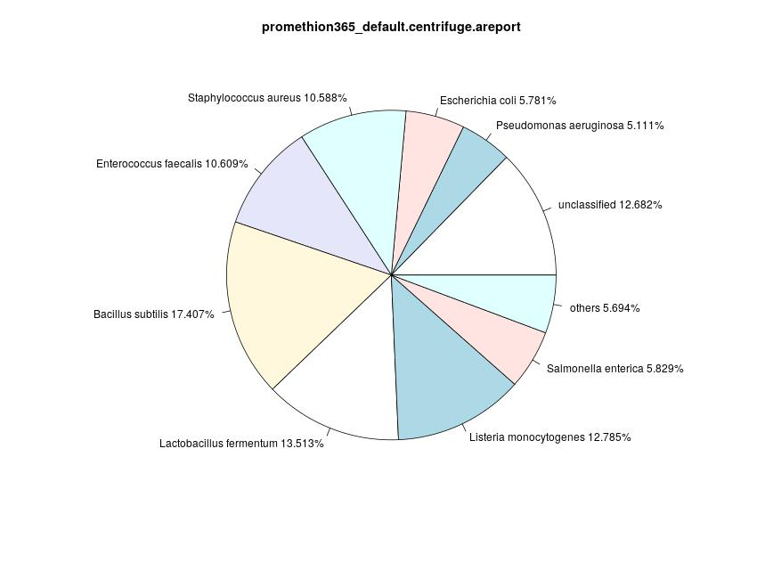\label{centrifuge365D}|**Promethion365: Piechart for Classification Results of Centifuge (default).** Centrifuge is able to identify all bacterial species in the sample with relatively high abundances (5.936% to 17.724%). 12.914% of the reads could not be classified and 3.974% could not be assigned to a taxon on species level or exceed the 1% abundance mark.|
|||

***Figure 5: Classification Results for Centrifuge, CS Even, Default Database***    

| Classified species 	| B. subtilis 	| L. monocytogenes 	| E. faecalis 	| S. aureus 	| S. enterica 	| E. coli 	| P. aeruginosa 	| L. fermentum 	|   	| unclassified 	| other 	|
|--------------------	|-------------	|------------------	|-------------	|-----------	|-------------	|---------	|---------------	|--------------	|---	|--------------	|-------	|
| CS Even            	|             	|                  	|             	|           	|             	|         	|               	|              	|   	|              	|       	|
| GridION 364        	| 18.368      	| 13.514           	| 11.182      	| 11.244    	| 6           	| 5.933   	| 5.21          	| 14.513       	|   	| 10.496 (366,458)       	| 3.541 	|
| PromethION 365     	| 17.724      	| 13.018           	| 10.803      	| 10.782    	| 5.936       	| 5.886   	| 5.204         	| 13.759       	|   	| 12.914 (4,624,479)       	| 3.974 	|
| CS Log             	|             	|                  	|             	|           	|             	|         	|               	|              	|   	|              	|       	|
| GridION 366        	| 1.085       	| 84.591           	|     -        	|    -       	|     -        	|       -  	| 4.653         	|      -        	|   	| 7.214 (264,559)       	| 2.457 	|
| PromethION 367     	| 1.069       	| 82.068           	|      -       	|   -        	|       -      	|      -   	| 4.532         	|       -       	|   	| 9.649 (3,335,852)       	| 2.682 	|

***Table 2: Abundances of classified species, Centrifuge.*** The table shows the classificaiton results of Centrifuge for all four samples considering the default database (in %). The two fungis can not be identified with the default database, because it only includes microbial genomes. The column "unclassified" also contains the abolsute number of unclassified reads.   

The CS Log results show similarity betweent the samples as well. Three species can be identified with the majotrity of reads assigned to *Listeria monocytogenes* (84.591% and 82.068% for GridIOn and PromethION, respectively). Centrifuge assigned about 1% of the reads to *Bacillus subtilis* and 4.5% to *Pseudomonas aeruginosa*. The sample sequences with GridION shows slightly less uncassified reads with 7.214% in contrast to 9.649% for PromethION. There are about 2.5% reads that could not be assigned to a taxon on species level (Table, Picture).

|||
|:--|:--|
|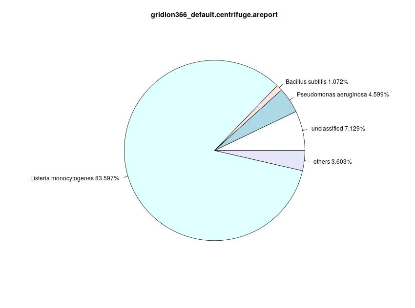\label{centrifuge366D}|**Gridion366: Piechart for Classification Results of Centrifuge (default)**. In this sample, 8.52% of reads could not be classified at all and 5.18% of reads are assigned to taxa that are not on species level or the corresponding species has below 1% abundance. The remaining reads are assigned to *Listeria monocytogenes* (81.293%), *Pseudomonas aeruginosa* (3.98%) and *Bacillus subtilis* (1.027%)|
|\label{centrifuge367D}|**Promethion367: Piechart for Classification Results of Centifuge (default).** In this sample, 10.4% of reads could not be classified at all and 4.805% of reads are assigned to taxa that are not on species level or the corresponding species has below 1% abundance. The remaining reads are assigned to *Listeria monocytogenes* (79.702%), *Pseudomonas aeruginosa* (4.069%) and *Bacillus subtilis* (1.023%).|
|||

***Figure X: Classification Results for Centrifuge, CS Log, Default Database***    

Using the custom database leads to slightly different results (Table A1, A2). The main change for CS Even samples is the amount of reads that are unclassified or assigned to "others". The percentage of unclassified reads has decreased to 5.052%, but 20.495% of reads are not assigned to anythin on species level or to a species that didn't reach 1% of reads.  
Although fungal species are included in this database, Centrifuge is not able to assign 1% of reads to those. The remaining reads are assigned with slislightly different proportions, instead of *Lactobacillus fermentum*, *Limosilactobacillus fermentum* is identified with a similar amount of reads (14.248% and 14.671%, respectively), but as discussd before, *Limosilactobacillus fermentum* is the . Instead of *Salmonella enterica*, Centrifuge identified thee subspecies of *Salmonella*: *Salmonella sp. S048_01045*, *Salmonella sp. S102_03650* and *Salmonella sp. S060_01291*, which are three unclassified *Salmonella* species [NCBISallmonella](https://www.ncbi.nlm.nih.gov/Taxonomy/Browser/wwwtax.cgi). Furthermore, instead of only *Bacillus subtilis*, *Bacillus spizizenii* is identified with 9.606% of reads as well, and 2.123% or reads are assigned to *Bacillus subtilis* (Default: *B. subtilis*: 18.033%).  
The CS Log samples show that th majority of reads is assigned to *Listeria monocytogenes* (366: 72.843%, 367: 70.223%), although the percentage has decreased (Table A1, Figure A1). This might be due to the identification of a new species -- *Listera innouca*. 3.405% and 2.671% of reads are assigned to this, respectively. The percentage of reads not classified has decreased to ~6.75% and the percentage of reads assigned to "others" has increased to ~13%.
   

### CLARK
As for CLARK, the results of the CS Even samples are similar for GridION and PromethION. The default database does not include fungi, therefore they cannot be considered here. 
Additional to the expected species, CLARK assigned 1.046% and 1.041% of the reads to Bacillus vallismortis for GridION and PromethION, respectively. 21.888% (22.801%) of reads are not classified, 4.068% (4.979%) could not be assigned to a taxon on species level. The bacterial species have abundances ranging from 4.562% to 14.609% and 4.66% to 13.894% (Table X). As seen for other classifiers, reads are assigned to *Limosilactobacillus fermentum*, which is a close relative to *Lactobacillus fermentum* (Figure X).
|||
|:--|:--|
|\label{clark364D}|**Gridion364: Piechart for Classification Results of CLARK (default)**. Since 25.946% of reads could not be assigned at all or to a species, the remaining reads are assigned to *Bacillus subtilis*, Bacillus vallismortis, *Enterococcus faecalis*,  *Escherichia coli*, *Limosilactobacillus fermentum*, *Listeria monocytogenes*, *Pseudomonas aeruginosa*, *Salmonella enterica* and *Staphylococcus aureus*.|
|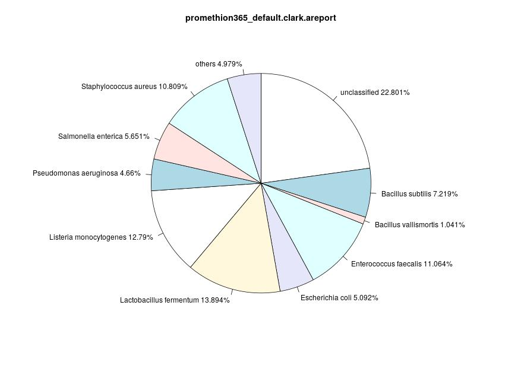\label{clark365D}|**Promethion365: Piechart for Classification Results of CLARK (default).** Since 27.78%% of reads could not be assigned at all or to a species, the remaining reads are assigned to *Bacillus subtilis*, Bacillus vallismortis, *Enterococcus faecalis*,  *Escherichia coli*, *Limosilactobacillus fermentum*, *Listeria monocytogenes*, *Pseudomonas aeruginosa*, *Salmonella enterica* and *Staphylococcus aureus*.|
|||

***Figure 5: Classification Results for Centrifuge, CS Even, Default Database***    

| Classified species 	| B. subtilis 	| L. monocytogenes 	| E. faecalis 	| S. aureus 	| S. enterica 	| E. coli 	| P. aeruginosa 	| L. fermentum 	| B. vallismortis 	|   	| unclassified 	| other 	|
|--------------------	|-------------	|------------------	|-------------	|-----------	|-------------	|---------	|---------------	|--------------	|-----------------	|---	|--------------	|-------	|
| CS Even            	|             	|                  	|             	|           	|             	|         	|               	|              	|                 	|   	|              	|       	|
| GridION 364        	| 7.332       	| 13.242           	| 11.445      	| 11.208    	| 5.649       	| 4.961   	| 4.562         	| 14.609       	| 1.046           	|   	| 21.888       	| 4.068 	|
| PromethION 365     	| 7.219       	| 12.79            	| 11.064      	| 10.809    	| 5.651       	| 5.092   	| 4.66          	| 13.894       	| 1.041           	|   	| 22.801       	| 4.979 	|
| CS Log             	|             	|                  	|             	|           	|             	|         	|               	|              	|                 	|   	|              	|       	|
| GridION 366        	| -           	| 82.708           	| -           	| -         	| -           	| -       	| 3.997         	| -            	| -               	|   	| 11.764       	| 1.531 	|
| PromethION 367     	| -           	| 80.632           	| -           	| -         	| -           	| -       	| 4.021         	| -            	| -               	|   	| 13.261       	| 2.086 	|

***Table 2: Abundances of classified species, CLARK.*** The table shows the classificaiton results of CLARK for all four samples considering the default database (in %). Note that, in this case, L. fermentum refers to *Limosilactobacillus fermentum*. The two fungis can not be identified with the default database, because it only includes microbial genomes.   

CLARK is also able to identify *Listeria monocytogenes* as the most prominent species in the CS Log samples. 82.708% and 80.632% of the reads are assigned to this species from the GridION and PromethION sample, respectively. In both samples, *Pseudomonas aeruginosa* can be identified as well with 3.997% and 4.021%, respectively. Roughly 12% of the reads could not be classified and roughly 1.75% of the reads could not be assigned to a taxon on species level (Figure X).
|||
|:--|:--|
|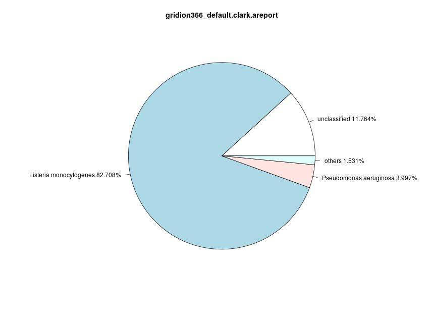\label{clark366D}|**Gridion366: Piechart for Classification Results of CLARK (default)**. *Listeria monocytogenes* and *Pseudomonas aeruginosa* are the identified species with 82.708% of reads and 3.997%, respectively. 11.764% of reads are not classified, whereas 1.531% of reads are not assigned to a taxon on species level or the assigned species has an abundance below 1%. |
|\label{clark367D}|**Promethion367: Piechart for Classification Results of CLARK (default).**  *Listeria monocytogenes* and *Pseudomonas aeruginosa* are the identified species with 80.632% of reads and 4.021%, respectively. 31.261% of reads are not classified, whereas 2.086% of reads are not assigned to a taxon on species level or the assigned species has an abundance below 1%.|
|||

***Figure 5: Classification Results for Centrifuge, CS Log, Default Database***    

[Custom Database]
[Resttricted Parameters?]    

### Kraken2
The Kraken default database includes the fungal genomes, therefore this is the only classifier that has the possibility to accurately identify all present species. Both the GridION and PromethION sequences sample are able to identify all ten species, no other species are identified. The read abundances range from 2.003% to 17.514% for GridION364 and 1.954% to 16.991% for PromethION365. On average for the CS Even samples, 10% of reads could not be classified at all, and 4.5% are not assigned on species level (Figure Y, Table X(HIER)).

|||
|:--|:--|
|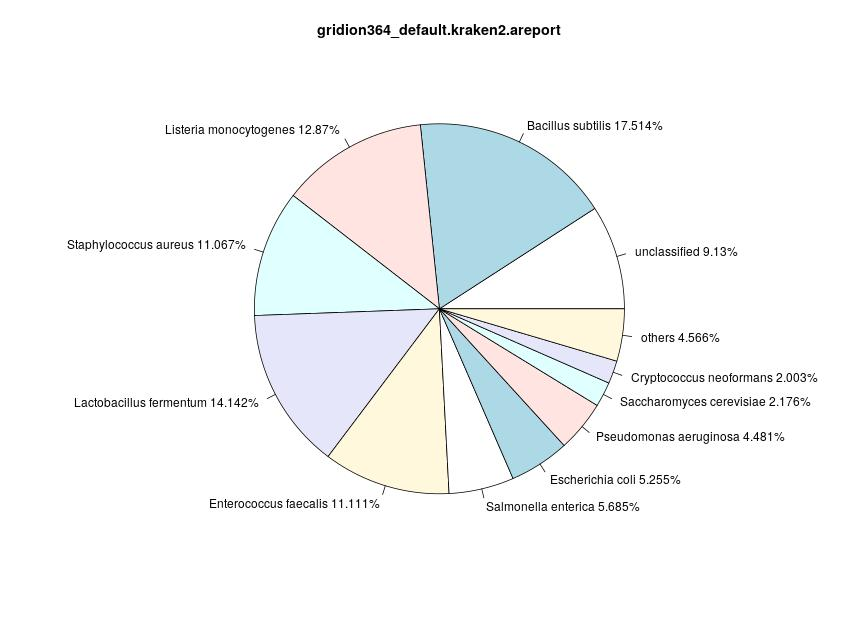\label{kraken364D}|**Gridion364: Piechart for Classification Results of Kraken2 (default)**. Kraken2 identified the species present in the CS Even samples, the abundances range from 2.003% for *Cryptococcus neoformans* to 17.514% for *Bacillus subtilis*. 9.13% of the reads are unclassified and 4.566% of the reads are assigned to a taxon on a different level (not species) or the corresponding species has no abundance of 1%.|
|\label{kraken365D}|**Promethion365: Piechart for Classification Results of Kraken2 (default).** Kraken2 identified the species present in the CS Even samples, the abundances range from 1.954% for *Cryptococcus neoformans* to 16.991% for *Bacillus subtilis*. 11.42% of the reads are unclassified and 4.569% of the reads are assigned to a taxon on a different level (not species) or the corresponding species has no abundance of 1%. |
|||

***Figure Y: Classification Results for Kraken2, CS Even, Default Database***    

| Classified Species 	| B. subtilis 	| L. monocytogenes 	| E. faecalis 	| S. aureus 	| S. enterica 	| E. coli 	| P. aeruginosa 	| L. fermentum 	| S. cerevisiae 	| C. neoformans 	|   	| unclassified 	| others 	|
|--------------------	|-------------	|------------------	|-------------	|-----------	|-------------	|---------	|---------------	|--------------	|---------------	|---------------	|---	|--------------	|--------	|
| CS Even            	|             	|                  	|             	|           	|             	|         	|               	|              	|               	|               	|   	|              	|        	|
| GridION 364        	| 17.514      	| 12.87            	| 11.111      	| 11.067    	| 5.685       	| 5.255   	| 4.481         	| 14.142       	| 2.176         	| 2.003         	|   	| 9.13         	| 4.566  	|
| PrometION 365      	| 16.991      	| 12.455           	| 10.757      	| 10.676    	| 5.703       	| 5.299   	| 4.612         	| 12.477       	| 2.096         	| 1.954         	|   	| 11.42        	| 4.559  	|
| CS Log             	|             	|                  	|             	|           	|             	|         	|               	|              	|               	|               	|   	|              	|        	|
| GridION 366        	| 1.027       	| 81.293           	| -           	| -         	| -           	| -       	| 3.98          	| -            	| -             	| -             	|   	| 8.52         	| 5.18   	|
| PromethION 367     	| 1.023       	| 79.702           	| -           	| -         	| -           	| -       	| 4.069         	| -            	| -             	| -             	|   	| 10.4         	| 4.805  	|

***Table X(HIER). !!!***

The classification results for CS Log are similar between the sequencing methods as well. The majority of reads is assigned to *Listeria monocytogenes* (81.293% and 79.702%, respectively). The other two identified species are *Pseudomonas aeruginosa* and *Bacillus subtilis* with roughly 4% and 1%, respectively (Figure A).
|||
|:--|:--|
|\label{kraken366D}|**Gridion366: Piechart for Classification Results of Kraken2 (default)**. Kraken2 is able to assign the majoity of reads to *Listeria monocytogenes* with 81.293%. 1.027% are assigned to *Bacillus subtilis* and 3.98% are assigned to *Pseudomonas aeruginosa*. 8.52% of reads are not classified at all. The percentage of reads that are classified to a taxon not on species level or a species with less than 1% abundance is 5.18%.|
|\label{kraken367D}|**Promethion367: Piechart for Classification Results of Kraken2 (default).** Kraken2 is able to assign the majoity of reads to *Listeria monocytogenes* with 79.702%. 1.023% are assigned to *Bacillus subtilis* and 4.069% are assigned to *Pseudomonas aeruginosa*. 10.4% of reads are not classified at all. The percentage of reads that are classified to a taxon not on species level or a species with less than 1% abundance is 4.805%. |
|||

***Figure A: Classification Results for Kraken2, CS Log, Default Database***    

Kraken2 reached similar classification results withe the custom database (Table A2, Figure A2).  
The main difference in the CS Even samples is the classification of *Limocilactobaillus fermentum* instead of *Lactobacillus fermentum*, but this was the case for Centrifuge as well, so it might a due to the sequences in the database or the seqid2taxid.map. The amount of reads assigned to *Limosilactobacillus fermentum* is similar to the amount of reads assigned to *Lactobacillus fermentum* with the default database (e.g. GridION 364: 14.142% and 12.963% for default and custom, respectively). Another difference is the identification of *Bacillus spizizenii* additionally to *Bacillus subtili* with 10.531% and 10.328% for GridION and PromethIOn, respectively. 4.912% and 4.747% of reads are assigned to *Bacillus subtilis*. this means, if the two species are combined, the percentage of reads assigned to only *Bacillus subtilis* with the default database is similar (~17.25% for both samples), although slightly higher. Since Centrifuge, again, classified similar proportions of *Bacillus subtilis* and *Bacillus spizizenii*, this might be due to the database or the seqid2taxid.map file.
The percentage of unclassified reads is similar (9.56% and 11.76%, respectively), but the percentage of reads assigned to "others" increased to ~8%.  
Considering the CS Log samples, the results are similar as well. The majority of reads is assigend to *Listeria monocytogenes* with 81.607% and 80.044% for GridION and PromethION, respectively. Arpund 4.5% of reads are assigned to *Pseudomonas aeruginosa*. The number of reads that are not classified as well as the number of reads assigned to taxa that are not on species level or to species that didn't reach 1% abundance.

### BugSeq

## Stuff that didn't work
At the beginning of this comparison, a list with more than 12 classification tools existed. Some of those tools are specifically for long read data, others are not.  

The Naive Bayes Classification Tool [NBC](https://academic.oup.com/bioinformatics/article/27/1/127/202209 "Rosen, G. L., Reichenberger, E. R., & Rosenfeld, A. M. (2011). NBC: the Naive Bayes Classification tool webserver for taxonomic classification of metagenomic reads. *Bioinformatics*, 27(1), 127-129.") should be used to test whether older classification approaches are able to handle the state-of-the-art long reads, but the webserver is only able to process 20 Mb files for gunal samples. The try to only use the bacterial database failed during the upload (GridiION 364), the page didn't respond. It seems that this tool is not able to process high throughput data.  

K-SLAM [kslam](https://academic.oup.com/nar/article/45/4/1649/2674183 "Ainsworth, D., Sternberg, M. J., Raczy, C., & Butcher, S. A. (2017). k-SLAM: accurate and ultra-fast taxonomic classification and gene identification for large metagenomic data sets. *Nucleic acids research*, 45(4), 1649-1656.") claims to be able to process up to 10,000,000 reads, but repeats to throw the following error:

    terminate called after throwing an instance of 'std::bad_alloc'
    what():  std::bad_alloc
    /bin/bash: line 1: 19208 Aborted

After trying different <tt>--num-reads-at-once</tt> values, the tool run several weeks <tt>--num-reads-at-once 1000000</tt> without any visible progress or output. It was terminated and decided not to be used.  

The lightweight alignment-free and assembly-free framework for metagenomic classification tool LiME [lime](https://bmcbioinformatics.biomedcentral.com/articles/10.1186/s12859-020-03628-w "Guerrini, V., Louza, F. A., & Rosone, G. (2020). Metagenomic analysis through the extended Burrows-Wheeler transform. *BMC bioinformatics*, 21(8), 1-25.") could not be installed via conda and the manual installation with git caused several errors while trying to install dependencies. It could not be installed.  

taxMaps [taxmaps](https://genome.cshlp.org/content/28/5/751 "Corvelo, A., Clarke, W. E., Robine, N., & Zody, M. C. (2018). taxMaps: comprehensive and highly accurate taxonomic classification of short-read data in reasonable time. *Genome research*, 28(5), 751-758.") is a python based classification tool for short read data. Trying to use it for long read data resulted in several IndexErrors.  

MetaOthello [metaothello](https://doi.org/10.1093/bioinformatics/btx432 "Liu, X., Yu, Y., Liu, J., Elliott, C. F., Qian, C., & Liu, J. (2018). A novel data structure to support ultra-fast taxonomic classification of metagenomic sequences with k-mer signatures. *Bioinformatics*, 34(1), 171-178.") is probabilistic hashing classifier for metagenomic reads. During the processing of a GridION sample, the tool repeatingly throws <tt>Segmentation Fraud</tt>s. It therefore was decided not to use the tool.

- deepmicrobes???

CCMetagen and Diamond are two tools used within this comparison, but only for the samples with up to 3.5 million reads. The PromethION samples could not be classified using these tools in reasonable time. Diamond used up to two weeks for a PromethION sample and stopped without reason or result. Due to this, it was decided to only use Diamond for the GridION samples. Since CCMetagen is based on KMA, the failed preprocessing with KMA while finding k-mer ankers lead to the use of CCMetagen only for GridION samples.
# Conclusion
# Attachments and Supplementary Information
| Classified Species 	| *B. subtilis*          	| *L. monocytogenes*     	| *E. faecalis*          	| *S. aureus*            	| *S. enterica*           	| *E. coli*               	| *P. aeruginosa*         	| *L. fermentum*        	| *S. cerevisiae*        	| *C. neoformans*         	|
|--------------------	|----------------------	|----------------------	|----------------------	|----------------------	|-----------------------	|-----------------------	|-----------------------	|---------------------	|----------------------	|-----------------------	|
| expected           	| 0.12                 	| 0.12                 	| 0.12                 	| 0.12                 	| 0.12                  	| 0.12                  	| 0.12                  	| 0.12                	| 0.02                 	| 0.02                  	|
| estimated          	| 0.1932               	| 0.1456               	| 0.1224               	| 0.1128               	| 0.0999                	| 0.0993                	| 0.097                 	| 0.0928              	| 0.0192               	| 0.0178                	|
| Diamond            	| 0.003931099075153449 	| 0.028948069393565312 	| 0.010118319637737405 	| 0.003972916231071292 	| 0.0025789155608511223 	| 0.0011511174632452977 	| 0.0010376955882900507 	| 0                   	| 0                    	| 0                     	|
| Kaiju              	| 0.00811224           	| 0.09322046           	| 0.10269091           	| 0.04151326           	| 0.01778919            	| 0.021244830000000003  	| 0.01103858            	| 0.12502928000000002 	| 0                    	| 0                     	|
| CCMetagen          	| 0.00357422115547103  	| 0.11325804335808948  	| 0.017949584549420146 	| 0.09837457287785094  	| 0                     	| 0.020692618126304997  	| 0.03386645433480648   	| 0                   	| 0.008941424475638643 	| 1.145675504598455e-06 	|
| Centrifuge         	| 0.18033222980001143  	| 0.13268354876744617  	| 0.10978380289037058  	| 0.11039120082853578  	| 0.05890522708106204   	| 0.05824580663430398   	| 0.05114965525948968   	| 0.14248487058908882 	| 0                    	| 0                     	|
| CLARK              	| 0.07331721749790199  	| 0.13241545630823254  	| 0.11445298290938566  	| 0.11208258029037145  	| 0.05648781717310298   	| 0.04960860860574155   	| 0.04561564305333979   	| 0                   	| 0                    	| 0                     	|
| Kraken2            	| 0.17514371067110807  	| 0.128698598552439    	| 0.11110932894921507  	| 0.11066767104219237  	| 0.05685214198356529   	| 0.05254612059953199   	| 0.04480679614709328   	| 0.14142218428763328 	| 0.021756091413448513 	| 0.020032995454532434  	|

***Table XYZ_364. Overview of abundances for GridION364, Default Database***

| Classified Species 	| *B. subtilis*          	| *L. monocytogenes*    	| *E. faecalis*         	| *S. aureus*           	| *S. enterica*          	| *E. coli*              	| *P. aeruginosa*        	| *L. fermentum*        	| *S. cerevisiae*       	| *C. neoformans*        	|
|--------------------	|----------------------	|---------------------	|---------------------	|---------------------	|----------------------	|----------------------	|----------------------	|---------------------	|---------------------	|----------------------	|
| expected           	| 0.12                 	| 0.12                	| 0.12                	| 0.12                	| 0.12                 	| 0.12                 	| 0.12                 	| 0.12                	| 0.02                	| 0.02                 	|
| estimated          	| 0.1902               	| 0.1433              	| 0.1207              	| 0.1111              	| 0.1032               	| 0.1026               	| 0.1011               	| 0.0913              	| 0.0187              	| 0.0177               	|
| Kaiju              	| 0.006889650000000001 	| 0.09046455          	| 0.09956079000000001 	| 0.03980312          	| 0.01784152           	| 0.02100569           	| 0.011106320000000001 	| 0                   	| 0                   	| 0                    	|
| Centrifuge         	| 0.1740696701561566   	| 0.12785193704152933 	| 0.106092408974466   	| 0.10588439652695726 	| 0.05829268429134972  	| 0.057807084237554436 	| 0.05111061918216472  	| 0.13512543438538727 	| 0                   	| 0                    	|
| CLARK              	| 0.07219174753831668  	| 0.12790055380526907 	| 0.11064198413206593 	| 0.10809287647472647 	| 0.05651135379967302  	| 0.050916139842427585 	| 0.046595982353225186 	| 0                   	| 0                   	| 0                    	|
| Kraken2            	| 0.1699094213132442   	| 0.12455124426561777 	| 0.10757029907294031 	| 0.10675915082205413 	| 0.057028290470714234 	| 0.05299148196601136  	| 0.04612495341161309  	| 0.1347737004447493  	| 0.02095813508282366 	| 0.019539547149290567 	|

***Table XYZ_365. This table does not contain entries for Diamond and CCMetagen since those tools could not deal with the PromethION samples in appropiate time or space.***

| Classified Species 	| *B. subtilis*          	| *L. monocytogenes* 	| *E. faecalis*          	| *S. aureus*            	| *S. enterica*          	| *E. coli*              	| *P. aeruginosa*       	| *L. fermentum*         	| *S. cerevisiae*       	| *C. neoformans*       	|
|--------------------	|------------------------	|--------------------	|------------------------	|------------------------	|------------------------	|------------------------	|-----------------------	|------------------------	|-----------------------	|-----------------------	|
| expected           	| 0.0089                 	| 0.891              	| 0.0000089              	| 0.00000089             	| 0.00089                	| 0.00089                	| 0.089                 	| 0.000089               	| 0.0089                	| 0.000089              	|
| Diamond            	| 0.00025494344890769686 	| 0.1887282275567965 	| 2.699401223728555e-05  	| 8.180003708268348e-07  	| 2.1813343222048926e-05 	| 1.2815339142953745e-05 	| 0.0009513344312716089 	| 0                      	| 0                     	| 0                     	|
| Kaiju              	| 0.00049489             	| 0.57905155         	| 0.00010442999999999999 	| 4.008e-05              	| 0.00015487             	| 0.00018487             	| 0.009706939999999999  	| 4.308e-05              	| 0                     	| 0                     	|
| CCMetagen          	| 0.00022822210346068691 	| 0.7149435034410548 	| 0                      	| 0                      	| 0                      	| 8.180003708268348e-07  	| 0.028215832124510565  	| 0                      	| 0.0018822188532725468 	| 0                     	|
| Centrifuge         	| 0.01072083365219725    	| 0.8359701133790269 	| 0.00033009152023178085 	| 7.92219648556274e-05   	| 0.0005451225676970552  	| 0.0006041348476405327  	| 0.04598754221129522   	| 5.173679337510361e-05  	| 0                     	| 0                     	|
| CLARK              	| 0.004480188031018574   	| 0.8270826289441251 	| 0.0014165039754818023  	| 6.0259360650910164e-05 	| 0.000442265533827042   	| 0.0004463555356811762  	| 0.03996749811859915   	| 0                      	| 0                     	| 0                     	|
| Kraken2            	| 0.010274629991165596   	| 0.8129274051937571 	| 0.0016234580693009913  	| 3.790068384831001e-05  	| 0.00048289288557810814 	| 0.0004796208840948008  	| 0.03980280737727268   	| 5.1534023362090594e-05 	| 0.006906649797681241  	| 2.699401223728555e-05 	|

***Table XYZ_366. Overview of abundances for GridION366, Default Database***

| Classified Species 	| *B. subtilis*          	| *L. monocytogenes* 	| *E. faecalis*         	| *S. aureus*           	| *S. enterica*         	| *E. coli*              	| *P. aeruginosa*      	| *L. fermentum*        	| *S. cerevisiae*      	| *C. neoformans*        	|
|--------------------	|------------------------	|--------------------	|-----------------------	|-----------------------	|-----------------------	|------------------------	|----------------------	|-----------------------	|----------------------	|------------------------	|
| expected           	| 0.0089                 	| 0.891              	| 0.0000089             	| 0.00000089            	| 0.00089               	| 0.00089                	| 0.089                	| 0.000089              	| 0.0089               	| 0.000089               	|
| Kaiju              	| 0.00042215000000000004 	| 0.5803125          	| 9.409e-05             	| 3.673e-05             	| 0.00016151            	| 0.00018481999999999998 	| 0.00964334           	| 0                     	| 0                    	| 0                      	|
| Centrifuge         	| 0.010583077878396838   	| 0.8121847388958147 	| 0.0002593407540856259 	| 8.203869770523221e-05 	| 0.0005472776906581768 	| 0.000588182540281616   	| 0.04485060756010358  	| 5.432988424442803e-05 	| 0                    	| 0                      	|
| CLARK              	| 0.004604104406402609   	| 0.806319139733393  	| 0.0014063171671118756 	| 5.388554086360676e-05 	| 0.0004462983872922449 	| 0.000881518856092401   	| 0.04021136899875459  	| 0                     	| 0                    	| 0                      	|
| Kraken2            	| 0.010232091937352085   	| 0.7970243033334238 	| 0.001674877149354811  	| 3.832439165017657e-05 	| 0.0004844781585965718 	| 0.00046553289329025806 	| 0.040692781206019144 	| 5.168731160669097e-05 	| 0.006771095668614857 	| 4.1477115189700534e-05 	|

***Table XYZ_367. This table does not contain entries for Diamond and CCMetagen since those tools could not deal with the PromethION samples in appropiate time or space.***
|    |    |    |    |    |    | 
|:--:|:--:|:--:|:--:|:--:|:--:|
||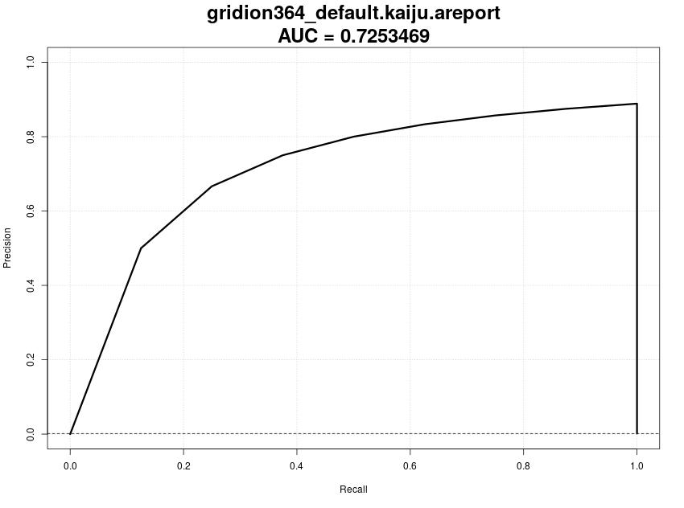|||||
| **Gridion364: PR Curve for Diamond (default)**. | **Gridion364: PR Curve for Kaiju (default)**.   |  **Gridion364: PR Curve for CCMetagen (default)**.  | **Gridion364: PR Curve for Centrifuge (default)**.  | **Gridion364: PR Curve for Clark (default)**.  |  **Gridion364: PR Curve for Kraken2 (default)**.  | 
| AUC: 0.7029369 | AUC: 0.7253469| AUC: 0.5786301 | AUC: 1.0 |AUC: 0.7029369 | AUC: 1.0 | 

|    |    |    |    |
|:--:|:--:|:--:|:--:|
|||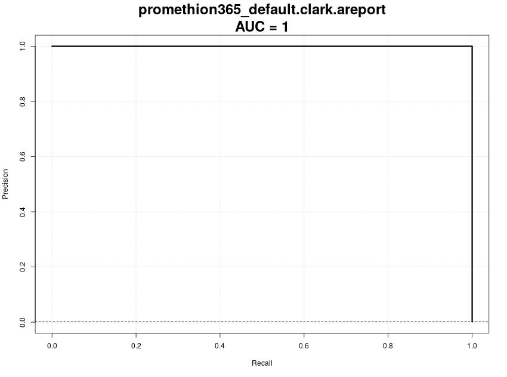||
| **Promethion365: PR Curve for Kaiju (default)**.   |  **Promethion365: PR Curve for Centrifuge (default)**.  | **Promethion365: PR Curve for Clark (default)**.  |  **Promethion365: PR Curve for Kraken2 (default)**.  | 
| AUC: 0.5702636 | AUC: 1.0| AUC: 0.7029369 | AUC: 1.0 |

|    |    |    |    |    |    | 
|:--:|:--:|:--:|:--:|:--:|:--:|
|||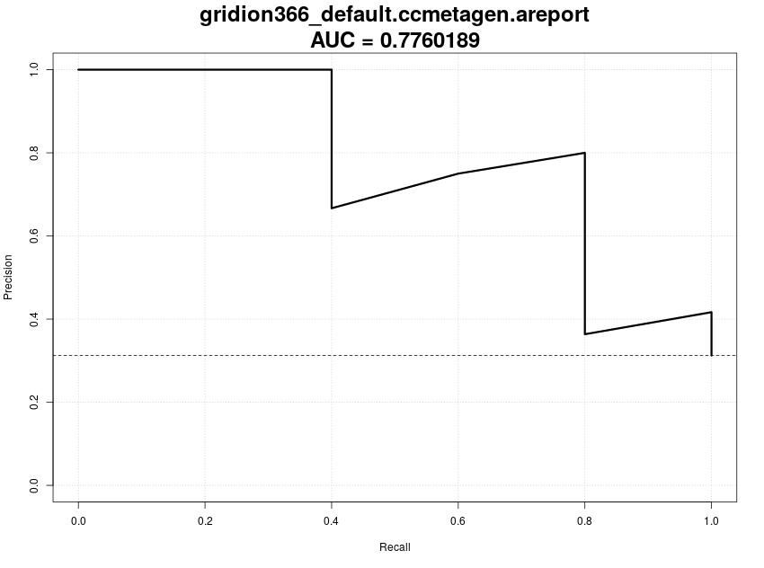||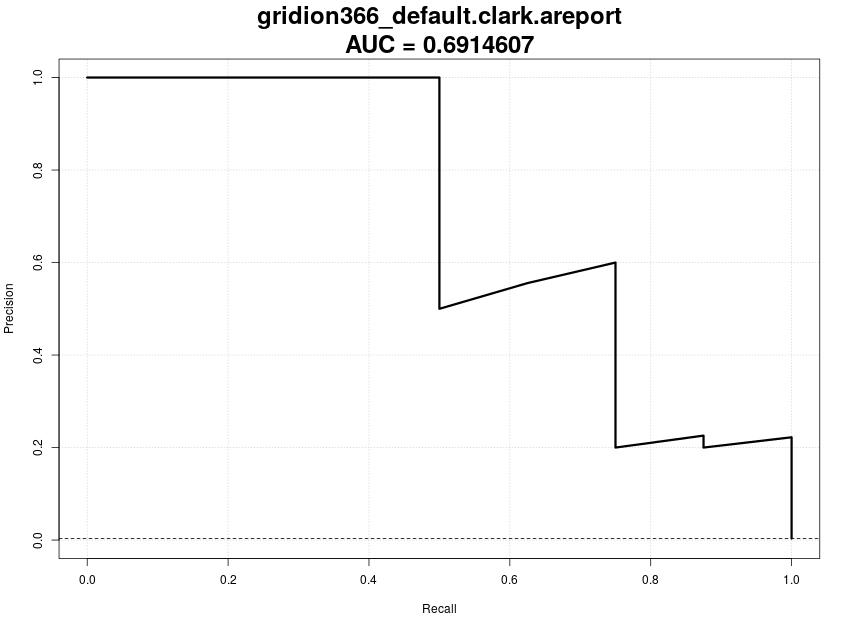|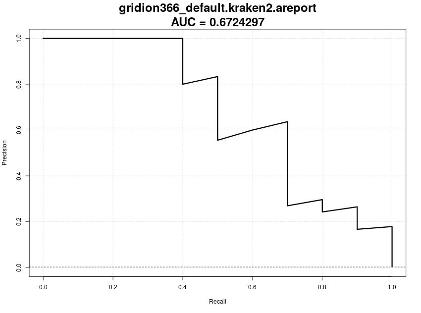|
| **Gridion366: PR Curve for Diamond (default)**. | **Gridion366: PR Curve for Kaiju (default)**.   |  **Gridion366: PR Curve for CCMetagen (default)**.  | **Gridion366: PR Curve for Centrifuge (default)**.  | **Gridion366: PR Curve for Clark (default)**.  |  **Gridion366: PR Curve for Kraken2 (default)**.  | 
| AUC: 0.5357696 | AUC: 0.3873827| AUC: 0.7760189 | AUC: 0.6062113 |AUC: 0.7600671 | AUC: 0.6724297 | 

|    |    |    |    |
|:--:|:--:|:--:|:--:|
|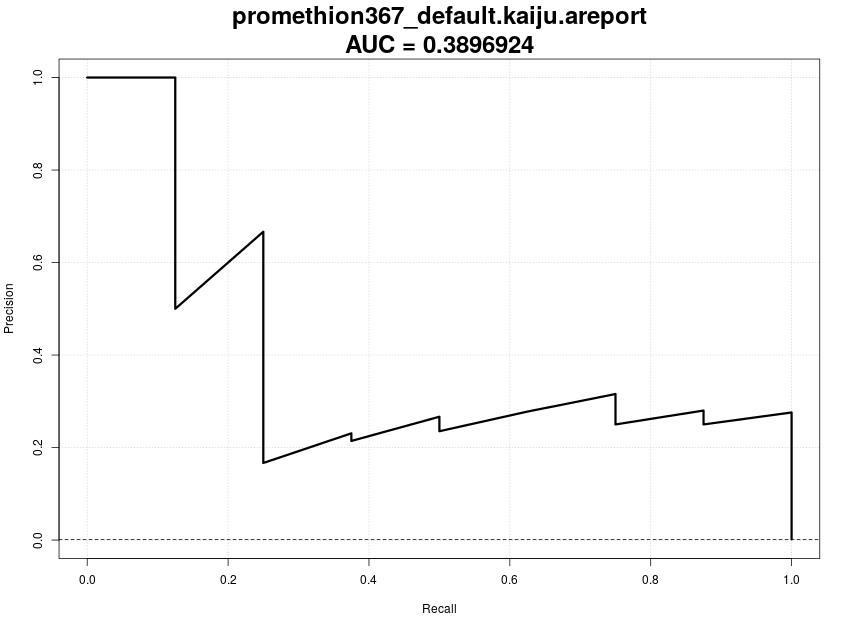||||
| **Promethion367: PR Curve for Kaiju (default)**.   |  **Promethion367: PR Curve for Centrifuge (default)**.  | **Promethion367: PR Curve for Clark (default)**.  |  **Promethion367: PR Curve for Kraken2 (default)**.  | 
| AUC: 0.5702636 | AUC: 0.6138137| AUC: 0.8156916 | AUC: 0.6965986 |

| Classified Species 	| B. subtilis 	| L. monocytogenes 	| E. faecalis 	| S. aureus 	| E. coli 	| P. aeruginosa 	| Limosil. fermentum 	| S. sp. S048_01045  	| S. sp. S102_03650 	| S sp. S060_01291 	| B. spizizenii |L. innocua 	|   	| unclassified 	| others 	|
|--------------------	|-------------	|------------------	|-------------	|-----------	|---------	|---------------	|--------------------	|--------------------	|-------------------	|------------------|----	|------------	|---	|--------------	|--------	|
| CS Even            	|             	|                  	|             	|           	|         	|               	|                    	|                    	|                   	|                  |	|            	|   	|              	|        	|
| GridION 364        	| 2.123       	| 9.774            	| 14.006      	| 8.247     	| 3.703   	| 4.943         	| 14.671             	| 2.46               	| 2.465             	| 2.454            |9.606	| -          	|   	| 5.052 (266,404)       	| 20.495 	|
| PrometION 365      	| 1.864       	| 9.238            	| 13.194      	| 7.84      	| 3.662   	| 4.825         	| 13.57              	| 2.46               	| 2.467             	| 2.456          |  9.169	| -          	|   	| 5.493 (2,990,357)       	| 23.762 	|
| CS Log             	|             	|                  	|             	|           	|         	|               	|                    	|                    	|                   	|                 | 	|            	|   	|              	|        	|
| GridION 366        	| -           	| 72.843           	| -           	| -         	| -       	| 5.199         	| -                  	| -                  	| -                 	| -             |   -	| 3.405      	|   	| 6.582 (318,073)        	| 11.971 	|
| PromethION 367     	| -           	| 70.223           	| -           	| -         	| -       	| 4.964         	| -                  	| -                  	| -                 	| -             |   -	| 2.671      	|   	| 6.99 (3,201,516)         	| 15.151 	|

***Table A1: Abundances of classified species, Centrifuge (custom).*** The table shows the classificaiton results of Centrifuge for all four samples considering the custom database (in %). The number behind the percentage of the column containing the unclassified values is the absolut number of unclassified reads.    

|||
|:--|:--|
|\label{centrifuge364D}|**Gridion364: Piechart for Classification Results of Centrifuge (custom)**. Centrifuge is able to identify the majority of the bacterial species correctly. Although the fungal species are included into the custom database, none are identified. Instead, Bacillus spizizenii is assigned 9.606% of reads, Salmonella enterica is not identified, but three currently unclassified Salmonella species and 14.671% od reads are classifies as Limosilactobacillus fermentum. The amount of reads assigned to something on another taxonomic level has increased to 20.495%, whereas the percentage of unclassified reads decreased to 5.052%. This is also true for the absolute number of reads.|
|\label{centrifuge365D}|**Promethion365: Piechart for Classification Results of Centifuge (custom).** Centrifuge is able to identify the majority of the bacterial species correctly. Although the fungal species are included into the custom database, none are identified. Instead, Bacillus spizizenii is assigned 9.169% of reads, Salmonella enterica is not identified, but three currently unclassified Salmonella species and 13.57% od reads are classifies as Limosilactobacillus fermentum. The amount of reads assigned to something on another taxonomic level has increased to 23.762%, whereas the percentage of unclassified reads decreased to 5.493%. This is also true for the absolute number of reads.
|\label{centrifuge366D}|**Gridion366: Piechart for Classification Results of Centrifuge (custom)**. In this sample, 6.582 of reads could not be classified at all and 11.971% of reads are assigned to taxa that are not on species level or the corresponding species has below 1% abundance. The remaining reads are assigned to *Listeria monocytogenes* (72.843%), *Pseudomonas aeruginosa* (5.199%) and *Listeria innocua* (3.405%)|
|\label{centrifuge367D}|**Promethion367: Piechart for Classification Results of Centifuge (custom).** In this sample, 10.4% of reads could not be classified at all and 4.805% of reads are assigned to taxa that are not on species level or the corresponding species has below 1% abundance. The remaining reads are assigned to *Listeria monocytogenes* (70.223%), *Pseudomonas aeruginosa* (4.964%) and *Listeria innocua* (2.671%).|
|||

***Figure A1: Classification Results for Centrifuge, Custom Database***

| Classified Species 	| B. subtilis 	| L. monocytogenes 	| E. faecalis 	| S. aureus 	| S. enterica 	| E. coli 	| P. aeruginosa 	| Limosil. fermentum 	| S. cerevisiae 	| C. neoformans 	| B. spizizenii 	|   	| unclassified 	| others 	|
|--------------------	|-------------	|------------------	|-------------	|-----------	|-------------	|---------	|---------------	|--------------------	|---------------	|---------------	|---------------	|---	|--------------	|--------	|
| CS Even            	|             	|                  	|             	|           	|             	|         	|               	|                    	|               	|               	|               	|   	|              	|        	|
| GridION 364        	| 4.912       	| 13.043           	| 10.513      	| 10.633    	| 3.699       	| 5.777   	| 5.097         	| 13.963             	| 2.088         	| 1.896         	| 10.531        	|   	| 9.56         	| 8.289  	|
| PrometION 365      	| 4.747       	| 12.626           	| 10.231      	| 10.296    	| 3.718       	| 5.793   	| 5.136         	| 13.32              	| 2.012         	| 1.852         	| 10.328        	|   	| 11.76        	| 8.181  	|
| CS Log             	|             	|                  	|             	|           	|             	|         	|               	|                    	|               	|               	|               	|   	|              	|        	|
| GridION 366        	| -           	| 81.607           	| -           	| -         	| -           	| -       	| 4.523         	| -                  	| -             	| -             	| -             	|   	| 8.74         	| 5.13   	|
| PromethION 367     	| -           	| 80.044           	| -           	| -         	| -           	| -       	| 4.469         	| -                  	| -             	| -             	| -             	|   	| 10.57        	| 4.917  	|

***Table 2: Abundances of classified species, Kraken2.*** The table shows the classificaiton results of Krakn2 for all four samples considering the custom database (in %). note that instead of *Lactobacillus fermentum*, *Laimosilactobacillus fermentum* is identified in the CS Even samples and the additional speices *Bacillus spizizenii* has ~10.4% of reads assigned. These values are similar to those in Table KRAMNEX(HIER)!!!    

|||
|:--|:--|
|\label{kraken364D}|**Gridion364: Piechart for Classification Results of Kraken2 (custom)**. The most dominant species are Limosilactobacillus fermentum (13.963%) and Listeria monocytogenes (13.043%), but Staphylococcus aureus (10.633%), Bacillus spizizenii (10.531%) and Enterococcus faecalis (10.513%) follow with slightly less assigned reads. There are 9.56% of reads that could not be assigned at all and 8.289% are assigned to other taxonomic level or species with less than 1% abundance. The bacterial species *Bacillus substilis*, *Salmonella enterica*, *Escherichia coli* and *Pseudomonas aeruginosa* range from 3.699% to 5.777%, whereas the two fungal species *Cryptococcus neoformans* and *Saccharomyces cerevisiae* have each around 2% of reads assigned (1.896% and 2.088%, respectively).|
|\label{kraken365D}|**Promethion365: Piechart for Classification Results of Kraken2 (custom).** The most dominant species are Limosilactobacillus fermentum (13.32%) and Listeria monocytogenes (12.626%), but Bacillus spizizenii (10.328%), Staphylococcus aureus (10.296%) and Enterococcus faecalis (10.231%) follow with slightly less assigned reads. There are 11.76% of reads that could not be assigned at all and 8.181% are assigned to other taxonomic level or species with less than 1% abundance. The bacterial species *Bacillus substilis*, *Salmonella enterica*, *Escherichia coli* and *Pseudomonas aeruginosa* range from 3.718% to 5.793%, whereas the two fungal species *Cryptococcus neoformans* and *Saccharomyces cerevisiae* have each around 2% of reads assigned (1.852% and 2.012%, respectively). |
|\label{kraken366D}|**Gridion366: Piechart for Classification Results of Kraken2 (custom)**. Kraken2 is able to assign the majoity of reads to *Listeria monocytogenes* with 81.607%. 4.523% are assigned to *Pseudomonas aeruginosas* and 8.74% of reads are not classified at all. The percentage of reads that are classified to a taxon not on species level or a species with less than 1% abundance is 5.13%. In contrast to the default database, *Bacillus subtilis* has a lower abundance than 1%.|
|\label{kraken367D}|**Promethion367: Piechart for Classification Results of Kraken2 (custom).** Kraken2 is able to assign the majoity of reads to *Listeria monocytogenes* with 80.044%. 4.469% are assigned to *Pseudomonas aeruginosas* and 10.57% of reads are not classified at all. The percentage of reads that are classified to a taxon not on species level or a species with less than 1% abundance is 4.917%. In contrast to the default database, *Bacillus subtilis* has a lower abundance than 1%. |
|||

***Figure A2: Classification Results for Kraken2, Custom Database***

# Citations

[[1]](https://doi.org/10.1016/j.cell.2019.07.010) Simon, H. Y., Siddle, K. J., Park, D. J., & Sabeti, P. C. (2019). Benchmarking metagenomics tools for taxonomic classification. *Cell*, 178(4), 779-794.

[conda](Anaconda Software Distribution. (2020). Anaconda Documentation. *Anaconda Inc.* Retrieved from https://docs.anaconda.com/)

[PRROC](https://cran.r-project.org/web/packages/PRROC/index.html "Jens Keilwagen, Ivo Grosse and Jan Grau (2014). Area under Precision-Recall Curves for Weighted and Unweighted Data. PLOS ONE (9) 3.").

[DataPaper](https://doi.org/10.1093/gigascience/giz043) Nicholls, S. M., Quick, J. C., Tang, S., & Loman, N. J. (2019). Ultra-deep, long-read nanopore sequencing of mock microbial community standards. *Gigascience*, 8(5), giz043.

[Morgan2012](https://doi.org/10.1186/gb-2012-13-9-r79) Morgan, X. C., Tickle, T. L., Sokol, H., Gevers, D., Devaney, K. L., Ward, D. V., ... & Huttenhower, C. (2012). Dysfunction of the intestinal microbiome in inflammatory bowel disease and treatment. *Genome Biology*, 13(9), 1-18.

[ZymoEven](https://www.zymoresearch.de/collections/zymobiomics-microbial-community-standards/products/zymobiomics-microbial-community-standard) Zymo Research Corporation, Irvine, CA, USA. Product D6300, Lot ZRC190633

[ZymoLog](https://www.zymoresearch.de/collections/zymobiomics-microbial-community-standards/products/zymobiomics-microbial-community-standard-ii-log-distribution) Zymo Research Corporation, Irvine, CA, USA. Product D6310, Lot ZRC190842

[Diamond](https://doi.org/10.1038/nmeth.3176) Buchfink, B., Xie, C., & Huson, D. H. (2015). Fast and sensitive protein alignment using DIAMOND. *Nature methods*, 12(1), 59-60.

[Kaiju](https://doi.org/10.1186/s13062-018-0208-7) Menzel, P., Ng, K. L., & Krogh, A. (2016). Fast and sensitive taxonomic classification for metagenomics with Kaiju. *Nature communications*, 7(1), 1-9.

[BugSeq](https://doi.org/10.1186/s12859-021-04089-5) Fan, J., Huang, S., & Chorlton, S. D. (2021). BugSeq: a highly accurate cloud platform for long-read metagenomic analyses. *BMC bioinformatics*, 22(1), 1-12.

[Centrifuge](https://doi.org/10.1101%2Fgr.210641.116) Kim, D., Song, L., Breitwieser, F. P., & Salzberg, S. L. (2016). Centrifuge: rapid and sensitive classification of metagenomic sequences. *Genome research*, 26(12), 1721-1729.

[PubMLST](https://pubmlst.org/multilocus-sequence-typing) Public databases for molecular typing and microbial genome diversity. Multi-Locus Sequence Typing. Retrieved from https://pubmlst.org/multilocus-sequence-typing. Last visited on 21/04/2021.

[MLSTToxi](https://www.sciencedirect.com/science/article/pii/S0580951715000148) Dingle, T. C., & MacCannell, D. R. (2015). Molecular strain typing and characterisation of toxigenic Clostridium difficile. *Methods in Microbiology*, 42, 329-357.

[MLSTfermentum](https://doi.org/10.1007/s00203-017-1346-5) Poluektova, E. U., Yunes, R. A., Epiphanova, M. V., Orlova, V. S., & Danilenko, V. N. (2017). The Lactobacillus rhamnosus and Lactobacillus fermentum strains from human biotopes characterized with MLST and toxin-antitoxin gene polymorphism. *Archives of microbiology*, 199(5), 683-690.

[MLSTcryptococcus](https://doi.org/10.1080/13693780902953886) Meyer, W., Aanensen, D. M., Boekhout, T., Cogliati, M., Diaz, M. R., Esposto, M. C., ... & Kwon-Chung, J. (2009). Consensus multi-locus sequence typing scheme for Cryptococcus neoformans and Cryptococcus gattii. *Medical mycology*, 47(6), 561-570.

[NCBISallmonella](https://www.ncbi.nlm.nih.gov/Taxonomy/Browser/wwwtax.cgi)

[NBC](https://academic.oup.com/bioinformatics/article/27/1/127/202209) Rosen, G. L., Reichenberger, E. R., & Rosenfeld, A. M. (2011). NBC: the Naive Bayes Classification tool webserver for taxonomic classification of metagenomic reads. *Bioinformatics*, 27(1), 127-129.

[kslam](https://academic.oup.com/nar/article/45/4/1649/2674183) Ainsworth, D., Sternberg, M. J., Raczy, C., & Butcher, S. A. (2017). k-SLAM: accurate and ultra-fast taxonomic classification and gene identification for large metagenomic data sets. *Nucleic acids research*, 45(4), 1649-1656.

[lime](https://bmcbioinformatics.biomedcentral.com/articles/10.1186/s12859-020-03628-w) Guerrini, V., Louza, F. A., & Rosone, G. (2020). Metagenomic analysis through the extended Burrows-Wheeler transform. *BMC bioinformatics*, 21(8), 1-25.

[taxmaps](https://genome.cshlp.org/content/28/5/751) Corvelo, A., Clarke, W. E., Robine, N., & Zody, M. C. (2018). taxMaps: comprehensive and highly accurate taxonomic classification of short-read data in reasonable time. *Genome research*, 28(5), 751-758.

[metaothello](https://doi.org/10.1093/bioinformatics/btx432) Liu, X., Yu, Y., Liu, J., Elliott, C. F., Qian, C., & Liu, J. (2018). A novel data structure to support ultra-fast taxonomic classification of metagenomic sequences with k-mer signatures. *Bioinformatics*, 34(1), 171-178.

[blast](https://doi.org/10.1016/S0022-2836(05)80360-2) Altschul, S. F., Gish, W., Miller, W., Myers, E. W., & Lipman, D. J. (1990). Basic local alignment search tool. *Journal of molecular biology*, 215(3), 403-410.

[MLST_Saccharomyces](https://doi.org/10.1007/s10068-018-0335-z) Eeom, Y. J., Son, S. Y., Jung, D. H., Hur, M. S., Kim, C. M., Park, S. Y., ... & Park, C. S. (2018). Diversity analysis of Saccharomyces cerevisiae isolated from natural sources by multilocus sequence typing (MLST). *Food science and biotechnology*, 27(4), 1119-1127.

[benchmark](https://doi.org/10.1016/j.cell.2019.07.010) Simon, H. Y., Siddle, K. J., Park, D. J., & Sabeti, P. C. (2019). Benchmarking metagenomics tools for taxonomic classification. *Cell*, 178(4), 779-794.

[renamingFermentum](https://doi.org/10.1099/ijsem.0.004107) Zheng, J., Wittouck, S., Salvetti, E., Franz, C. M., Harris, H. M., Mattarelli, P., ... & Lebeer, S. (2020). A taxonomic note on the genus Lactobacillus: Description of 23 novel genera, emended description of the genus Lactobacillus Beijerinck 1901, and union of Lactobacillaceae and Leuconostocaceae. *International journal of systematic and evolutionary microbiology*, 70(4), 2782-2858.

[subSpecB]( https://doi.org/10.1007/s10482-019-01354-9) Dunlap, C. A., Bowman, M. J., & Zeigler, D. R. (2020). Promotion of Bacillus subtilis subsp. inaquosorum, Bacillus subtilis subsp. spizizenii and Bacillus subtilis subsp. stercoris to species status. *Antonie van Leeuwenhoek*, 113(1), 1-12.

### rest
- *Bacillus subtilis* https://pubmlst.org/bigsdb?db=pubmlst_bsubtilis_seqdef&page=schemeInfo&scheme_id=1
- *Listeria monocytogenes* https://bigsdb.pasteur.fr/cgi-bin/bigsdb/bigsdb.pl?db=pubmlst_listeria_seqdef&page=schemeInfo&scheme_id=2
  - https://bigsdb.pasteur.fr/cgi-bin/bigsdb/bigsdb.pl?db=pubmlst_listeria_seqdef&page=downloadProfiles&scheme_id=2
- *Enterococcus faecalis* https://pubmlst.org/bigsdb?db=pubmlst_efaecalis_seqdef&page=schemeInfo&scheme_id=1
- *Staphylococcus aureus* https://pubmlst.org/bigsdb?db=pubmlst_saureus_seqdef&page=schemeInfo&scheme_id=1
- *Salmonella enterica* https://pubmlst.org/bigsdb?db=pubmlst_mlst_seqdef&page=schemeInfo&scheme_id=2
- https://pubmlst.org/bigsdb?db=pubmlst_mlst_seqdef&page=downloadProfiles&scheme_id=2
- *Escherichia coli* https://bigsdb.pasteur.fr/cgi-bin/bigsdb/bigsdb.pl?db=pubmlst_ecoli_seqdef&page=schemeInfo&scheme_id=1
   - https://bigsdb.pasteur.fr/cgi-bin/bigsdb/bigsdb.pl?db=pubmlst_ecoli_seqdef&page=downloadProfiles&scheme_id=1
- *Pseudomonas aeruginosa* https://pubmlst.org/bigsdb?db=pubmlst_paeruginosa_seqdef&page=schemeInfo&scheme_id=1
- *Lactobacillus fermentum* parB, ychF, pyrG, atpF, recA, ileS, recG, and leuS https://link.springer.com/article/10.1007/s00203-017-1346-5 https://link.springer.com/article/10.1007/s00203-017-1346-5/tables/2
    - https://doi.org/10.1007/s00203-017-1346-5
    - 
    - https://static-content.springer.com/esm/art%3A10.1007%2Fs00203-017-1346-5/MediaObjects/203_2017_1346_MOESM1_ESM.docx

    - found in additional information
- *Saccharomyces cerevisiae*
  - ACC1, ADP1, GLN4, MET4, NUP116, and RPN2, https://link.springer.com/content/pdf/10.1007/s10068-018-0335-z.pdf
- *Cryptococcus neoformans* CAP59, GPD1, LAC1, PLB1, SOD1, URA5 and IGS1. https://www.ncbi.nlm.nih.gov/pmc/articles/PMC2884100/
  - https://mlst.mycologylab.org/page/Allele_Search/30707
  - https://academic.oup.com/view-large/16644048
  - based on second links genes, the database of first link was used to get a sequence for each loci --> allele location 1